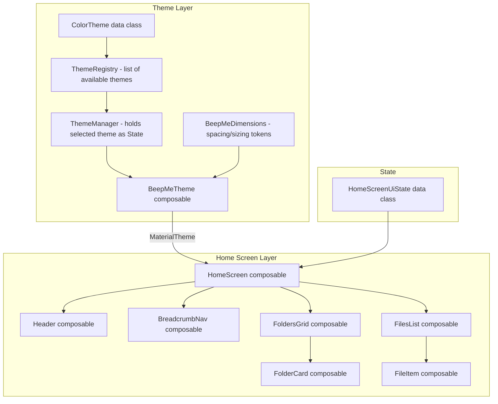

# Design Document: BeepMe Theme and Home Screen

## Overview

This design covers two interconnected areas of the BeepMe notes app:

1. A Material 3 theme system that supports multiple selectable color themes, each with light and dark variants, built on Compose Multiplatform's `MaterialTheme`.
2. A home screen UI matching the Figma design, consuming the theme system for all visual styling.

The theme system is designed as a registry of `ColorTheme` objects. Each theme bundles a name, a light `ColorScheme`, and a dark `ColorScheme`. A `ThemeManager` holds the currently selected theme as observable state. The top-level `BeepMeTheme` composable resolves the correct variant based on system dark mode and applies it alongside shared typography and shapes via `MaterialTheme`.

The home screen is a stateless composable that receives UI state (folders, files, breadcrumb path) and emits callbacks for user interactions. It composes the Header, BreadcrumbNav, FoldersGrid, FilesList sections in a scrollable column.

## Architecture



The theme layer is independent of the home screen. Any screen in the app wraps its content in `BeepMeTheme` and gets access to colors, typography, and shapes via `MaterialTheme`.

## Components and Interfaces

### Theme System Components

#### `ColorTheme`

```kotlin
data class ColorTheme(
    val name: String,
    val lightColorScheme: ColorScheme,
    val darkColorScheme: ColorScheme
)
```

A pure data holder. Adding a new theme means creating a new `ColorTheme` instance — no code changes elsewhere.

#### `BeepMeClassicTheme`

Defines the "BeepMe Classic" `ColorTheme`:

| Role | Light | Dark |
|------|-------|------|
| background | #FFFAF0 | #1A1A1A |
| surface | #FFFFFF | #2C2C2C |
| primary | #023047 | #8ECAE6 |
| onPrimary | #FFFFFF | #023047 |
| secondary | #780000 | #FFB3B3 |
| onSecondary | #FFFFFF | #780000 |
| onBackground | #023047 | #FFFAF0 |
| onSurface | #023047 | #E0E0E0 |

The dark variant inverts contrast: primary becomes a lighter tint (#8ECAE6) so it reads well on dark backgrounds, and secondary becomes a soft red (#FFB3B3).

#### `ThemeManager`

```kotlin
class ThemeManager(
    availableThemes: List<ColorTheme>,
    initialTheme: ColorTheme = availableThemes.first()
) {
    val availableThemes: List<ColorTheme>
    val selectedTheme: StateFlow<ColorTheme>
    fun selectTheme(theme: ColorTheme)
}
```

Holds the list of available themes and the currently selected one as a `StateFlow`. The UI observes `selectedTheme` and recomposes when it changes.

#### `BeepMeTheme` Composable

```kotlin
@Composable
fun BeepMeTheme(
    themeManager: ThemeManager,
    dimensions: BeepMeDimensions = BeepMeDimensions(),
    darkTheme: Boolean = isSystemInDarkTheme(),
    content: @Composable () -> Unit
) {
    val colorTheme by themeManager.selectedTheme.collectAsState()
    val colorScheme = if (darkTheme) colorTheme.darkColorScheme else colorTheme.lightColorScheme
    CompositionLocalProvider(LocalBeepMeDimensions provides dimensions) {
        MaterialTheme(
            colorScheme = colorScheme,
            typography = BeepMeTypography,
            shapes = BeepMeShapes,
            content = content
        )
    }
}
```

#### `BeepMeTypography`

A `Typography` instance using Work Sans:

| Material3 Style | Work Sans Weight | Size |
|-----------------|-----------------|------|
| titleLarge | Bold (700) | 24sp |
| titleSmall | SemiBold (600) | 14sp |
| labelMedium | Medium (500) | 14sp |
| labelSmall | Medium (500) | 10sp |
| bodySmall | Regular (400) | 10sp |
| bodyMedium | Regular (400) | 14sp |

Work Sans font files are bundled as Compose Multiplatform resources in `composeResources/font/`.

#### `BeepMeDimensions`

A custom dimensions object providing named spacing and sizing tokens, accessible via a `CompositionLocal` so all composables can read them from the theme.

```kotlin
data class BeepMeDimensions(
    val xxs: Dp = 2.dp,
    val xs: Dp = 4.dp,
    val s: Dp = 8.dp,
    val m: Dp = 12.dp,
    val l: Dp = 16.dp,
    val xl: Dp = 24.dp,
    val xxl: Dp = 32.dp,
    val xxxl: Dp = 40.dp,
    val iconSmall: Dp = 36.dp,
    val iconMedium: Dp = 40.dp,
    val fabSize: Dp = 64.dp,
    val borderWidth: Dp = 1.dp
)

val LocalBeepMeDimensions = staticCompositionLocalOf { BeepMeDimensions() }
```

Accessed in composables via `LocalBeepMeDimensions.current`. The `BeepMeTheme` composable provides this via `CompositionLocalProvider`.

#### `BeepMeShapes`

Uses dimension tokens for corner radii:

```kotlin
val BeepMeShapes = Shapes(
    small = RoundedCornerShape(BeepMeDimensions().s),   // 8dp
    medium = RoundedCornerShape(BeepMeDimensions().m)    // 12dp
)
```

### Home Screen Components

#### `HomeScreenUiState`

```kotlin
data class HomeScreenUiState(
    val title: String,
    val breadcrumbs: List<BreadcrumbItem>,
    val folders: List<FolderUiModel>,
    val files: List<FileUiModel>
)

data class BreadcrumbItem(
    val label: String,
    val path: String
)

data class FolderUiModel(
    val id: String,
    val name: String,
    val itemCount: Int
)

data class FileUiModel(
    val id: String,
    val title: String,
    val preview: String,
    val timestamp: String
)
```

#### `HomeScreen`

```kotlin
@Composable
fun HomeScreen(
    uiState: HomeScreenUiState,
    onBreadcrumbClick: (path: String) -> Unit,
    onFolderClick: (folderId: String) -> Unit,
    onFileClick: (fileId: String) -> Unit
)
```

A stateless composable. Uses `Scaffold` or a `Box` with a `LazyColumn` / scrollable `Column` to lay out:
1. `Header` — nav icon + title
2. `BreadcrumbNav` — horizontal path segments
3. "FOLDERS" section label + `FoldersGrid` (hidden when `folders` is empty)
4. "FILES" section label + `FilesList` (hidden when `files` is empty)

#### `Header`

```kotlin
@Composable
fun Header(
    title: String,
    onNavigationClick: () -> Unit
)
```

Displays a leading icon button and the title in `titleLarge` style, both tinted with `MaterialTheme.colorScheme.primary`.

#### `BreadcrumbNav`

```kotlin
@Composable
fun BreadcrumbNav(
    breadcrumbs: List<BreadcrumbItem>,
    onBreadcrumbClick: (path: String) -> Unit
)
```

Renders breadcrumbs in a horizontal `Row`. The last item gets a pill-shaped chip (primary background, onPrimary text). Other items are plain text in primary color, each clickable.

#### `FolderCard`

```kotlin
@Composable
fun FolderCard(
    folder: FolderUiModel,
    onClick: () -> Unit
)
```

A `Card` or `Surface` with:
- White background, medium shape corners, `borderWidth` primary-colored border
- `iconMedium` × `iconMedium` icon box: primary background, small shape corners, folder icon in onPrimary
- Folder name (Bold 14sp) and item count (Regular 10sp)

#### `FileItem`

```kotlin
@Composable
fun FileItem(
    file: FileUiModel,
    onClick: () -> Unit
)
```

A `Card` or `Surface` with:
- White background, medium shape corners, `borderWidth` secondary-colored border
- `iconSmall` × `iconSmall` icon box: primary color at 5% opacity background, small shape corners
- Title (`titleSmall`), preview (`bodySmall`), timestamp (`labelSmall`)

## Data Models

### UI Models

The home screen uses dedicated UI models decoupled from the data layer's `Note` domain model:

| Model | Fields | Purpose |
|-------|--------|---------|
| `HomeScreenUiState` | title, breadcrumbs, folders, files | Top-level screen state |
| `BreadcrumbItem` | label, path | Single breadcrumb segment |
| `FolderUiModel` | id, name, itemCount | Folder card display data |
| `FileUiModel` | id, title, preview, timestamp | File item display data |

### Theme Models

| Model | Fields | Purpose |
|-------|--------|---------|
| `ColorTheme` | name, lightColorScheme, darkColorScheme | A selectable theme definition |

### Mapping

A mapper function converts domain `Note` objects to `FileUiModel`:

```kotlin
fun Note.toFileUiModel(): FileUiModel = FileUiModel(
    id = filePath,
    title = title,
    preview = content.take(80),
    timestamp = formatTimestamp(updatedAt)
)
```

Folder data will come from a future folder domain model. For now, `FolderUiModel` is constructed directly from whatever data source provides folder information.


## Correctness Properties

*A property is a characteristic or behavior that should hold true across all valid executions of a system — essentially, a formal statement about what the system should do. Properties serve as the bridge between human-readable specifications and machine-verifiable correctness guarantees.*

Most of this feature is UI rendering (layout, colors, typography), which is not amenable to property-based testing. The testable properties focus on the theme system's data integrity and state management logic.

### Property 1: ColorTheme structural invariant

*For any* `ColorTheme` instance, the name must be non-blank, and both the light and dark `ColorScheme` must be distinct objects (not referencing the same instance), ensuring each theme truly provides two variants.

**Validates: Requirements 1.1**

### Property 2: Theme selection updates state

*For any* `ThemeManager` initialized with a list of available themes, and *for any* theme selected from that list via `selectTheme()`, the `selectedTheme` flow must emit the newly selected theme.

**Validates: Requirements 2.1, 2.2**

### Property 3: Dark mode variant resolution

*For any* `ColorTheme` and *for any* boolean `isDarkMode` flag, resolving the active `ColorScheme` must return `darkColorScheme` when `isDarkMode` is true and `lightColorScheme` when `isDarkMode` is false.

**Validates: Requirements 2.3**

## Error Handling

This feature is primarily a UI layer with minimal error surface:

- **ThemeManager**: If `selectTheme()` is called with a theme not in the available list, the manager should ignore the call and keep the current selection. The `availableThemes` list must contain at least one theme at construction time.
- **HomeScreen**: The composable handles empty states gracefully — empty folders or files lists simply hide the respective sections (Requirements 9.3, 9.4). No error UI is needed for these cases.
- **Font loading**: If Work Sans font resources fail to load, Compose falls back to the platform default font. No explicit error handling is needed beyond ensuring the font files are bundled correctly.
- **Timestamp formatting**: The `formatTimestamp` utility should handle edge cases (e.g., 0 or negative timestamps) by returning a fallback string like "Unknown".

## Testing Strategy

### Property-Based Tests

Use **Kotest Property** (already in the project's `commonTest` dependencies) for property-based testing. Each property test runs a minimum of 100 iterations.

| Property | Test Description | Tag |
|----------|-----------------|-----|
| Property 1 | Generate random ColorTheme instances and verify structural invariants | Feature: beepme-theme-and-home-screen, Property 1: ColorTheme structural invariant |
| Property 2 | Generate random theme lists and selection sequences, verify state updates | Feature: beepme-theme-and-home-screen, Property 2: Theme selection updates state |
| Property 3 | Generate random ColorThemes and boolean flags, verify variant resolution | Feature: beepme-theme-and-home-screen, Property 3: Dark mode variant resolution |

Each property test must be implemented as a single Kotest property test using `checkAll` with custom `Arb` generators for `ColorScheme` and `ColorTheme`.

### Unit Tests

Unit tests complement property tests for specific examples and edge cases:

- **BeepMe Classic light colors**: Assert exact hex values for background, surface, primary, secondary.
- **BeepMe Classic dark colors**: Assert the dark variant has adjusted colors.
- **Typography mapping**: Assert each typography slot has the correct font weight and size.
- **Shapes**: Assert small = 8dp, medium = 12dp.
- **ThemeManager initialization**: Assert selectedTheme equals the initial theme.
- **ThemeManager with invalid selection**: Assert selecting a theme not in the list is ignored.

### Compose UI Tests (optional, platform-specific)

- Verify HomeScreen hides FOLDERS section when folders list is empty.
- Verify HomeScreen hides FILES section when files list is empty.
- Verify breadcrumb tap invokes callback with correct path.
- Verify folder card tap invokes callback with correct folder ID.
- Verify file item tap invokes callback with correct file ID.
