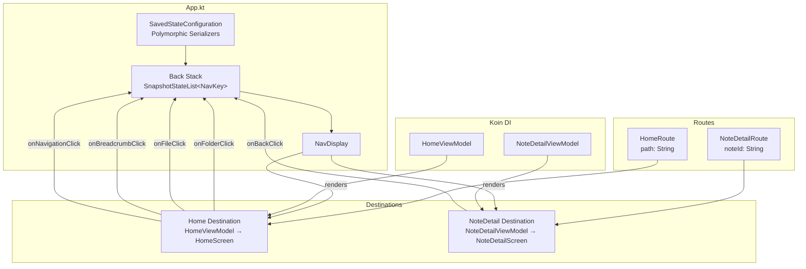

# Design Document: Compose Navigation 3 Integration

## Overview

This design integrates Compose Navigation 3 into EchoList, replacing the hardcoded `HomeScreen` rendering in `App.kt` with a back-stack-driven navigation system. The key architectural change is that the application owns the back stack as a `SnapshotStateList<NavKey>`, and a `NavDisplay` composable observes it to render the active destination.

The integration covers:
- Adding Navigation 3 and kotlinx-serialization dependencies to the build
- Defining serializable route keys (`HomeRoute`, `NoteDetailRoute`)
- Refactoring `App.kt` to host a `NavDisplay` with destination mappings
- Creating a `NoteDetailScreen` composable for viewing individual notes
- Introducing ViewModels for `HomeScreen` and `NoteDetailScreen`
- Registering navigation-related components in Koin

Navigation 3 is alpha software (1.0.0-alpha05). This design uses only stable patterns from the library's public API and avoids experimental features beyond what is necessary for multiplatform support.

## Architecture



The navigation flow is unidirectional: user actions in destination composables emit callbacks that modify the back stack, and `NavDisplay` recomposes to show the new top destination.

## Components and Interfaces

### Route Definitions

All routes live in a new file `navigation/Routes.kt` under the `ui` package:

```kotlin
package net.onefivefour.echolist.ui.navigation

import androidx.navigation3.runtime.NavKey
import kotlinx.serialization.Serializable
import kotlinx.serialization.modules.SerializersModule
import kotlinx.serialization.modules.polymorphic
import kotlinx.serialization.modules.subclass

@Serializable
data class HomeRoute(val path: String = "/") : NavKey

@Serializable
data class NoteDetailRoute(val noteId: String) : NavKey

val navKeySerializersModule = SerializersModule {
    polymorphic(NavKey::class) {
        subclass(HomeRoute::class, HomeRoute.serializer())
        subclass(NoteDetailRoute::class, NoteDetailRoute.serializer())
    }
}
```

### SavedStateConfiguration

A top-level configuration object used when creating the back stack, ensuring cross-platform state restoration:

```kotlin
package net.onefivefour.echolist.ui.navigation

import androidx.navigation3.runtime.SavedStateConfiguration

val echoListSavedStateConfig = SavedStateConfiguration {
    serializersModule = navKeySerializersModule
}
```

### Refactored App.kt

`App.kt` becomes the navigation host. It creates the back stack, sets up `NavDisplay`, and wires each route to its destination composable with the appropriate ViewModel:

```kotlin
@Composable
fun App() {
    EchoListTheme {
        val backStack = rememberNavBackStack(echoListSavedStateConfig, HomeRoute())

        NavDisplay(
            backStack = backStack,
            onBack = { backStack.removeLastOrNull() }
        ) {
            entryProvider<HomeRoute> { route ->
                val viewModel = koinViewModel<HomeViewModel> { parametersOf(route.path) }
                val uiState by viewModel.uiState.collectAsStateWithLifecycle()
                HomeScreen(
                    uiState = uiState,
                    onNavigationClick = { backStack.removeLastOrNull() },
                    onBreadcrumbClick = { path ->
                        // Pop to matching route or push new one
                        val index = backStack.indexOfLast { it is HomeRoute && it.path == path }
                        if (index >= 0) {
                            while (backStack.size > index + 1) backStack.removeLast()
                        } else {
                            backStack.add(HomeRoute(path))
                        }
                    },
                    onFolderClick = { folderId -> backStack.add(HomeRoute(folderId)) },
                    onFileClick = { fileId -> backStack.add(NoteDetailRoute(fileId)) }
                )
            }

            entryProvider<NoteDetailRoute> { route ->
                val viewModel = koinViewModel<NoteDetailViewModel> { parametersOf(route.noteId) }
                val uiState by viewModel.uiState.collectAsStateWithLifecycle()
                NoteDetailScreen(
                    uiState = uiState,
                    onBackClick = { backStack.removeLastOrNull() }
                )
            }
        }
    }
}
```

### HomeViewModel

A new ViewModel that replaces the sample data currently hardcoded in `App.kt`. It loads folder and file data for a given path from the repository:

```kotlin
package net.onefivefour.echolist.ui.home

import androidx.lifecycle.ViewModel
import androidx.lifecycle.viewModelScope
import kotlinx.coroutines.flow.MutableStateFlow
import kotlinx.coroutines.flow.StateFlow
import kotlinx.coroutines.flow.asStateFlow
import kotlinx.coroutines.launch
import net.onefivefour.echolist.data.repository.NotesRepository

class HomeViewModel(
    private val path: String,
    private val repository: NotesRepository
) : ViewModel() {

    private val _uiState = MutableStateFlow(HomeScreenUiState(title = "", breadcrumbs = emptyList(), folders = emptyList(), files = emptyList()))
    val uiState: StateFlow<HomeScreenUiState> = _uiState.asStateFlow()

    init {
        viewModelScope.launch {
            // Load data for the given path from repository
            // Map domain models to UI models and update _uiState
        }
    }
}
```

### NoteDetailViewModel

Loads a single note by ID and exposes its UI state:

```kotlin
package net.onefivefour.echolist.ui.notedetail

import androidx.lifecycle.ViewModel
import androidx.lifecycle.viewModelScope
import kotlinx.coroutines.flow.MutableStateFlow
import kotlinx.coroutines.flow.StateFlow
import kotlinx.coroutines.flow.asStateFlow
import kotlinx.coroutines.launch
import net.onefivefour.echolist.data.repository.NotesRepository

class NoteDetailViewModel(
    private val noteId: String,
    private val repository: NotesRepository
) : ViewModel() {

    private val _uiState = MutableStateFlow<NoteDetailUiState>(NoteDetailUiState.Loading)
    val uiState: StateFlow<NoteDetailUiState> = _uiState.asStateFlow()

    init {
        viewModelScope.launch {
            // Load note by noteId from repository
            // Update _uiState with Success or Error
        }
    }
}
```

### NoteDetailScreen

A new stateless composable following the existing pattern:

```kotlin
package net.onefivefour.echolist.ui.notedetail

import androidx.compose.runtime.Composable
import androidx.compose.ui.Modifier

@Composable
fun NoteDetailScreen(
    uiState: NoteDetailUiState,
    onBackClick: () -> Unit,
    modifier: Modifier = Modifier
) {
    // Renders note title, content, timestamp
    // Shows error state when note is unavailable
    // Back arrow in TopAppBar triggers onBackClick
}
```

### NoteDetailUiState

```kotlin
package net.onefivefour.echolist.ui.notedetail

sealed interface NoteDetailUiState {
    data object Loading : NoteDetailUiState
    data class Success(
        val title: String,
        val content: String,
        val lastUpdated: String
    ) : NoteDetailUiState
    data class Error(val message: String) : NoteDetailUiState
}
```

### Koin Module Updates

The navigation module registers ViewModels with their factory parameters:

```kotlin
// In AppModules.kt, add to uiModule or create a new navigationModule
val navigationModule: Module = module {
    factoryOf(::HomeViewModel)
    factoryOf(::NoteDetailViewModel)
}
```

### Package Structure After Integration

```
composeApp/src/commonMain/kotlin/net/onefivefour/notes/
├── App.kt                          # NavDisplay host (refactored)
├── ui/
│   ├── navigation/
│   │   └── Routes.kt               # NavKey routes + SerializersModule + SavedStateConfiguration
│   ├── home/
│   │   ├── HomeScreen.kt           # Unchanged stateless composable
│   │   ├── HomeScreenUiState.kt    # Unchanged
│   │   ├── HomeViewModel.kt        # New
│   │   ├── BreadcrumbNav.kt        # Unchanged
│   │   ├── FolderCard.kt           # Unchanged
│   │   └── FileItem.kt             # Unchanged
│   ├── notedetail/
│   │   ├── NoteDetailScreen.kt     # New stateless composable
│   │   ├── NoteDetailUiState.kt    # New sealed interface
│   │   └── NoteDetailViewModel.kt  # New
│   └── theme/                      # Unchanged
├── data/                           # Unchanged
├── di/                             # Updated with navigation module
└── network/                        # Unchanged
```

## Data Models

### Existing Models (Unchanged)

| Model | Fields | Purpose |
|-------|--------|---------|
| `HomeScreenUiState` | `title`, `breadcrumbs`, `folders`, `files` | UI state for the home screen |
| `BreadcrumbItem` | `label`, `path` | Single breadcrumb entry |
| `FolderUiModel` | `id`, `name`, `itemCount` | Folder display data |
| `FileUiModel` | `id`, `title`, `preview`, `timestamp` | File display data |
| `Note` | `filePath`, `title`, `content`, `updatedAt` | Domain model for a note |

### New Models

| Model | Fields | Purpose |
|-------|--------|---------|
| `HomeRoute` | `path: String` (default `"/"`) | NavKey for home destination |
| `NoteDetailRoute` | `noteId: String` | NavKey for note detail destination |
| `NoteDetailUiState` | Sealed: `Loading`, `Success(title, content, lastUpdated)`, `Error(message)` | UI state for note detail screen |

### Route Serialization

All `NavKey` implementations use `@Serializable` and are registered in a polymorphic `SerializersModule`. This is required because non-JVM platforms (iOS, JS, WasmJS) cannot use reflection-based serialization for state restoration.


## Correctness Properties

*A property is a characteristic or behavior that should hold true across all valid executions of a system — essentially, a formal statement about what the system should do. Properties serve as the bridge between human-readable specifications and machine-verifiable correctness guarantees.*

### Property 1: Route serialization round-trip

*For any* valid `NavKey` instance (either `HomeRoute` with any path string or `NoteDetailRoute` with any noteId string), serializing the route to JSON using the polymorphic `SerializersModule` and then deserializing it back should produce an object equal to the original.

This is a classic round-trip property. The polymorphic serialization configuration must correctly register all `NavKey` subtypes so that the type discriminator is preserved across the serialization boundary. If this property holds, it validates both the `@Serializable` annotations (2.3) and the `SerializersModule` registration (2.4).

**Validates: Requirements 2.3, 2.4**

### Property 2: Push navigation grows the back stack

*For any* back stack (non-empty list of `NavKey`) and *for any* new `NavKey` (either `HomeRoute` or `NoteDetailRoute`), pushing the key onto the back stack should result in:
1. The back stack size increasing by exactly one
2. The last element of the back stack being equal to the pushed key
3. All previous entries remaining unchanged in order

This covers both folder navigation (pushing `HomeRoute`) and file navigation (pushing `NoteDetailRoute`).

**Validates: Requirements 4.1, 4.2**

### Property 3: Breadcrumb navigation truncates the back stack

*For any* back stack containing at least one `HomeRoute` with a given path, navigating to that breadcrumb path should result in:
1. The back stack being truncated so the matching `HomeRoute` is the last entry
2. All entries at or before the matching index remaining unchanged
3. The back stack size being less than or equal to the original size

**Validates: Requirements 4.3**

### Property 4: Back navigation removes the top entry

*For any* back stack with more than one entry, performing a back action should result in:
1. The back stack size decreasing by exactly one
2. The remaining entries being identical to the original back stack minus the last element

Edge case: *For any* back stack with exactly one entry, performing a back action should leave the back stack unchanged (size remains one, entry is preserved).

**Validates: Requirements 5.1, 5.2, 5.3**

### Property 5: Missing note produces error state

*For any* `noteId` that does not exist in the repository, the `NoteDetailViewModel` should produce a `NoteDetailUiState.Error` state with a non-empty error message.

**Validates: Requirements 6.3**

## Error Handling

| Scenario | Handling |
|----------|----------|
| Note not found by `noteId` | `NoteDetailViewModel` emits `NoteDetailUiState.Error` with a descriptive message. `NoteDetailScreen` renders the error state with a back button. |
| Repository/network failure during note load | `NoteDetailViewModel` catches the exception and emits `NoteDetailUiState.Error`. |
| Repository/network failure during home data load | `HomeViewModel` catches the exception and emits a `HomeScreenUiState` with empty lists and an appropriate title or a dedicated error field (to be added if needed). |
| Back navigation on single-entry stack | `removeLastOrNull()` returns `null` and the stack remains unchanged. No crash. |
| Breadcrumb path not found in back stack | Falls through to pushing a new `HomeRoute` with that path, so the user still navigates correctly. |
| Serialization failure on state restoration | Navigation 3 handles this gracefully by resetting to the initial back stack entry (`HomeRoute("/")`). |

## Testing Strategy

### Property-Based Testing

Library: **Kotest Property** (`io.kotest:kotest-property`), already in the project's `commonTest` dependencies.

Each correctness property maps to a single property-based test with a minimum of 100 iterations. Tests use Kotest's `checkAll` or `forAll` with custom `Arb` generators for `NavKey` instances and back stack states.

| Property | Test Description | Generator Strategy |
|----------|------------------|--------------------|
| Property 1 | Serialize then deserialize each route type | `Arb.string()` for path/noteId, randomly choose `HomeRoute` or `NoteDetailRoute` |
| Property 2 | Push a random NavKey onto a random back stack | `Arb` for non-empty list of `NavKey`, `Arb` for a single `NavKey` |
| Property 3 | Build a back stack with known HomeRoutes, pick one path, truncate | `Arb` for list of `HomeRoute` with varying paths, random index selection |
| Property 4 | Remove last from back stacks of varying sizes | `Arb` for non-empty list of `NavKey` (size > 1 for normal case, size == 1 for edge case) |
| Property 5 | Generate random noteIds not in a mock repository | `Arb.string()` for noteId, empty or non-matching mock repository |

Each test must be annotated with a comment referencing the design property:
```kotlin
// Feature: compose-navigation-3, Property 1: Route serialization round-trip
// Validates: Requirements 2.3, 2.4
```

### Unit Testing

Unit tests complement property tests by covering specific examples and integration points:

- **Route defaults**: Verify `HomeRoute()` has `path = "/"`, `NoteDetailRoute("abc")` has `noteId = "abc"`
- **ViewModel success states**: Verify `HomeViewModel` emits correct `HomeScreenUiState` for a known path with mock repository data
- **ViewModel error states**: Verify `NoteDetailViewModel` emits `Error` for a specific missing noteId
- **DI resolution**: Verify Koin can resolve `HomeViewModel` and `NoteDetailViewModel` with parameters
- **Breadcrumb edge cases**: Navigate to root breadcrumb, navigate to non-existent path

### Test File Organization

```
composeApp/src/commonTest/kotlin/net/onefivefour/notes/
├── ui/
│   ├── navigation/
│   │   ├── RouteSerializationPropertyTest.kt   # Property 1
│   │   └── BackStackPropertyTest.kt            # Properties 2, 3, 4
│   ├── home/
│   │   └── HomeViewModelTest.kt                # Unit tests
│   └── notedetail/
│       ├── NoteDetailViewModelTest.kt           # Unit tests + Property 5
│       └── NoteDetailViewModelPropertyTest.kt   # Property 5
└── di/
    └── NavigationModuleTest.kt                  # DI resolution tests
```
