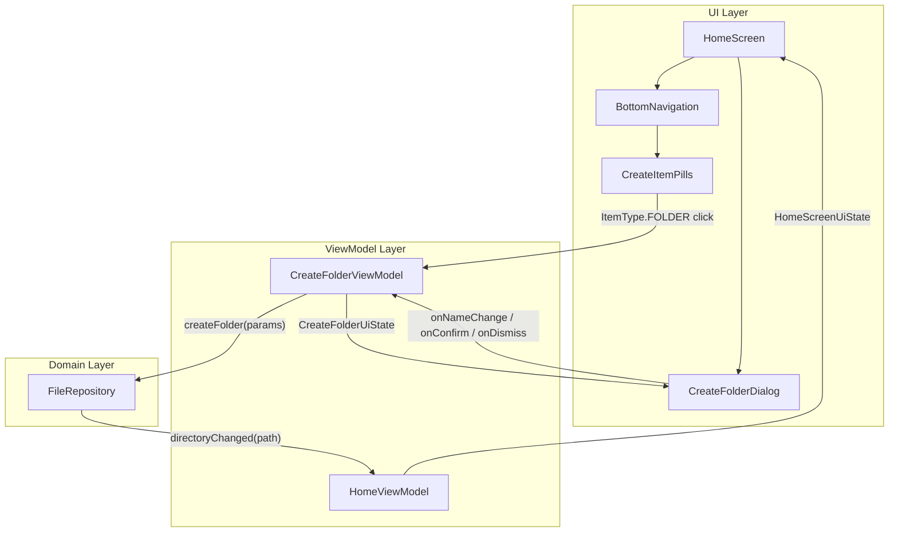

# Design Document: Create Folder Dialog

## Overview

This feature adds a modal dialog for creating folders on the EchoList home screen. When the user taps the `CreateItemPill` for `ItemType.FOLDER`, a dialog appears with a text field for the folder name, a confirm button, and a cancel button. The dialog is managed by a dedicated `CreateFolderViewModel` that handles input state, validation, the network call to `FileRepository.createFolder`, and error/loading states. On success, the dialog closes and the home screen refreshes its file list.

A secondary goal is to refactor the `HomeScreen` composable parameter surface: replace the individual `onCreateFolder`, `onCreateNote`, and `onCreateTaskList` lambdas with a single grouped callback, and wire the dialog internally so that `App.kt` does not manage dialog state.

### Key Design Decisions

1. **Dedicated ViewModel**: `CreateFolderViewModel` owns all dialog state (visibility, input, loading, error). This keeps `HomeViewModel` focused on browsing and makes the pattern reusable for future note/task-list creation dialogs.
2. **Material 3 AlertDialog**: The dialog uses `AlertDialog` from Material 3 rather than a custom overlay. This gives us built-in scrim, dismiss-on-outside-tap, and accessibility support across all platforms.
3. **Repository-level directory change signal**: `FileRepository` exposes a `SharedFlow<String>` (`directoryChanged`) that emits the path of any directory whose contents were modified (folder created, deleted, renamed, etc.). `HomeViewModel` collects this flow and refreshes when the emitted path matches its current path. This is more decoupled and reusable than a ViewModel-to-ViewModel signal — any future operation that modifies directory contents (note creation, task list creation, deletion) can emit on the same flow without additional wiring.
4. **Whitespace trimming at submission**: The folder name is trimmed only when the user confirms, not on every keystroke. The confirm button is disabled when the trimmed input is blank.

## Architecture



### Data Flow

1. User taps the Folder pill → `CreateFolderViewModel.showDialog()` is called.
2. `CreateFolderDialog` observes `CreateFolderUiState` from `CreateFolderViewModel`.
3. User types a name → `CreateFolderViewModel.onNameChange(value)` updates state.
4. User taps confirm → `CreateFolderViewModel.onConfirm()`:
   - Trims the name, sets `isLoading = true`, disables confirm button.
   - Calls `FileRepository.createFolder(CreateFolderParams(parentDir, trimmedName))`.
   - On success: resets state, hides dialog. The repository internally emits the parent directory path on `directoryChanged`.
   - On failure: sets `error` in state, keeps dialog open.
5. `HomeViewModel` collects `FileRepository.directoryChanged` in its `init` block. When the emitted path matches its own `path`, it calls `loadData()` to refresh the file list. This decouples the refresh mechanism from any specific creation ViewModel.

## Components and Interfaces

### CreateFolderUiState

```kotlin
data class CreateFolderUiState(
    val isVisible: Boolean = false,
    val folderName: String = "",
    val isLoading: Boolean = false,
    val error: String? = null
) {
    val isConfirmEnabled: Boolean
        get() = folderName.trim().isNotBlank() && !isLoading
}
```

### CreateFolderViewModel

```kotlin
class CreateFolderViewModel(
    private val currentPath: String,
    private val fileRepository: FileRepository
) : ViewModel() {

    private val _uiState = MutableStateFlow(CreateFolderUiState())
    val uiState: StateFlow<CreateFolderUiState> = _uiState.asStateFlow()

    fun showDialog() { /* sets isVisible = true, resets fields */ }
    fun dismissDialog() { /* sets isVisible = false, resets fields */ }
    fun onNameChange(value: String) { /* updates folderName, clears error */ }
    fun onConfirm() { /* trims name, calls fileRepository.createFolder, handles result */ }
}
```

Note: `CreateFolderViewModel` no longer exposes a `folderCreated` signal. The refresh mechanism is handled by `FileRepository.directoryChanged` (see below).

### CreateFolderDialog Composable

```kotlin
@Composable
fun CreateFolderDialog(
    uiState: CreateFolderUiState,
    onNameChange: (String) -> Unit,
    onConfirm: () -> Unit,
    onDismiss: () -> Unit
)
```

- Renders only when `uiState.isVisible` is true.
- Uses Material 3 `AlertDialog` with `EchoListTheme` tokens.
- Text field uses `ElOutlinedTextField` with auto-focus via `FocusRequester`.
- Confirm button uses `ElButton`, disabled when `!uiState.isConfirmEnabled`.
- Shows `CircularProgressIndicator` inside the confirm button area when `isLoading`.
- Shows error text below the text field when `uiState.error != null`.

### HomeScreen Refactoring

Replace individual creation lambdas with a grouped callback:

```kotlin
data class CreateItemCallbacks(
    val onCreateFolder: () -> Unit = {},
    val onCreateNote: () -> Unit = {},
    val onCreateTaskList: () -> Unit = {}
)

@Composable
fun HomeScreen(
    uiState: HomeScreenUiState,
    createFolderUiState: CreateFolderUiState,
    onBreadcrumbClick: (path: String) -> Unit,
    onFolderClick: (path: String) -> Unit = {},
    onNoteClick: (path: String) -> Unit = {},
    onTaskClick: (path: String) -> Unit = {},
    createItemCallbacks: CreateItemCallbacks = CreateItemCallbacks(),
    onFolderNameChange: (String) -> Unit = {},
    onConfirmCreateFolder: () -> Unit = {},
    onDismissCreateFolder: () -> Unit = {}
)
```

`HomeScreen` renders `CreateFolderDialog` internally based on `createFolderUiState`.

### FileRepository Interface Changes

Add a `directoryChanged` signal to the existing `FileRepository` interface:

```kotlin
interface FileRepository {
    val directoryChanged: SharedFlow<String>

    suspend fun createFolder(params: CreateFolderParams): Result<Folder>
    suspend fun listFiles(parentPath: String): Result<List<FileEntry>>
    suspend fun updateFolder(params: UpdateFolderParams): Result<Folder>
    suspend fun deleteFolder(params: DeleteFolderParams): Result<Unit>
}
```

`directoryChanged` emits the path of the parent directory whenever its contents are modified. `FileRepositoryImpl` emits on this flow after any successful mutating operation (`createFolder`, `deleteFolder`, `updateFolder`). This makes the signal reusable for all future operations that change directory contents.

```kotlin
internal class FileRepositoryImpl(
    private val networkDataSource: FileRemoteDataSource,
    private val dispatcher: CoroutineDispatcher = Dispatchers.Default
) : FileRepository {

    private val _directoryChanged = MutableSharedFlow<String>()
    override val directoryChanged: SharedFlow<String> = _directoryChanged.asSharedFlow()

    override suspend fun createFolder(params: CreateFolderParams): Result<Folder> =
        withContext(dispatcher) {
            try {
                val request = FileMapper.toProto(params)
                val response = networkDataSource.createFolder(request)
                val folder = FileMapper.toDomain(response)
                _directoryChanged.emit(params.parentDir)
                Result.success(folder)
            } catch (e: Exception) {
                Result.failure(e)
            }
        }

    // ... other methods similarly emit on _directoryChanged after success ...
}
```

### HomeViewModel Changes

`HomeViewModel` now collects `FileRepository.directoryChanged` directly and refreshes when the emitted path matches its own path:

```kotlin
class HomeViewModel(
    private val path: String,
    private val fileRepository: FileRepository
) : ViewModel() {
    // ... existing uiState ...

    init {
        viewModelScope.launch { loadData() }
        viewModelScope.launch {
            fileRepository.directoryChanged.collect { changedPath ->
                if (changedPath == path) {
                    loadData()
                }
            }
        }
    }
}
```

No `refresh()` method is needed — `HomeViewModel` is self-refreshing via the repository signal.

### Koin Registration

In `navigationModule`:

```kotlin
val navigationModule: Module = module {
    viewModel { params ->
        HomeViewModel(
            path = params.get(),
            fileRepository = get()
        )
    }
    viewModel { params ->
        CreateFolderViewModel(
            currentPath = params.get(),
            fileRepository = get()
        )
    }
}
```

### App.kt Wiring

Inside the `entry<HomeRoute>` block. Note the absence of any `LaunchedEffect` for refresh signaling — `HomeViewModel` handles that internally via `FileRepository.directoryChanged`:

```kotlin
entry<HomeRoute> { route ->
    val homeViewModel = koinViewModel<HomeViewModel>(key = route.path) { parametersOf(route.path) }
    val createFolderViewModel = koinViewModel<CreateFolderViewModel>(
        key = "createFolder-${route.path}"
    ) { parametersOf(route.path) }

    val homeUiState by homeViewModel.uiState.collectAsStateWithLifecycle()
    val createFolderUiState by createFolderViewModel.uiState.collectAsStateWithLifecycle()

    HomeScreen(
        uiState = homeUiState,
        createFolderUiState = createFolderUiState,
        onBreadcrumbClick = { /* existing logic */ },
        createItemCallbacks = CreateItemCallbacks(
            onCreateFolder = createFolderViewModel::showDialog
        ),
        onFolderNameChange = createFolderViewModel::onNameChange,
        onConfirmCreateFolder = createFolderViewModel::onConfirm,
        onDismissCreateFolder = createFolderViewModel::dismissDialog
    )
}
```

## Data Models

### Existing Models (no changes)

| Model | Location | Fields |
|---|---|---|
| `CreateFolderParams` | `data/models/` | `parentDir: String`, `name: String` |
| `Folder` | `data/models/` | `path: String`, `name: String` |
| `FileEntry` | `data/models/` | `path: String`, `title: String`, `itemType: ItemType`, `metadata: FileMetadata?` |

### New Models

| Model | Location | Fields |
|---|---|---|
| `CreateFolderUiState` | `ui/home/` | `isVisible: Boolean`, `folderName: String`, `isLoading: Boolean`, `error: String?`, computed `isConfirmEnabled: Boolean` |
| `CreateItemCallbacks` | `ui/home/` | `onCreateFolder: () -> Unit`, `onCreateNote: () -> Unit`, `onCreateTaskList: () -> Unit` |


## Correctness Properties

*A property is a characteristic or behavior that should hold true across all valid executions of a system — essentially, a formal statement about what the system should do. Properties serve as the bridge between human-readable specifications and machine-verifiable correctness guarantees.*

### Property 1: Show/dismiss dialog round trip

*For any* `CreateFolderUiState` where the dialog is not visible, calling `showDialog()` followed by `dismissDialog()` should return the state to its original hidden state with an empty folder name, no error, and no loading indicator.

**Validates: Requirements 1.1, 1.5**

### Property 2: Confirm button enabled if and only if input is valid and not loading

*For any* `CreateFolderUiState` with an arbitrary `folderName` string and `isLoading` boolean, `isConfirmEnabled` should be `true` if and only if `folderName.trim().isNotBlank()` is true AND `isLoading` is false.

**Validates: Requirements 1.4, 2.4, 3.2**

### Property 3: Confirm sends trimmed name with correct path

*For any* non-blank folder name string and any current directory path, when `onConfirm()` is called, the `CreateFolderParams` passed to `FileRepository.createFolder` should have `parentDir` equal to the current path and `name` equal to the trimmed folder name.

**Validates: Requirements 2.1, 3.1**

### Property 4: Successful creation closes dialog

*For any* folder name where `FileRepository.createFolder` returns `Result.success`, after `onConfirm()` completes, the UI state should have `isVisible = false`, `folderName = ""`, `isLoading = false`, and `error = null`.

**Validates: Requirements 2.2**

### Property 5: Failed creation keeps dialog open with error

*For any* folder name where `FileRepository.createFolder` returns `Result.failure` with an exception, after `onConfirm()` completes, the UI state should have `isVisible = true`, `isLoading = false`, and `error` equal to the exception's message.

**Validates: Requirements 2.3**

### Property 6: Repository emits directoryChanged on successful mutation

*For any* successful `createFolder` call with a given `parentDir`, the `FileRepository.directoryChanged` SharedFlow should emit exactly that `parentDir` path.

**Validates: Requirements 4.5**

### Property 7: HomeViewModel refreshes on matching directoryChanged signal

*For any* `HomeViewModel` observing path `P`, when `FileRepository.directoryChanged` emits path `P`, the ViewModel should reload its file list from the repository. When the emitted path does not match `P`, the ViewModel should not reload.

**Validates: Requirements 2.2, 4.5**

## Error Handling

| Scenario | Handling |
|---|---|
| `FileRepository.createFolder` returns `Result.failure` | `CreateFolderViewModel` sets `error` in `CreateFolderUiState` to the exception message. Dialog remains open. User can edit the name and retry. |
| Network timeout / connectivity loss | Caught by `FileRepositoryImpl` as an exception, surfaced as `Result.failure`. Same handling as above. |
| User submits whitespace-only name | `isConfirmEnabled` computed property returns `false`, confirm button stays disabled. `onConfirm()` is a no-op if called programmatically with blank trimmed input. |
| ViewModel scope cancelled (navigation away) | Coroutine in `viewModelScope` is automatically cancelled. No state update occurs. |
| Dismiss during loading | `dismissDialog()` resets all state including `isLoading`. The in-flight coroutine result is ignored because the state is already reset. |

## Testing Strategy

### Property-Based Tests (Kotest Property)

Each correctness property maps to a single property-based test using `kotest-property`. Tests run with a minimum of 100 iterations.

| Test | Property | Generator Strategy |
|---|---|---|
| `show dismiss round trip` | Property 1 | Generate arbitrary initial states, apply show then dismiss |
| `isConfirmEnabled iff valid and not loading` | Property 2 | Generate arbitrary strings (including whitespace, empty, unicode) × booleans for isLoading |
| `confirm sends trimmed params` | Property 3 | Generate non-blank strings with leading/trailing whitespace × arbitrary path strings. Mock `FileRepository` to capture the `CreateFolderParams` argument. |
| `success closes dialog` | Property 4 | Generate non-blank folder names. Mock `FileRepository` to return `Result.success`. Verify state resets. |
| `failure keeps dialog open with error` | Property 5 | Generate non-blank folder names × arbitrary error messages. Mock `FileRepository` to return `Result.failure`. Verify state. |
| `repository emits directoryChanged on success` | Property 6 | Generate arbitrary `CreateFolderParams`. Call `createFolder` on `FileRepositoryImpl` with a mock network data source returning success. Collect `directoryChanged` and verify it emits `params.parentDir`. |
| `HomeViewModel refreshes on matching path` | Property 7 | Generate arbitrary path strings. Create `HomeViewModel` with a mock `FileRepository`. Emit matching and non-matching paths on `directoryChanged`. Verify `listFiles` is called again only for matching paths. |

### Unit Tests

Unit tests cover specific examples, edge cases, and integration points not covered by property tests:

- Dialog contains text field, confirm button, and cancel button (Requirement 1.2)
- Text field receives focus when dialog appears (Requirement 1.3)
- `FileRepositoryImpl` does not emit `directoryChanged` when `createFolder` fails
- `CreateFolderViewModel` Koin registration resolves correctly with path and repository parameters
- `CreateItemCallbacks` wiring: tapping folder pill calls `showDialog()`

### Testing Libraries

- **Framework**: Kotest with JUnit 5 runner (`jvmTest`)
- **Property testing**: `kotest-property` (Arb.string, Arb.boolean, custom Arbs for paths)
- **Mocking**: Mock `FileRepository` interface for ViewModel tests
- **UI testing**: Compose UI test APIs for composable rendering verification

### Test Tagging

Each property test includes a comment referencing its design property:

```kotlin
// Feature: create-folder-dialog, Property 1: Show/dismiss dialog round trip
// Feature: create-folder-dialog, Property 2: Confirm button enabled iff valid and not loading
// Feature: create-folder-dialog, Property 3: Confirm sends trimmed name with correct path
// Feature: create-folder-dialog, Property 4: Successful creation closes dialog
// Feature: create-folder-dialog, Property 5: Failed creation keeps dialog open with error
// Feature: create-folder-dialog, Property 6: Repository emits directoryChanged on successful mutation
// Feature: create-folder-dialog, Property 7: HomeViewModel refreshes on matching directoryChanged signal
```
