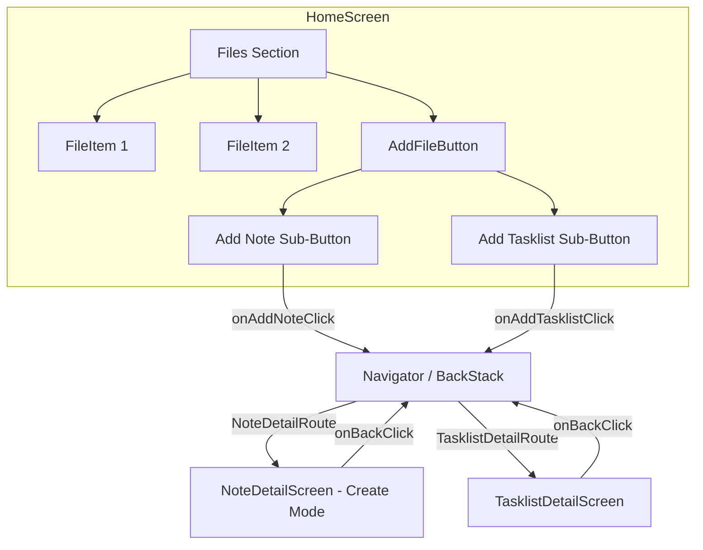

# Design Document: File Add Button

## Overview

This feature adds a composite "add file" button as the last item in the files section of the home screen. Unlike the existing `AddItemButton` (used in the folders section, which shows a single plus icon), this button contains two sub-buttons: one for creating a new note and one for creating a new tasklist. Tapping either sub-button navigates to a dedicated detail screen with an editable `TextField` and a non-functional save button.

The feature introduces:
- `AddFileButton` composable in the home screen's files grid
- `TasklistDetailScreen` composable (new screen, mirroring the existing `NoteDetailScreen` pattern but for tasklist creation)
- A new `TasklistDetailRoute` navigation route
- Modifications to `HomeScreen` to render the add-file button after all file items
- Modifications to `App.kt` to wire up the new route

The existing `NoteDetailScreen` will be adapted to support the "create new note" use case (editable `TextField` + non-functional save button), since it currently only displays read-only note content.

## Architecture



### Navigation Flow

The app uses `androidx.navigation3` with a `rememberNavBackStack`. New routes are pushed onto the back stack. The existing pattern in `App.kt` already handles `HomeRoute` and `NoteDetailRoute`. We add:

1. A new `TasklistDetailRoute` data class in `Routes.kt`
2. A new `entry<TasklistDetailRoute>` block in `App.kt`'s `entryProvider`
3. Two new callbacks on `HomeScreen`: `onAddNoteClick` and `onAddTasklistClick`

### Component Hierarchy

```
HomeScreen
├── ... (folders section, unchanged)
├── FILES section
│   ├── FileItem (for each file)
│   └── AddFileButton          ← NEW
│       ├── Add Note sub-button
│       └── Add Tasklist sub-button
│
NoteDetailScreen (create mode)  ← MODIFIED (add editable TextField + save button)
TasklistDetailScreen            ← NEW
```

## Components and Interfaces

### AddFileButton Composable

**File:** `composeApp/src/commonMain/kotlin/net/onefivefour/echolist/ui/home/AddFileButton.kt`

```kotlin
@Composable
fun AddFileButton(
    onAddNoteClick: () -> Unit,
    onAddTasklistClick: () -> Unit,
    modifier: Modifier = Modifier
)
```

- Stateless composable following the project pattern
- Uses secondary-colored border (matching `FileItem` styling)
- Medium shape, surface background
- Contains two clickable sub-buttons arranged horizontally (Row) with equal weight
- Each sub-button has an icon and label text
- Sub-buttons separated by a vertical divider or spacing

**Visual structure:**
```
┌──────────────────────────────┐
│  [📝 Note]  │  [☑ Tasklist] │  ← secondary border, medium shape
└──────────────────────────────┘
```

### HomeScreen Modifications

**File:** `composeApp/src/commonMain/kotlin/net/onefivefour/echolist/ui/home/HomeScreen.kt`

New callback parameters:
```kotlin
fun HomeScreen(
    // ... existing params ...
    onAddNoteClick: () -> Unit,
    onAddTasklistClick: () -> Unit,
    modifier: Modifier = Modifier
)
```

The FILES section rendering changes from a simple `forEachIndexed` over `uiState.files` to include `AddFileButton` as the last item after all `FileItem` entries.

### TasklistDetailRoute

**File:** `composeApp/src/commonMain/kotlin/net/onefivefour/echolist/ui/navigation/Routes.kt`

```kotlin
@Serializable
data object TasklistDetailRoute : NavKey
```

This route takes no parameters since it represents a "create new" screen with no existing data to load. It must be registered in `navKeySerializersModule`.

### NoteCreateRoute

**File:** `composeApp/src/commonMain/kotlin/net/onefivefour/echolist/ui/navigation/Routes.kt`

```kotlin
@Serializable
data object NoteCreateRoute : NavKey
```

A separate route for creating a new note (distinct from `NoteDetailRoute` which loads an existing note). Registered in `navKeySerializersModule`.

### TasklistDetailScreen Composable

**File:** `composeApp/src/commonMain/kotlin/net/onefivefour/echolist/ui/tasklistdetail/TasklistDetailScreen.kt`

```kotlin
@Composable
fun TasklistDetailScreen(
    text: String,
    onTextChanged: (String) -> Unit,
    onSaveClick: () -> Unit,
    onBackClick: () -> Unit,
    modifier: Modifier = Modifier
)
```

- Stateless composable
- TopAppBar with back button and title ("New Tasklist")
- Editable `TextField` / `OutlinedTextField` for content
- Save button (non-functional — `onSaveClick` callback provided but wired to no-op)
- Follows EchoList design system (MaterialTheme colors, typography, dimensions)

### NoteDetailScreen Modifications (Create Mode)

For the "create new note" flow, we introduce a new simple composable or reuse a pattern similar to `TasklistDetailScreen`:

**File:** `composeApp/src/commonMain/kotlin/net/onefivefour/echolist/ui/notecreate/NoteCreateScreen.kt`

```kotlin
@Composable
fun NoteCreateScreen(
    text: String,
    onTextChanged: (String) -> Unit,
    onSaveClick: () -> Unit,
    onBackClick: () -> Unit,
    modifier: Modifier = Modifier
)
```

- Same structure as `TasklistDetailScreen` but titled "New Note"
- Keeps the existing `NoteDetailScreen` untouched (it handles viewing existing notes)

### App.kt Modifications

New entries in the `entryProvider`:
```kotlin
entry<NoteCreateRoute> {
    var text by remember { mutableStateOf("") }
    NoteCreateScreen(
        text = text,
        onTextChanged = { text = it },
        onSaveClick = { /* no-op */ },
        onBackClick = { backStack.removeLastOrNull() }
    )
}

entry<TasklistDetailRoute> {
    var text by remember { mutableStateOf("") }
    TasklistDetailScreen(
        text = text,
        onTextChanged = { text = it },
        onSaveClick = { /* no-op */ },
        onBackClick = { backStack.removeLastOrNull() }
    )
}
```

State for the text field is held at the `App.kt` level (or in a simple ViewModel). Since the save button is non-functional, a simple `remember { mutableStateOf("") }` suffices.

## Data Models

### New Routes

| Route | Parameters | Purpose |
|-------|-----------|---------|
| `NoteCreateRoute` | None | Navigate to new note creation screen |
| `TasklistDetailRoute` | None | Navigate to new tasklist creation screen |

### UI State

No new UI state data classes are needed for the detail screens since they are simple create screens with local text state. The `HomeScreenUiState` remains unchanged — the `AddFileButton` is always shown as the last item in the files section regardless of state.

### Serialization Module Update

`navKeySerializersModule` must register both new routes:
```kotlin
val navKeySerializersModule = SerializersModule {
    polymorphic(NavKey::class) {
        subclass(LoginRoute::class, LoginRoute.serializer())
        subclass(HomeRoute::class, HomeRoute.serializer())
        subclass(NoteDetailRoute::class, NoteDetailRoute.serializer())
        subclass(NoteCreateRoute::class, NoteCreateRoute.serializer())
        subclass(TasklistDetailRoute::class, TasklistDetailRoute.serializer())
    }
}
```


## Correctness Properties

*A property is a characteristic or behavior that should hold true across all valid executions of a system — essentially, a formal statement about what the system should do. Properties serve as the bridge between human-readable specifications and machine-verifiable correctness guarantees.*

### Property 1: AddFileButton is always the last item in the files section

*For any* list of files (including empty), when the files section is rendered, the `AddFileButton` should always appear as the final item after all `FileItem` entries. The number of items rendered in the files section should equal `files.size + 1`.

**Validates: Requirements 1.1**

### Property 2: Sub-button navigation pushes the correct route

*For any* back stack state where the home screen is visible, invoking the add-note callback should result in a `NoteCreateRoute` on top of the stack, and invoking the add-tasklist callback should result in a `TasklistDetailRoute` on top of the stack. In both cases, the stack size should increase by exactly one.

**Validates: Requirements 3.1, 4.1**

### Property 3: Save button is a no-op (idempotence)

*For any* text content in the `NoteCreateScreen` or `TasklistDetailScreen`, invoking the save callback should not change the text state. The text before and after the save action should be identical.

**Validates: Requirements 3.4, 4.4**

### Property 4: Back navigation pops the detail route

*For any* back stack that has a `NoteCreateRoute` or `TasklistDetailRoute` on top, invoking the back action should remove the top entry and reveal the previous route. The stack size should decrease by exactly one.

**Validates: Requirements 3.6, 4.6**

### Property 5: Route serialization round-trip

*For any* `NoteCreateRoute` or `TasklistDetailRoute` instance, serializing to JSON using the polymorphic `navKeySerializersModule` and deserializing back should produce an equal object.

**Validates: Requirements 3.1, 4.1** (route integrity)

## Error Handling

| Scenario | Handling |
|----------|----------|
| Save button tapped | No-op by design. The callback is provided but wired to do nothing. No error state needed. |
| Back navigation from empty stack | The `removeLastOrNull()` call on the back stack safely returns `null` if the stack is empty. No crash. |
| TextField input | Standard Compose `TextField` handles all input. No custom validation needed for this feature since save is non-functional. |
| Route not found | Navigation3's `entryProvider` will not match unknown routes. Both new routes are registered in the serializers module and entry provider. |

Since the save button is explicitly non-functional and the detail screens are simple text editors with no persistence, error handling is minimal. Future iterations that implement actual save functionality will need error states for network/storage failures.

## Testing Strategy

### Property-Based Testing

- **Library:** Kotest property-based testing (`io.kotest.property`)
- **Configuration:** Minimum 100 iterations per property test
- **Tag format:** `Feature: file-add-button, Property {number}: {property_text}`

Each correctness property above maps to a single property-based test:

| Property | Test Description | Approach |
|----------|-----------------|----------|
| Property 1 | File section item count invariant | Generate random lists of `FileUiModel`, build the files section items, assert count = `files.size + 1` and last item is `AddFileButton` |
| Property 2 | Navigation forward | Generate random back stack states, invoke add-note/add-tasklist callbacks, assert correct route on top |
| Property 3 | Save no-op | Generate random strings as text content, invoke save, assert text unchanged |
| Property 4 | Back navigation | Generate random back stacks with detail route on top, invoke back, assert top removed |
| Property 5 | Route serialization round-trip | Existing pattern from `RouteSerializationPropertyTest` — extend to cover `NoteCreateRoute` and `TasklistDetailRoute` |

### Unit Testing

Unit tests complement property tests for specific examples and edge cases:

- **AddFileButton renders with two sub-buttons** (example test, validates 2.1)
- **NoteCreateScreen displays TextField and save button** (example test, validates 3.2, 3.3)
- **TasklistDetailScreen displays TextField and save button** (example test, validates 4.2, 4.3)
- **NoteCreateScreen displays back button** (example test, validates 3.5)
- **TasklistDetailScreen displays back button** (example test, validates 4.5)
- **AddFileButton shown even when files list is empty** (edge case)

### Testing Notes

- Compose UI tests use `@OptIn(ExperimentalTestApi::class)` with `runComposeUiTest`
- Property tests for navigation use a mock/fake back stack (simple `MutableList<NavKey>`)
- Route serialization tests extend the existing `RouteSerializationPropertyTest` pattern
- Each property-based test must reference its design property in a comment tag
