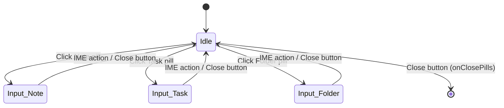
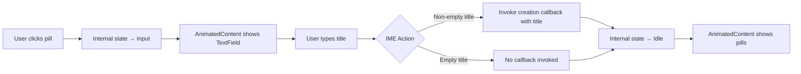

# Design Document: Inline Item Creation

## Overview

This feature transforms the `CreateItemPills` composable from a simple row of clickable pills into an inline creation flow. Currently, clicking a pill immediately fires a creation callback with no user input. The new design introduces an intermediate `Input_State` where the selected pill expands into a text field, allowing the user to type a title before confirming creation via the keyboard IME action.

The composable remains stateless at the API boundary — it receives UI state and emits callbacks — while managing local animation and text field state internally via Compose `remember`/`mutableStateOf`, consistent with the pattern established by `BottomNavigation`.

### Key Design Decisions

1. **Internal state machine over hoisted state**: The `CreateItemPills` composable manages its own `Idle_State`/`Input_State` transition internally. This keeps the parent (`BottomNavigation`) simple and avoids threading inline-creation state through the ViewModel. The composable's public API changes only in that creation callbacks now accept a `String` parameter (the entered title).

2. **`AnimatedContent` over `Crossfade`**: `AnimatedContent` provides fine-grained control over enter/exit transitions (slide, fade, size change), which is needed to animate individual pills disappearing while the text field expands. `Crossfade` only supports alpha transitions.

3. **Sealed interface for pill state**: A `PillsUiState` sealed interface with `Idle` and `Input(itemType)` variants makes the state machine explicit and exhaustive in `when` expressions.

## Architecture

The feature is scoped entirely within the `CreateItemPills` composable and its immediate surroundings. No ViewModel or repository changes are required.



### Data Flow



## Components and Interfaces

### Modified: `CreateItemPills`

The public API changes to accept `String`-parameterized creation callbacks:

```kotlin
@Composable
fun CreateItemPills(
    onCreateNote: (String) -> Unit,    // was () -> Unit
    onTaskCreate: (String) -> Unit,    // was () -> Unit
    onFolderCreate: (String) -> Unit,  // was () -> Unit
    onClosePills: () -> Unit
)
```

Internal state:
- `pillsState: PillsUiState` — tracked via `remember { mutableStateOf(PillsUiState.Idle) }`
- `textFieldValue: String` — tracked via `remember { mutableStateOf("") }`, reset on state transitions

Behavior:
- In `Idle`: renders three `CreateItemPill` composables + `RoundIconButton` (unchanged layout)
- In `Input(itemType)`: renders a styled `BasicTextField` filling available width + `RoundIconButton`
- `AnimatedContent(targetState = pillsState)` wraps the content switching
- On pill click: sets `pillsState = Input(itemType)`, clears text field
- On IME action: if text is non-empty, invokes the matching callback; always resets to `Idle`
- On close button in `Input`: resets to `Idle`, invokes `onClosePills`
- On close button in `Idle`: invokes `onClosePills`

### New: `PillsUiState` sealed interface

```kotlin
internal sealed interface PillsUiState {
    data object Idle : PillsUiState
    data class Input(val itemType: ItemType) : PillsUiState
}
```

This reuses the existing `net.onefivefour.echolist.data.models.ItemType` enum (`NOTE`, `TASK_LIST`, `FOLDER`). Only these three values are valid for `Input`; `UNSPECIFIED` is never used here.

### New: `ItemType` → color/label resolver

A helper function maps `ItemType` to the pill's color and display label:

```kotlin
@Composable
internal fun ItemType.pillColor(): Color = when (this) {
    ItemType.NOTE -> EchoListTheme.echoListColorScheme.noteColor
    ItemType.TASK_LIST -> EchoListTheme.echoListColorScheme.taskColor
    ItemType.FOLDER -> EchoListTheme.echoListColorScheme.folderColor
    ItemType.UNSPECIFIED -> Color.Transparent
}

internal fun ItemType.pillLabel(): String = when (this) {
    ItemType.NOTE -> "Note"
    ItemType.TASK_LIST -> "Task"
    ItemType.FOLDER -> "Folder"
    ItemType.UNSPECIFIED -> ""
}
```

### Modified: `BottomNavigation`

The `BottomNavigation` composable's creation callbacks change signature from `() -> Unit` to `(String) -> Unit` to pass through the title entered by the user:

```kotlin
@Composable
internal fun BottomNavigation(
    onNoteCreate: (String) -> Unit = {},   // was () -> Unit
    onTaskCreate: (String) -> Unit = {},   // was () -> Unit
    onFolderCreate: (String) -> Unit = {}  // was () -> Unit
)
```

### Modified: `HomeScreen`

Same callback signature change propagated up:

```kotlin
onNoteCreate: (String) -> Unit = {},
onTaskCreate: (String) -> Unit = {},
onFolderCreate: (String) -> Unit = {}
```

### Unchanged: `CreateItemPill`, `RoundIconButton`

These composables remain unchanged. `CreateItemPill` is still used in `Idle` state. `RoundIconButton` is used in both states.

### Animation Approach

The `AnimatedContent` composable wraps the content area (excluding the `RoundIconButton`, which stays outside the animation scope so it remains visible at all times):

```kotlin
Row(verticalAlignment = Alignment.CenterVertically) {
    AnimatedContent(
        targetState = pillsState,
        modifier = Modifier.weight(1f),
        transitionSpec = {
            (fadeIn(tween(200)) + expandHorizontally(expandFrom = Alignment.Start))
                .togetherWith(fadeOut(tween(200)) + shrinkHorizontally(shrinkTowards = Alignment.Start))
        }
    ) { state ->
        when (state) {
            PillsUiState.Idle -> { /* three pills in a Row */ }
            is PillsUiState.Input -> { /* BasicTextField styled as pill */ }
        }
    }
    Spacer(Modifier.width(EchoListTheme.dimensions.m))
    RoundIconButton(/* always visible */)
}
```

The `RoundIconButton` sits outside `AnimatedContent` so it never animates away. The `Modifier.weight(1f)` on `AnimatedContent` ensures the text field fills available space up to the button.

### TextField Styling

The `BasicTextField` in `Input` state is styled to match the pill appearance:
- Background: `itemType.pillColor()` (same color as the original pill)
- Shape: `RoundedCornerShape(50)` (fully rounded, matching `CreateItemPill`)
- Padding: horizontal `m` (12dp), vertical `s` (8dp) — matching `CreateItemPill`
- Text style: `EchoListTheme.typography.labelMedium` — matching `CreateItemPill`
- Single line, IME action `Done`
- Focus requested immediately via `FocusRequester` + `LaunchedEffect`

## Data Models

No new data models are introduced. The feature reuses:

- `ItemType` enum from `net.onefivefour.echolist.data.models` — identifies which pill type was selected
- `PillsUiState` sealed interface (new, internal to the composable file) — represents the two-state machine

### State Transitions

| Current State | Trigger | Next State | Side Effects |
|---|---|---|---|
| `Idle` | Click Note pill | `Input(NOTE)` | Clear text field |
| `Idle` | Click Task pill | `Input(TASK_LIST)` | Clear text field |
| `Idle` | Click Folder pill | `Input(FOLDER)` | Clear text field |
| `Input(type)` | IME action (non-empty) | `Idle` | Invoke creation callback with title |
| `Input(type)` | IME action (empty) | `Idle` | No callback invoked |
| `Input(type)` | Close button | `Idle` | Invoke `onClosePills` |
| `Idle` | Close button | — | Invoke `onClosePills` |


## Correctness Properties

*A property is a characteristic or behavior that should hold true across all valid executions of a system — essentially, a formal statement about what the system should do. Properties serve as the bridge between human-readable specifications and machine-verifiable correctness guarantees.*

### Property 1: Pill selection transitions to correct Input state

*For any* item type in {NOTE, TASK_LIST, FOLDER}, clicking the corresponding pill while in Idle state should produce an Input state with that exact item type selected.

**Validates: Requirements 1.1, 1.2, 1.3**

### Property 2: Item type color mapping is consistent

*For any* item type in {NOTE, TASK_LIST, FOLDER}, the `pillColor()` resolver should return the matching color from `EchoListColorScheme` (noteColor for NOTE, taskColor for TASK_LIST, folderColor for FOLDER), and this mapping should be a bijection (no two item types share a color).

**Validates: Requirements 3.3**

### Property 3: IME confirm with non-empty title invokes correct callback and resets

*For any* item type and any non-empty string title, triggering the IME action while in Input state should invoke exactly the creation callback corresponding to that item type with the entered title as argument, and the state should transition back to Idle.

**Validates: Requirements 4.1, 4.2**

### Property 4: IME confirm with empty title resets without callback

*For any* item type, triggering the IME action while in Input state with an empty (or whitespace-only) title should transition the state back to Idle without invoking any creation callback.

**Validates: Requirements 4.3**

### Property 5: Close button in Input state resets and invokes onClosePills

*For any* item type, clicking the close button while in Input state should transition the state back to Idle and invoke the `onClosePills` callback exactly once.

**Validates: Requirements 5.3, 5.4**

## Error Handling

This feature has a minimal error surface since it operates entirely within the UI layer with no network or persistence calls.

| Scenario | Handling |
|---|---|
| Empty title on IME confirm | Transition to Idle without invoking creation callback (Requirement 4.3) |
| Rapid pill clicks during animation | `AnimatedContent` handles this gracefully — it interrupts the current animation and starts a new one toward the latest target state |
| Focus request failure | `FocusRequester.requestFocus()` is called inside a `LaunchedEffect` keyed on the Input state. If focus cannot be acquired (e.g., another component holds focus), the text field remains visible but the keyboard may not appear. No crash or error state. |
| Very long title input | `BasicTextField` with `singleLine = true` handles horizontal scrolling natively. No truncation or validation needed at this layer — title length validation is the responsibility of the creation callback consumer. |

## Testing Strategy

### Property-Based Testing

Library: **Kotest Property** (`io.kotest.property`)

Each correctness property maps to a single property-based test using `checkAll` with `PropTestConfig(iterations = 100)`. Tests are placed in `composeApp/src/commonTest/kotlin/net/onefivefour/echolist/ui/home/`.

The state machine logic (pill selection, IME confirm, close button behavior) should be extracted into a pure function or testable helper so that property tests can exercise it without requiring a Compose runtime. This follows the pattern already established in the project (e.g., `FileMapperPropertyTest` tests pure mapping functions).

Specifically:
- Extract a `resolveImeAction(itemType: ItemType, title: String)` function that returns which callback to invoke (or null for empty titles)
- Extract the `pillColor()` and `pillLabel()` resolvers as pure functions
- The state machine transitions can be modeled as a pure function: `nextState(current: PillsUiState, action: PillsAction): PillsUiState`

Each test must be tagged with a comment referencing the design property:
- **Feature: inline-item-creation, Property 1: Pill selection transitions to correct Input state**
- **Feature: inline-item-creation, Property 2: Item type color mapping is consistent**
- **Feature: inline-item-creation, Property 3: IME confirm with non-empty title invokes correct callback and resets**
- **Feature: inline-item-creation, Property 4: IME confirm with empty title resets without callback**
- **Feature: inline-item-creation, Property 5: Close button in Input state resets and invokes onClosePills**

### Unit Testing

Unit tests complement property tests for specific examples and edge cases:

- Verify that `onClosePills` is invoked when close button is clicked in Idle state (Requirement 5.5)
- Verify the `AnimatedContent` renders the correct content for each state (smoke test)
- Verify `FocusRequester.requestFocus()` is called when entering Input state
- Verify text field is cleared when transitioning from one Input type to another (if the user clicks a different pill while already in Input — though current design resets to Idle first)

### Test File Structure

```
composeApp/src/commonTest/kotlin/net/onefivefour/echolist/ui/home/
├── CreateItemPillsPropertyTest.kt    # Property-based tests (Properties 1-5)
└── CreateItemPillsTest.kt            # Unit tests for edge cases and examples
```
