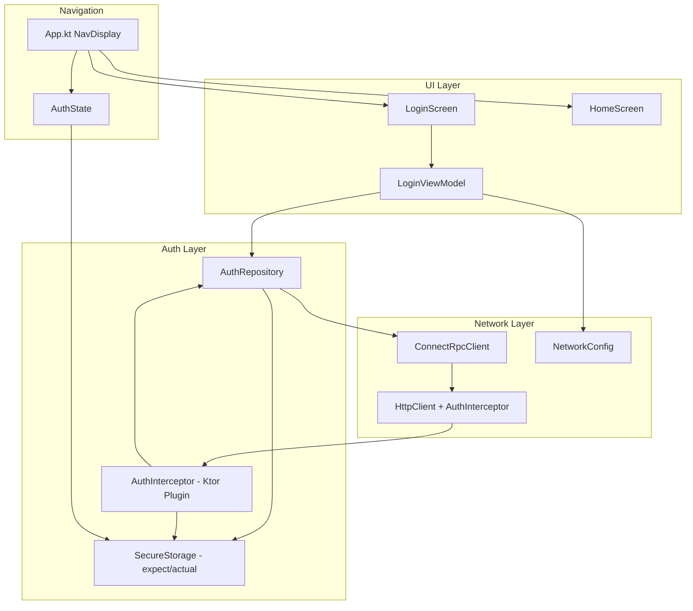

# Design Document: JWT Authentication

## Overview

This design adds JWT authentication to the EchoList Compose Multiplatform app. The implementation introduces a login screen, platform-specific secure token storage via `expect`/`actual`, a Ktor-level auth interceptor for automatic Bearer token attachment and 401-triggered refresh, and navigation gating that directs users to the login screen or home screen based on authentication state.

The auth flow uses ConnectRPC protobuf endpoints (`Login`, `RefreshToken`) defined in the `auth.v1` package. The existing `ConnectRpcClient` is extended with an auth-aware wrapper, and the Ktor `HttpClient` gains an interceptor plugin. Platform targets are Android (EncryptedSharedPreferences) and JS/WasmJS (localStorage). iOS and Desktop are deferred.

## Architecture



The auth layer sits between the UI and network layers. `AuthRepository` orchestrates login and refresh calls through `ConnectRpcClient`. `AuthInterceptor` is a Ktor plugin that reads tokens from `SecureStorage`, attaches Bearer headers, and handles 401 refresh-and-retry. Navigation observes `AuthState` derived from `SecureStorage` to decide which screen to show.

## Components and Interfaces

### SecureStorage (expect/actual)

```kotlin
// commonMain
expect class SecureStorage {
    fun get(key: String): String?
    fun put(key: String, value: String)
    fun delete(key: String)
}

object StorageKeys {
    const val ACCESS_TOKEN = "access_token"
    const val REFRESH_TOKEN = "refresh_token"
    const val BACKEND_URL = "backend_url"
}
```

**Android** (`androidMain`): Backed by `EncryptedSharedPreferences` from AndroidX Security.

```kotlin
actual class SecureStorage(private val context: Context) {
    private val prefs = EncryptedSharedPreferences.create(
        "echolist_secure_prefs",
        MasterKeys.getOrCreate(MasterKeys.AES256_GCM_SPEC),
        context,
        EncryptedSharedPreferences.PrefKeyEncryptionScheme.AES256_SIV,
        EncryptedSharedPreferences.PrefValueEncryptionScheme.AES256_GCM
    )
    actual fun get(key: String): String? = prefs.getString(key, null)
    actual fun put(key: String, value: String) = prefs.edit().putString(key, value).apply()
    actual fun delete(key: String) = prefs.edit().remove(key).apply()
}
```

**JS/WasmJS** (`webMain` or separate `jsMain`/`wasmJsMain`): Backed by `localStorage`.

```kotlin
actual class SecureStorage {
    actual fun get(key: String): String? = localStorage.getItem(key)
    actual fun put(key: String, value: String) = localStorage.setItem(key, value)
    actual fun delete(key: String) = localStorage.removeItem(key)
}
```

### AuthRepository

Handles login and refresh logic. Does not depend on Ktor directly — uses `ConnectRpcClient`.

```kotlin
interface AuthRepository {
    suspend fun login(baseUrl: String, username: String, password: String): Result<Unit>
    suspend fun refreshToken(): Result<String>  // returns new access token
    fun isAuthenticated(): Boolean
    fun clearAuth()
    fun getAccessToken(): String?
    fun getBaseUrl(): String?
}
```

`AuthRepositoryImpl` uses `ConnectRpcClient` for the two auth RPCs and `SecureStorage` for persistence. On successful login, it stores both tokens and the backend URL. On refresh, it updates the access token. On `clearAuth`, it deletes all three keys.

The `login` method needs a dedicated `ConnectRpcClient` instance (or direct Ktor call) because the base URL is not yet known at DI time — it comes from user input. The implementation creates a temporary `HttpClient` call to the user-provided URL for login, then configures the main client's `NetworkConfig` on success.

### AuthInterceptor (Ktor Plugin)

A Ktor `HttpClient` plugin that:

1. On every outgoing request (except login/refresh paths), reads the access token from `SecureStorage` and adds `Authorization: Bearer <token>`.
2. On 401 response, acquires a mutex, checks if another coroutine already refreshed, calls `AuthRepository.refreshToken()`, stores the new token, and retries the original request.
3. If refresh fails, calls `AuthRepository.clearAuth()` and emits an auth-required event via a `SharedFlow`.

```kotlin
val AuthInterceptor = createClientPlugin("AuthInterceptor") {
    val authRepository: AuthRepository = /* injected */
    val authEventFlow: MutableSharedFlow<AuthEvent> = /* injected */
    val refreshMutex = Mutex()

    onRequest { request, _ ->
        val path = request.url.encodedPath
        if (!isAuthEndpoint(path)) {
            authRepository.getAccessToken()?.let { token ->
                request.header("Authorization", "Bearer $token")
            }
        }
    }

    on(ResponseHook) { response ->
        if (response.status.value == 401 && !isAuthEndpoint(response.request.url.encodedPath)) {
            refreshMutex.withLock {
                val result = authRepository.refreshToken()
                if (result.isFailure) {
                    authRepository.clearAuth()
                    authEventFlow.emit(AuthEvent.ReAuthRequired)
                }
            }
            // retry original request with new token
        }
    }
}
```

The `isAuthEndpoint` check excludes `/auth.v1.AuthService/Login` and `/auth.v1.AuthService/RefreshToken` from token attachment and 401 interception.

### AuthState

An observable authentication state used by navigation:

```kotlin
sealed interface AuthState {
    data object Loading : AuthState
    data object Authenticated : AuthState
    data object Unauthenticated : AuthState
}
```

`AuthViewModel` (or a top-level state holder in `App.kt`) checks `SecureStorage` for an existing access token on startup and exposes `AuthState` as a `StateFlow`. It also collects `AuthEvent.ReAuthRequired` from the interceptor to transition back to `Unauthenticated`.

### LoginViewModel

```kotlin
class LoginViewModel(
    private val authRepository: AuthRepository,
    private val secureStorage: SecureStorage
) : ViewModel() {

    data class UiState(
        val backendUrl: String = "",
        val username: String = "",
        val password: String = "",
        val isLoading: Boolean = false,
        val error: String? = null,
        val backendUrlError: String? = null,
        val usernameError: String? = null,
        val passwordError: String? = null
    )

    val uiState: StateFlow<UiState>

    fun onBackendUrlChanged(value: String)
    fun onUsernameChanged(value: String)
    fun onPasswordChanged(value: String)
    fun onLoginClick()
}
```

On init, reads stored backend URL from `SecureStorage` and prefills. `onLoginClick` validates all fields (non-blank), sets field-level errors, then calls `authRepository.login(...)`. On success, the `AuthState` transitions to `Authenticated` and navigation moves to `HomeScreen`.

### LoginScreen (Composable)

Stateless composable following existing patterns:

```kotlin
@Composable
fun LoginScreen(
    uiState: LoginViewModel.UiState,
    onBackendUrlChanged: (String) -> Unit,
    onUsernameChanged: (String) -> Unit,
    onPasswordChanged: (String) -> Unit,
    onLoginClick: () -> Unit
)
```

Layout: Centered `Column` with app title (titleLarge), three `OutlinedTextField`s (backend URL, username, password), field-level error text (bodySmall, secondary color), a `Button` for login, and a general error message area. Password field uses `visualTransformation = PasswordVisualTransformation()`. All styling via `MaterialTheme` tokens and `LocalEchoListDimensions`.

### Navigation Changes (App.kt)

```kotlin
@Composable
fun App() {
    EchoListTheme {
        val authViewModel = koinViewModel<AuthViewModel>()
        val authState by authViewModel.authState.collectAsStateWithLifecycle()

        when (authState) {
            AuthState.Loading -> { /* splash or empty */ }
            AuthState.Unauthenticated -> {
                val loginVm = koinViewModel<LoginViewModel>()
                val loginState by loginVm.uiState.collectAsStateWithLifecycle()
                LoginScreen(
                    uiState = loginState,
                    onBackendUrlChanged = loginVm::onBackendUrlChanged,
                    onUsernameChanged = loginVm::onUsernameChanged,
                    onPasswordChanged = loginVm::onPasswordChanged,
                    onLoginClick = loginVm::onLoginClick
                )
            }
            AuthState.Authenticated -> {
                // existing NavDisplay with HomeRoute / NoteDetailRoute
            }
        }
    }
}
```

The existing `NavDisplay` with `HomeRoute` and `NoteDetailRoute` moves inside the `Authenticated` branch. Login success triggers `AuthState.Authenticated`. Refresh failure triggers `AuthState.Unauthenticated`.

### Wire Protobuf Configuration

Add `auth.proto` to the `proto/` directory. Update `wire {}` block in `build.gradle.kts`:

```kotlin
wire {
    kotlin {
        out = "${layout.buildDirectory.get()}/generated/wire"
    }
    sourcePath {
        srcDir("${rootProject.projectDir}/proto")
    }
    prune("notes.v1.NotesService")
    prune("auth.v1.AuthService")  // prune service, keep messages
}
```

This generates `LoginRequest`, `LoginResponse`, `RefreshTokenRequest`, `RefreshTokenResponse` message classes while pruning the gRPC service stubs (we use ConnectRPC manually).

### Koin DI Updates

New modules added to `AppModules.kt`:

```kotlin
val authModule: Module = module {
    single { SecureStorage(/* platform params */) }
    single<AuthRepository> { AuthRepositoryImpl(secureStorage = get()) }
    single { MutableSharedFlow<AuthEvent>() }
    viewModel { AuthViewModel(authRepository = get(), authEvents = get()) }
    viewModel { LoginViewModel(authRepository = get(), secureStorage = get()) }
}
```

The `networkModule` is updated so that `HttpClient` installs the `AuthInterceptor` plugin, and `NetworkConfig` becomes mutable (backed by `SecureStorage` for the base URL).

## Data Models

### Protobuf Messages (Wire-generated)

From `auth.proto`:

```kotlin
// Generated by Wire
data class LoginRequest(val username: String, val password: String)
data class LoginResponse(val access_token: String, val refresh_token: String)
data class RefreshTokenRequest(val refresh_token: String)
data class RefreshTokenResponse(val access_token: String)
```

### Auth Domain Models

```kotlin
sealed interface AuthEvent {
    data object ReAuthRequired : AuthEvent
}

sealed interface AuthState {
    data object Loading : AuthState
    data object Authenticated : AuthState
    data object Unauthenticated : AuthState
}
```

### LoginUiState

```kotlin
data class LoginUiState(
    val backendUrl: String = "",
    val username: String = "",
    val password: String = "",
    val isLoading: Boolean = false,
    val error: String? = null,
    val backendUrlError: String? = null,
    val usernameError: String? = null,
    val passwordError: String? = null
)
```

### Storage Keys

```kotlin
object StorageKeys {
    const val ACCESS_TOKEN = "access_token"
    const val REFRESH_TOKEN = "refresh_token"
    const val BACKEND_URL = "backend_url"
}
```


## Correctness Properties

*A property is a characteristic or behavior that should hold true across all valid executions of a system — essentially, a formal statement about what the system should do. Properties serve as the bridge between human-readable specifications and machine-verifiable correctness guarantees.*

### Property 1: Blank field validation rejects submission

*For any* login form submission where at least one required field (backend URL, username, or password) is a string composed entirely of whitespace characters, the system should reject the submission and set the corresponding field-level error message to a non-null value, while leaving the other fields' errors unchanged.

**Validates: Requirements 1.3, 1.4, 1.5**

### Property 2: Backend URL prefill round-trip

*For any* non-null string stored under the `BACKEND_URL` key in SecureStorage, when LoginViewModel initializes, its UiState.backendUrl should equal that stored string.

**Validates: Requirements 1.2, 7.2**

### Property 3: Valid submission triggers loading state

*For any* login form state where all three fields (backend URL, username, password) are non-blank strings, calling `onLoginClick` should transition `isLoading` to true and all field-level errors to null.

**Validates: Requirements 1.6**

### Property 4: Login request construction

*For any* username and password string pair, when `AuthRepository.login` is called, the system should send a `LoginRequest` protobuf message to the `/auth.v1.AuthService/Login` path where the request's `username` and `password` fields match the provided values.

**Validates: Requirements 2.1**

### Property 5: Successful login persists all credentials

*For any* successful `LoginResponse` containing an access_token, refresh_token, and the provided backend URL, after login completes, `SecureStorage.get(ACCESS_TOKEN)` should return the access_token, `SecureStorage.get(REFRESH_TOKEN)` should return the refresh_token, and `SecureStorage.get(BACKEND_URL)` should return the backend URL.

**Validates: Requirements 2.2, 2.3, 7.1**

### Property 6: Login errors surface to UI

*For any* error result returned by `AuthRepository.login` (network error, client error, timeout, server error), the LoginViewModel's UiState should have a non-null `error` message and `isLoading` set to false.

**Validates: Requirements 2.4**

### Property 7: SecureStorage put/get/delete round-trip

*For any* key-value string pair (k, v): (a) `put(k, v)` then `get(k)` returns `v`; (b) `put(k, v)` then `delete(k)` then `get(k)` returns null; (c) `put(k, v1)` then `put(k, v2)` then `get(k)` returns `v2`.

**Validates: Requirements 3.4, 3.5, 3.6**

### Property 8: 401 triggers refresh-store-retry

*For any* authenticated request to a non-auth endpoint that receives a 401 response, the Auth_Interceptor should: (a) call `RefreshToken` with the stored refresh_token, (b) store the new access_token from the response, and (c) retry the original request with the new access_token in the Bearer header.

**Validates: Requirements 4.1, 4.2, 4.3**

### Property 9: Refresh failure clears auth

*For any* refresh token request that fails (any error type), the Auth_Interceptor should delete all tokens from SecureStorage (ACCESS_TOKEN, REFRESH_TOKEN) and emit an `AuthEvent.ReAuthRequired` event.

**Validates: Requirements 4.4**

### Property 10: Bearer token attachment on non-auth endpoints

*For any* outgoing request to a path that is not `/auth.v1.AuthService/Login` or `/auth.v1.AuthService/RefreshToken`, and where an access_token exists in SecureStorage, the request should contain an `Authorization` header with value `Bearer <access_token>`.

**Validates: Requirements 5.1**

### Property 11: AuthState reflects storage

*For any* SecureStorage state, `AuthState` should be `Authenticated` if and only if `SecureStorage.get(ACCESS_TOKEN)` returns a non-null value; otherwise it should be `Unauthenticated`.

**Validates: Requirements 6.1, 6.2**

### Property 12: NetworkConfig uses correct backend URL

*For any* backend URL string, after a successful login or app startup with stored tokens, `NetworkConfig.baseUrl` should equal that backend URL.

**Validates: Requirements 8.1, 8.2**

## Error Handling

### Login Errors

| Error Source | Behavior |
|---|---|
| Blank field submitted | Field-level error message set on the specific field(s). No network call made. |
| Network unreachable / timeout | General error message displayed: "Could not reach the server. Check the URL and your connection." |
| 401 from Login endpoint | General error message: "Invalid username or password." |
| Other server errors (5xx) | General error message: "Server error. Please try again later." |
| Malformed response | General error message: "Unexpected response from server." |

All errors set `isLoading = false` and re-enable the submit button.

### Token Refresh Errors

| Error Source | Behavior |
|---|---|
| Refresh returns 401 (expired refresh token) | Clear all tokens, emit `ReAuthRequired`, navigate to LoginScreen. |
| Network error during refresh | Same as above — clear tokens and force re-login. |
| Timeout during refresh | Same as above. |

### SecureStorage Errors

Platform-specific storage failures (e.g., Android keystore unavailable) are caught and wrapped. The app falls back to treating the user as unauthenticated, showing the login screen.

### Concurrent 401 Handling

A `Mutex` in the interceptor ensures only one refresh call happens at a time. Concurrent 401-triggered coroutines wait on the mutex and then use the already-refreshed token for their retry.

## Testing Strategy

### Property-Based Testing

Library: **Kotest Property** (`io.kotest.property`) — already in the project's `commonTest` dependencies.

Each correctness property maps to a single property-based test with a minimum of 100 iterations. Tests are tagged with the property number and feature name.

Tag format: `Feature: jwt-authentication, Property {N}: {title}`

Properties to implement as PBT:
- Property 1 (blank field validation) — Generate arbitrary whitespace strings for each field, verify rejection.
- Property 2 (URL prefill) — Generate arbitrary URL strings, verify prefill.
- Property 3 (loading state) — Generate arbitrary non-blank field triples, verify loading transition.
- Property 5 (credential persistence) — Generate arbitrary token/URL triples, verify storage.
- Property 6 (error surfacing) — Generate arbitrary error types, verify UI state.
- Property 7 (SecureStorage round-trip) — Generate arbitrary key/value pairs, verify get/put/delete semantics.
- Property 10 (Bearer attachment) — Generate arbitrary non-auth paths and tokens, verify header.
- Property 11 (AuthState from storage) — Generate arbitrary storage states (token present/absent), verify AuthState.
- Property 12 (NetworkConfig URL) — Generate arbitrary URL strings, verify config update.

### Unit Testing

Unit tests complement property tests for specific examples, edge cases, and integration points:

- Login flow happy path with mocked ConnectRpcClient
- Login flow with each specific error type (401, 500, timeout, network error)
- Auth interceptor: 401 → refresh → retry with mocked HTTP responses
- Auth interceptor: refresh failure → clear tokens → emit ReAuthRequired
- Auth interceptor: concurrent 401s result in single refresh call
- AuthViewModel startup with/without stored token
- LoginViewModel field validation edge cases (empty string vs whitespace vs valid)
- Navigation transitions: Unauthenticated → Authenticated → Unauthenticated

### Test Infrastructure

- Use `ktor-client-mock` (already in commonTest) for HTTP response simulation
- Use a simple in-memory `SecureStorage` implementation for common tests
- Use Kotest `FunSpec` or `StringSpec` as the test framework
- Property tests use `checkAll` from `io.kotest.property` with `iterations = 100`
- Use `Arb.string()`, `Arb.whitespace()`, custom `Arb` generators for domain types
