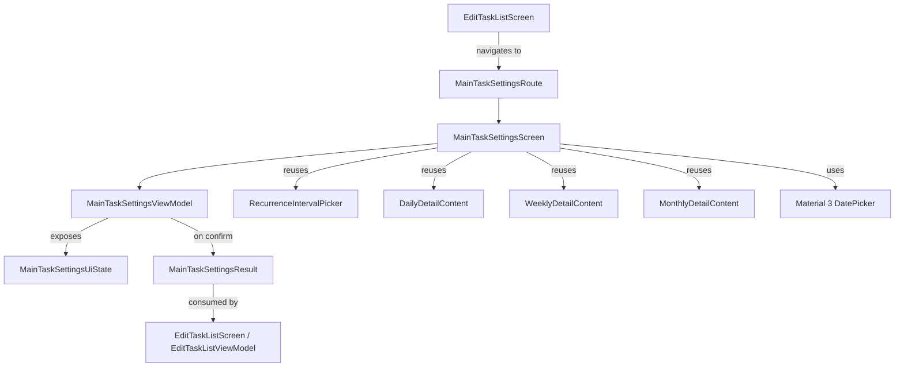

# Design Document: Main Task Settings Screen

## Overview

This design describes the refactoring of the main task due-date and recurrence editing UI from a `ModalBottomSheet` (`TaskDateBottomSheet.kt`) into a dedicated full-screen settings screen with its own navigation route, package, and ViewModel. The existing recurrence picker components (`RecurrenceIntervalPicker`, `DailyDetailContent`, `WeeklyDetailContent`, `MonthlyDetailContent`) are relocated to a shared package and reused. The `EditTaskListScreen` drops all bottom-sheet state and instead navigates to the new route, receiving results back when the user confirms.

### Key Design Decisions

1. **Full-screen route over bottom sheet** — gives more room for the DatePicker + recurrence controls and follows the existing navigation pattern.
2. **Dedicated ViewModel** — the settings screen owns its own transient state (selected date, recurrence config). The `EditTaskListViewModel` is only updated on confirmation.
3. **Result passing via back-stack entry** — the settings screen pops itself and the edit screen reads the result. AndroidX Navigation 3 does not have a built-in `savedStateHandle` result API, so we use a lightweight in-memory result holder (a `SharedFlow` or a Koin-scoped result object) keyed by `mainTaskId`.
4. **Shared recurrence package** — recurrence components move from `ui.edittasklist` to a new `ui.recurrence` package so both the settings screen and any future consumers can import them without circular dependencies.

## Architecture



### Navigation Flow

1. User taps calendar icon or due-date tag on `MainTaskCard`.
2. `EditTaskListScreen` callback adds `MainTaskSettingsRoute(mainTaskId, currentDueDate, currentRecurrence)` to the back stack.
3. `NavDisplay` renders `MainTaskSettingsScreen` via a new `entry<MainTaskSettingsRoute>` block in `App.kt`.
4. On confirm, `MainTaskSettingsViewModel` publishes a `MainTaskSettingsResult` to a Koin-scoped `MutableSharedFlow<MainTaskSettingsResult>` and pops the back stack.
5. `EditTaskListViewModel` collects from the same shared flow and applies the result to the matching `UiMainTask`.
6. On dismiss (back without confirm), the screen simply pops — no result is emitted.

## Components and Interfaces

### New Types

| Type | Location | Description |
|---|---|---|
| `MainTaskSettingsRoute` | `ui.navigation.Routes.kt` | `@Serializable data class` implementing `NavKey`. Params: `mainTaskId: Long`, `currentDueDate: String`, `currentRecurrence: String`. |
| `MainTaskSettingsScreen` | `ui.maintasksettings` | Stateless composable. Receives `MainTaskSettingsUiState` + callbacks. |
| `MainTaskSettingsViewModel` | `ui.maintasksettings` | Owns date-picker state and `RecurrenceState`. Accepts initial values from route params. |
| `MainTaskSettingsUiState` | `ui.maintasksettings` | Data class: `selectedDueDate: String`, `recurrenceState: RecurrenceState`, `initialDateMillis: Long?`. |
| `MainTaskSettingsResult` | `ui.maintasksettings` | Data class: `mainTaskId: Long`, `dueDate: String`, `recurrence: String`. |

### Relocated Types

The following move from `ui.edittasklist` → `ui.recurrence`:

- `RecurrenceInterval`
- `RecurrenceState`
- `RecurrenceIntervalPicker`
- `DailyDetailContent`
- `WeeklyDetailContent`
- `MonthlyDetailContent`
- `RecurrenceValidation` (`isValidPositiveInt`, `isValidDayOfMonth`)

### Modified Types

| Type | Change |
|---|---|
| `EditTaskListScreen` | Remove `activeDateSheet` state, `TaskDateBottomSheet` invocation. Replace `onOpenTaskDateSheet` callback with `onNavigateToSettings: (Long) -> Unit`. |
| `EditTaskListViewModel` | Add collection of `MainTaskSettingsResult` flow. Remove `onDueDateSelected` (replaced by result handling). |
| `App.kt` | Add `entry<MainTaskSettingsRoute>` block. Wire up result flow. |
| `Routes.kt` | Add `MainTaskSettingsRoute`. Register in `navKeySerializersModule`. |
| `AppModules.kt` | Register `MainTaskSettingsViewModel` in `navigationModule`. Add `single` for the result `MutableSharedFlow`. |

### Deleted Types

| Type | Reason |
|---|---|
| `TaskDateBottomSheet` | Replaced by `MainTaskSettingsScreen`. |
| `TaskDateSheetState` | No longer needed — route params carry the data. |

### Helper Functions

`dueDateToUtcMillis` and `utcMillisToDueDate` move from `TaskDateBottomSheet.kt` to a new `ui.maintasksettings.DateConversions.kt` utility file (or `ui.recurrence` if preferred), since they are pure conversion functions used by the new screen.

## Data Models

### MainTaskSettingsRoute

```kotlin
@Serializable
data class MainTaskSettingsRoute(
    val mainTaskId: Long,
    val currentDueDate: String,
    val currentRecurrence: String
) : NavKey
```

### MainTaskSettingsUiState

```kotlin
data class MainTaskSettingsUiState(
    val selectedDueDate: String,
    val recurrenceState: RecurrenceState,
    val initialDateMillis: Long?
)
```

### MainTaskSettingsResult

```kotlin
data class MainTaskSettingsResult(
    val mainTaskId: Long,
    val dueDate: String,
    val recurrence: String
)
```

### RecurrenceState → RRULE Conversion

The `MainTaskSettingsViewModel` needs to convert between `RecurrenceState` (UI model) and RRULE strings (domain model). Two pure functions are required:

```kotlin
fun RecurrenceState.toRrule(): String
fun rruleToRecurrenceState(rrule: String): RecurrenceState
```

These are the primary candidates for property-based testing (round-trip property).

### Mutual Exclusion Logic

Encapsulated in `MainTaskSettingsViewModel`:
- Setting a date clears recurrence to `RecurrenceState.Off`.
- Setting a recurrence interval ≠ Off clears the due date to `""`.

This mirrors the existing `observeDueDateRecurrenceExclusion` logic in `EditTaskListViewModel`, but is simpler because the settings screen manages a single task at a time.

## Correctness Properties

*A property is a characteristic or behavior that should hold true across all valid executions of a system — essentially, a formal statement about what the system should do. Properties serve as the bridge between human-readable specifications and machine-verifiable correctness guarantees.*

### Property 1: RRULE round-trip

*For any* valid `RecurrenceState` instance, converting it to an RRULE string via `toRrule()` and then parsing it back via `rruleToRecurrenceState()` shall produce a `RecurrenceState` equal to the original.

**Validates: Requirements 4.5**

### Property 2: Date conversion round-trip

*For any* valid `YYYY-MM-DD` date string, converting it to UTC milliseconds via `dueDateToUtcMillis()` and back via `utcMillisToDueDate()` shall produce the original date string.

**Validates: Requirements 3.1, 4.3**

### Property 3: Selecting a date clears recurrence

*For any* `MainTaskSettingsViewModel` whose recurrence state is not `Off`, and *for any* valid date string, calling `onDateSelected(date)` shall result in the recurrence state being `RecurrenceState.Off` and the due date state being the selected date.

**Validates: Requirements 5.1**

### Property 4: Selecting a recurrence clears due date

*For any* `MainTaskSettingsViewModel` whose due date is non-empty, and *for any* recurrence interval other than `Off`, calling `onRecurrenceIntervalSelected(interval)` shall result in the due date state being empty (`""`) and the recurrence state reflecting the selected interval.

**Validates: Requirements 5.2**

## Error Handling

| Scenario | Handling |
|---|---|
| Invalid `currentDueDate` passed via route (not YYYY-MM-DD) | `dueDateToUtcMillis` returns `null`; DatePicker initializes to today's date. No crash. |
| Invalid `currentRecurrence` passed via route (malformed RRULE) | `rruleToRecurrenceState` returns `RecurrenceState.Off`. Recurrence picker shows "Off". |
| User confirms with no date and no recurrence | Result emitted with `dueDate = ""` and `recurrence = ""`. Edit screen clears both fields on the task. |
| Back-stack pop race condition | The result `SharedFlow` uses `replay = 0` and `BufferOverflow.DROP_OLDEST`. If the edit screen is not collecting when the result is emitted, the result is dropped — equivalent to a dismiss. |
| ViewModel cleared before result consumed | The `SharedFlow` is Koin-scoped to the navigation graph lifetime, not to either ViewModel. It survives individual ViewModel destruction. |

## Testing Strategy

### Unit Tests (example-based)

- **ViewModel initialization**: Verify `MainTaskSettingsViewModel` initializes state from constructor params (date picker millis, recurrence state parsed from RRULE).
- **Date selection**: Call `onDateSelected`, verify `uiState` updates.
- **Recurrence selection**: Call `onRecurrenceIntervalSelected` for each interval, verify `uiState` updates with correct `RecurrenceState` subtype.
- **Confirm emits result**: Set state, call `onConfirm`, verify `MainTaskSettingsResult` is emitted with correct `mainTaskId`, `dueDate`, and `recurrence`.
- **Dismiss emits no result**: Navigate back without confirming, verify no result is emitted.
- **Result consumption**: In `EditTaskListViewModel`, emit a `MainTaskSettingsResult`, verify the matching `UiMainTask` is updated and others are untouched.
- **Detail content mapping**: Verify each `RecurrenceInterval` maps to the correct detail composable (Daily → `DailyDetailContent`, etc.).

### Property-Based Tests (Kotest Property)

Each property test runs a minimum of **100 iterations** using `kotest-property` generators.

- **Feature: main-task-settings-screen, Property 1: RRULE round-trip**
  Generator: Random `RecurrenceState` instances (Off, Daily with random day sets, Weekly with random week counts 1–52, Monthly with random month counts 1–12 and day 1–31, Yearly).
  Assertion: `rruleToRecurrenceState(state.toRrule()) == state`.

- **Feature: main-task-settings-screen, Property 2: Date conversion round-trip**
  Generator: Random `LocalDate` instances within a reasonable range (2000-01-01 to 2099-12-31), formatted as `YYYY-MM-DD`.
  Assertion: `utcMillisToDueDate(dueDateToUtcMillis(dateString)!!) == dateString`.

- **Feature: main-task-settings-screen, Property 3: Selecting a date clears recurrence**
  Generator: Random non-Off `RecurrenceState` + random valid date string.
  Assertion: After `onDateSelected`, `recurrenceState == RecurrenceState.Off` and `selectedDueDate == date`.

- **Feature: main-task-settings-screen, Property 4: Selecting a recurrence clears due date**
  Generator: Random non-empty date string + random non-Off `RecurrenceInterval`.
  Assertion: After `onRecurrenceIntervalSelected`, `selectedDueDate == ""` and `recurrenceState.interval == interval`.

### Integration Tests

- Navigation: Add `MainTaskSettingsRoute` to back stack, verify `MainTaskSettingsScreen` renders.
- Full flow: Navigate from `EditTaskListScreen` → settings → confirm → verify task updated on edit screen.

