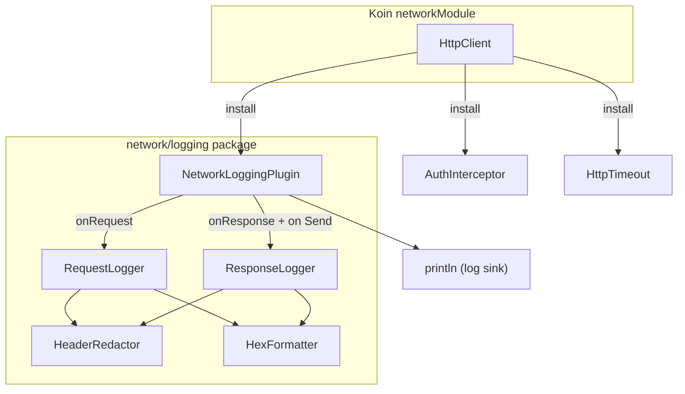

# Design Document: Network Request Logging

## Overview

This feature adds a Ktor `HttpClient` plugin that intercepts all HTTP traffic and emits structured log entries for outgoing requests and incoming responses. Binary protobuf payloads are displayed in hex format, sensitive headers (Authorization, token-related) are redacted, and error responses are logged at elevated severity levels. The plugin is installed alongside the existing `AuthInterceptor` in the `networkModule` Koin module and operates entirely in Kotlin common code using `println` for cross-platform compatibility.

### Design Decisions

- **Ktor `createClientPlugin` API**: Reuses the same plugin pattern as `AuthInterceptor`, keeping the networking layer consistent.
- **`println` over logging frameworks**: Avoids platform-specific logging dependencies (e.g., `android.util.Log`, `NSLog`). All KMP targets support `println`.
- **Hex formatting as a pure function**: Body formatting is extracted into a standalone utility so it can be tested independently of Ktor.
- **Header redaction as a pure function**: Redaction logic is isolated for direct property-based testing without HTTP infrastructure.
- **`TimeSource.Monotonic` for elapsed time**: Provides accurate duration measurement across all KMP targets without `System.nanoTime()`.

## Architecture



The plugin hooks into Ktor's request/response pipeline. Pure utility functions (`HeaderRedactor`, `HexFormatter`) handle formatting and redaction. The plugin configuration holds the minimum log level threshold.

## Components and Interfaces

### 1. `LogLevel` enum

```kotlin
package net.onefivefour.echolist.data.network.logging

enum class LogLevel { DEBUG, INFO, WARN, ERROR }
```

Ordered by severity. The plugin suppresses messages below the configured minimum.

### 2. `HexFormatter` object

```kotlin
package net.onefivefour.echolist.data.network.logging

object HexFormatter {
    private const val MAX_BYTES = 1024

    /**
     * Formats [bytes] as space-separated uppercase hex octets.
     * Truncates at 1024 bytes and appends a truncation suffix.
     * Always includes total size.
     */
    fun format(bytes: ByteArray): String
}
```

- Empty array → `"empty body"`
- ≤1024 bytes → `"0A 1B 2C (3 bytes)"`
- \>1024 bytes → first 1024 octets + `"... (truncated, 2048 bytes total)"`

### 3. `HeaderRedactor` object

```kotlin
package net.onefivefour.echolist.data.network.logging

object HeaderRedactor {
    private const val REDACTED = "[REDACTED]"

    /**
     * Returns a redacted copy of [headers].
     * Sensitive headers: "Authorization" (case-insensitive) or
     * any header name containing "token" (case-insensitive).
     */
    fun redact(headers: Map<String, List<String>>): Map<String, List<String>>
}
```

### 4. `NetworkLoggingPlugin`

```kotlin
package net.onefivefour.echolist.data.network.logging

import io.ktor.client.plugins.api.createClientPlugin

val NetworkLoggingPlugin = createClientPlugin("NetworkLoggingPlugin", ::NetworkLoggingConfig) {
    // onRequest: capture start time, emit Request_Log_Entry at DEBUG
    // on(Send): proceed, capture response, compute elapsed time,
    //           emit Response_Log_Entry at DEBUG or WARN (4xx/5xx),
    //           catch exceptions and emit ERROR entry
}

class NetworkLoggingConfig {
    var minLogLevel: LogLevel = LogLevel.DEBUG
}
```

The plugin:
1. **onRequest**: Records `TimeSource.Monotonic.markNow()`, formats and emits the request log entry if `DEBUG >= minLogLevel`.
2. **on(Send)**: Calls `proceed`, reads the response, computes elapsed time, and emits the response log entry. Status 400–599 → WARN level. Exceptions/timeouts → ERROR level with URL and message.

### 5. `LogEntryFormatter` (internal)

```kotlin
internal object LogEntryFormatter {
    fun formatRequest(method: String, url: String, headers: Map<String, List<String>>, body: ByteArray): String
    fun formatResponse(statusCode: Int, headers: Map<String, List<String>>, body: ByteArray, elapsedMs: Long): String
    fun formatError(url: String, errorMessage: String): String
}
```

Builds the final multi-line log strings. Delegates to `HeaderRedactor` and `HexFormatter`.

### 6. Koin integration

The plugin is installed in `networkModule` inside the `HttpClient` block:

```kotlin
install(NetworkLoggingPlugin) {
    minLogLevel = LogLevel.DEBUG // or configurable via BuildConfig
}
```

## Data Models

### LogLevel

| Value | Ordinal | Description |
|-------|---------|-------------|
| DEBUG | 0 | Default level for request/response entries |
| INFO  | 1 | Informational (reserved for future use) |
| WARN  | 2 | Error responses (4xx/5xx) |
| ERROR | 3 | Exceptions, timeouts |

### NetworkLoggingConfig

| Field | Type | Default | Description |
|-------|------|---------|-------------|
| `minLogLevel` | `LogLevel` | `DEBUG` | Minimum severity to emit |

### Request Log Entry (output format)

```
--> POST https://example.com/notes.v1.NoteService/ListNotes
Headers: {Content-Type=[application/proto], Authorization=[[REDACTED]]}
Body: 0A 1B 2C (3 bytes)
```

### Response Log Entry (output format)

```
<-- 200 OK (142ms)
Headers: {Content-Type=[application/proto]}
Body: 0A 1B 2C 3D ... (truncated, 2048 bytes total)
```

### Error Log Entry (output format)

```
<-- ERROR https://example.com/path
Exception: Request timed out after 30000ms
```


## Correctness Properties

*A property is a characteristic or behavior that should hold true across all valid executions of a system — essentially, a formal statement about what the system should do. Properties serve as the bridge between human-readable specifications and machine-verifiable correctness guarantees.*

### Property 1: Request log entry contains method, URL, and headers

*For any* HTTP method, URL string, and map of non-sensitive headers, formatting a request log entry should produce a string that contains the HTTP method, the full URL, and every header name and value from the map.

**Validates: Requirements 1.1**

### Property 2: Response log entry contains status code, headers, and elapsed time

*For any* HTTP status code (100–599), map of non-sensitive headers, and non-negative elapsed time in milliseconds, formatting a response log entry should produce a string that contains the status code, every header name and value, and the elapsed time value.

**Validates: Requirements 2.1, 2.4**

### Property 3: Sensitive header identification

*For any* header name, the redactor should classify it as sensitive if and only if the name equals "Authorization" (case-insensitive) or contains the substring "token" (case-insensitive). All other header names should be classified as non-sensitive.

**Validates: Requirements 3.2**

### Property 4: Sensitive values never appear in redacted output

*For any* map of headers that includes at least one sensitive header with a non-empty value, after redaction, none of the original sensitive header values should appear anywhere in the redacted map — they should all be replaced with `[REDACTED]`, and all non-sensitive header values should remain unchanged.

**Validates: Requirements 3.1, 3.3**

### Property 5: Hex formatting correctness

*For any* non-empty byte array, `HexFormatter.format` should produce a string where: (a) each byte is represented as exactly two uppercase hexadecimal characters, (b) octets are space-separated, (c) the total byte count appears in the output, and (d) if the array exceeds 1024 bytes, only the first 1024 bytes are represented as hex octets and a truncation indicator is present.

**Validates: Requirements 4.1, 4.2, 4.3**

### Property 6: Log level suppression

*For any* `LogLevel` strictly greater than `DEBUG`, when the plugin's minimum log level is set to that level, normal request and response log entries (which are at DEBUG level) should be suppressed (not emitted).

**Validates: Requirements 7.2**

### Property 7: Error status codes logged at WARN

*For any* HTTP status code in the range 400–599, the plugin should assign `WARN` log level to the response log entry instead of `DEBUG`.

**Validates: Requirements 8.1**

### Property 8: Error entries contain URL and error message

*For any* URL string and error message string, formatting an error log entry should produce a string that contains both the URL and the error message.

**Validates: Requirements 8.2**

## Error Handling

| Scenario | Behavior |
|----------|----------|
| Response body read fails | Log the response headers and status; log body as `"<body read error>"` instead of hex. Do not propagate the exception — the plugin must not break the HTTP pipeline. |
| Request body is null | Treat as empty body — log `"empty body"`. |
| `println` throws (theoretically impossible) | Catch silently. Logging must never cause request failure. |
| Plugin installed with invalid config | `LogLevel` is an enum — no invalid values possible. Default to `DEBUG`. |
| Exception during response interception | Catch the exception, emit an ERROR-level log entry with URL and exception message, then rethrow so the caller still receives the failure. |
| Timeout during request | Caught by the `on(Send)` handler. Emit ERROR-level entry with URL and timeout info, then rethrow. |

The plugin follows a strict principle: **logging must never cause a request to fail**. All formatting and output operations are wrapped in try-catch blocks. If logging itself fails, the failure is silently swallowed and the HTTP pipeline continues normally.

## Testing Strategy

### Property-Based Testing

Use `kotest-property` (already in `commonTest` dependencies) for all correctness properties. Each property test runs a minimum of 100 iterations with randomly generated inputs.

| Property | Test Target | Generator Strategy |
|----------|-------------|-------------------|
| Property 1 | `LogEntryFormatter.formatRequest` | Random HTTP methods, URL strings, header maps |
| Property 2 | `LogEntryFormatter.formatResponse` | Random status codes (100–599), header maps, non-negative longs |
| Property 3 | `HeaderRedactor` (identification) | Random header names including "authorization" variants, "X-Token-*" variants, and normal names |
| Property 4 | `HeaderRedactor.redact` | Random header maps with guaranteed sensitive entries |
| Property 5 | `HexFormatter.format` | Random byte arrays of varying sizes (0–4096 bytes) |
| Property 6 | Log level filtering logic | All `LogLevel` values above DEBUG |
| Property 7 | Log level assignment for status codes | Random ints in 400–599 |
| Property 8 | `LogEntryFormatter.formatError` | Random URL and message strings |

Each property test must be tagged with a comment:
```
// Feature: network-request-logging, Property {N}: {title}
```

Each correctness property is implemented by a single property-based test.

### Unit Testing

Unit tests complement property tests for specific examples and edge cases:

- Empty body formatting returns `"empty body"` (edge case from 1.3, 2.3)
- Exact hex output for known byte arrays (e.g., `byteArrayOf(0x0A, 0x1B)` → `"0A 1B (2 bytes)"`)
- Boundary: exactly 1024 bytes (no truncation) vs 1025 bytes (truncation)
- Timeout error entry includes timeout duration (edge case from 8.3)
- Default `LogLevel` is `DEBUG` when no config provided (example from 7.3)
- Plugin integration: install on mock `HttpClient`, make a request, verify log output (example from 6.2)
- Mixed sensitive and non-sensitive headers in a single map

### Test Location

- Pure function tests (`HexFormatter`, `HeaderRedactor`, `LogEntryFormatter`): `commonTest` source set
- Plugin integration tests (Ktor mock client): `jvmTest` source set (full Kotest JUnit 5 runner)

### Test Libraries

- Framework: `kotest-framework-engine` + `kotest-runner-junit5`
- Assertions: `kotest-assertions-core`
- Property testing: `kotest-property`
- HTTP mocking: `ktor-client-mock`

No new dependencies are needed — all libraries are already in the project's `commonTest` and `jvmTest` dependency blocks.
