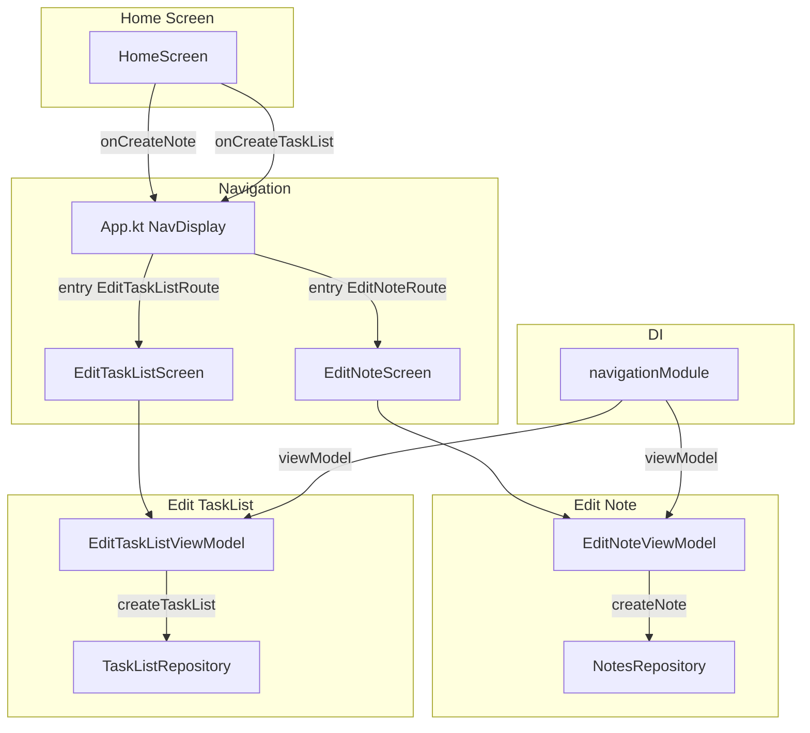

# Design Document: Note & Task List Editors

## Overview

This design covers two new editor screens for EchoList: `EditNoteScreen` and `EditTaskListScreen`. Both screens follow the same structural pattern — a title text field and a save button — and are backed by dedicated ViewModels that coordinate with existing repositories (`NotesRepository`, `TaskListRepository`). The screens are navigated to from the home screen via existing route stubs (`EditNoteRoute`, `EditTaskListRoute`) which will be extended with a `parentPath` parameter.

The implementation mirrors the existing `CreateFolderViewModel` / `CreateFolderDialog` pattern but as full-screen navigation destinations rather than dialogs. Each ViewModel owns a `TextFieldState` instance (Compose Foundation state-based text input API) and exposes a `StateFlow<UiState>` to its screen composable.

### Key Design Decisions

1. **TextFieldState over value-based text input**: The requirements mandate the state-based `TextFieldState` API. This means the ViewModel owns the `TextFieldState` instance and the composable binds to it directly — no `onValueChange` callback needed for text. This is a departure from the existing `CreateFolderViewModel` which uses a `String` value + `onNameChange` callback, but aligns with the newer Compose text input best practices.

2. **Navigate-back signal via SharedFlow**: On successful save, the ViewModel emits a one-shot event via `SharedFlow<Unit>` (same pattern as `LoginViewModel.loginSuccess`). The navigation entry in `App.kt` collects this flow and pops the back stack.

3. **Separate packages per screen**: Each editor gets its own package (`ui/editnote/`, `ui/edittasklist/`) containing the screen composable, UI state data class, and ViewModel. This keeps the home package from growing further.

4. **Route parameter extension**: `EditNoteRoute` and `EditTaskListRoute` gain a `parentPath: String` parameter. The existing optional `noteId`/`taskListId` parameters are retained for future edit-mode support.

## Architecture



Data flows unidirectionally:
1. `HomeScreen` triggers navigation by pushing an `EditNoteRoute(parentPath)` or `EditTaskListRoute(parentPath)` onto the back stack.
2. `App.kt` entry provider creates the ViewModel via `koinViewModel` with `parentPath` from the route.
3. The ViewModel exposes `StateFlow<UiState>` (containing `TextFieldState`, `isLoading`, `error`).
4. The screen composable observes the state and emits a single callback: `onSaveClick`.
5. On save, the ViewModel calls the repository, and on success emits a navigate-back event.
6. The entry in `App.kt` collects the navigate-back event and pops the back stack.

## Components and Interfaces

### Routes (modified)

```kotlin
// Routes.kt — updated
@Serializable
data class EditNoteRoute(
    val parentPath: String,
    val noteId: String? = null
) : NavKey

@Serializable
data class EditTaskListRoute(
    val parentPath: String,
    val taskListId: String? = null
) : NavKey
```

Both routes remain `@Serializable` for saved-state persistence. The `parentPath` is required; `noteId`/`taskListId` default to `null` (creation mode).

### EditNoteUiState

```kotlin
data class EditNoteUiState(
    val titleState: TextFieldState,
    val isLoading: Boolean = false,
    val error: String? = null
) {
    val isSaveEnabled: Boolean
        get() = titleState.text.isNotBlank() && !isLoading
}
```

### EditNoteViewModel

```kotlin
class EditNoteViewModel(
    private val parentPath: String,
    private val notesRepository: NotesRepository
) : ViewModel() {

    private val titleState = TextFieldState()

    private val _uiState = MutableStateFlow(EditNoteUiState(titleState = titleState))
    val uiState: StateFlow<EditNoteUiState> = _uiState.asStateFlow()

    private val _navigateBack = MutableSharedFlow<Unit>()
    val navigateBack: SharedFlow<Unit> = _navigateBack.asSharedFlow()

    fun onSaveClick() {
        val trimmedTitle = titleState.text.toString().trim()
        if (trimmedTitle.isBlank()) return

        _uiState.update { it.copy(isLoading = true, error = null) }

        viewModelScope.launch {
            val result = notesRepository.createNote(
                CreateNoteParams(
                    title = trimmedTitle,
                    content = "",
                    parentDir = parentPath
                )
            )
            result.fold(
                onSuccess = { _navigateBack.emit(Unit) },
                onFailure = { e ->
                    _uiState.update { it.copy(isLoading = false, error = e.message) }
                }
            )
        }
    }
}
```

### EditNoteScreen

```kotlin
@Composable
fun EditNoteScreen(
    uiState: EditNoteUiState,
    onSaveClick: () -> Unit,
    modifier: Modifier = Modifier
)
```

Stateless composable. Receives `EditNoteUiState` (which contains the `TextFieldState` for the title `BasicTextField`), a save callback, and an optional modifier. Uses `EchoListTheme` tokens for all styling.

### EditTaskListUiState

```kotlin
data class EditTaskListUiState(
    val titleState: TextFieldState,
    val isLoading: Boolean = false,
    val error: String? = null
) {
    val isSaveEnabled: Boolean
        get() = titleState.text.isNotBlank() && !isLoading
}
```

### EditTaskListViewModel

```kotlin
class EditTaskListViewModel(
    private val parentPath: String,
    private val taskListRepository: TaskListRepository
) : ViewModel() {

    private val titleState = TextFieldState()

    private val _uiState = MutableStateFlow(EditTaskListUiState(titleState = titleState))
    val uiState: StateFlow<EditTaskListUiState> = _uiState.asStateFlow()

    private val _navigateBack = MutableSharedFlow<Unit>()
    val navigateBack: SharedFlow<Unit> = _navigateBack.asSharedFlow()

    fun onSaveClick() {
        val trimmedTitle = titleState.text.toString().trim()
        if (trimmedTitle.isBlank()) return

        _uiState.update { it.copy(isLoading = true, error = null) }

        viewModelScope.launch {
            val result = taskListRepository.createTaskList(
                CreateTaskListParams(
                    title = trimmedTitle,
                    path = parentPath,
                    tasks = emptyList()
                )
            )
            result.fold(
                onSuccess = { _navigateBack.emit(Unit) },
                onFailure = { e ->
                    _uiState.update { it.copy(isLoading = false, error = e.message) }
                }
            )
        }
    }
}
```

### EditTaskListScreen

```kotlin
@Composable
fun EditTaskListScreen(
    uiState: EditTaskListUiState,
    onSaveClick: () -> Unit,
    modifier: Modifier = Modifier
)
```

Same pattern as `EditNoteScreen`. Stateless, themed, receives state + callback.

### Koin Registration (navigationModule)

```kotlin
val navigationModule: Module = module {
    // ... existing registrations ...
    viewModel { params ->
        EditNoteViewModel(
            parentPath = params.get(),
            notesRepository = get()
        )
    }
    viewModel { params ->
        EditTaskListViewModel(
            parentPath = params.get(),
            taskListRepository = get()
        )
    }
}
```

### App.kt Entry Provider (updated entries)

```kotlin
entry<EditNoteRoute> { route ->
    val viewModel = koinViewModel<EditNoteViewModel>(
        key = "editNote-${route.parentPath}"
    ) { parametersOf(route.parentPath) }
    val uiState by viewModel.uiState.collectAsStateWithLifecycle()

    LaunchedEffect(Unit) {
        viewModel.navigateBack.collect { backStack.removeLastOrNull() }
    }

    EditNoteScreen(
        uiState = uiState,
        onSaveClick = viewModel::onSaveClick
    )
}

entry<EditTaskListRoute> { route ->
    val viewModel = koinViewModel<EditTaskListViewModel>(
        key = "editTaskList-${route.parentPath}"
    ) { parametersOf(route.parentPath) }
    val uiState by viewModel.uiState.collectAsStateWithLifecycle()

    LaunchedEffect(Unit) {
        viewModel.navigateBack.collect { backStack.removeLastOrNull() }
    }

    EditTaskListScreen(
        uiState = uiState,
        onSaveClick = viewModel::onSaveClick
    )
}
```

### Home Screen Navigation Wiring

The existing `CreateItemCallbacks` already has `onCreateNote` and `onCreateTaskList` lambdas. In `App.kt`, the `HomeRoute` entry wires them to push the editor routes:

```kotlin
createItemCallbacks = CreateItemCallbacks(
    onCreateFolder = createFolderViewModel::showDialog,
    onCreateNote = { backStack.add(EditNoteRoute(parentPath = route.path)) },
    onCreateTaskList = { backStack.add(EditTaskListRoute(parentPath = route.path)) }
)
```

## Data Models

### Existing Models (no changes)

| Model | Fields | Package |
|-------|--------|---------|
| `CreateNoteParams` | `title: String`, `content: String`, `parentDir: String` | `data.models` |
| `CreateTaskListParams` | `name: String`, `path: String`, `tasks: List<MainTask>` | `data.models` |
| `Note` | `filePath: String`, `title: String`, `content: String`, `updatedAt: Long` | `data.models` |
| `TaskList` | `filePath: String`, `name: String`, `tasks: List<MainTask>`, `updatedAt: Long` | `data.models` |

### New Models

| Model | Fields | Package |
|-------|--------|---------|
| `EditNoteUiState` | `titleState: TextFieldState`, `isLoading: Boolean`, `error: String?` | `ui.editnote` |
| `EditTaskListUiState` | `titleState: TextFieldState`, `isLoading: Boolean`, `error: String?` | `ui.edittasklist` |

Both UI state classes expose a computed `isSaveEnabled: Boolean` property that returns `true` only when the text field is not blank and loading is `false`. This drives the save button's enabled state.

### Route Changes

| Route | Before | After |
|-------|--------|-------|
| `EditNoteRoute` | `noteId: String? = null` | `parentPath: String`, `noteId: String? = null` |
| `EditTaskListRoute` | `taskListId: String? = null` | `parentPath: String`, `taskListId: String? = null` |

The `navKeySerializersModule` polymorphic registration remains unchanged — `kotlinx.serialization` handles the new field automatically since the routes are `@Serializable` data classes.


## Correctness Properties

*A property is a characteristic or behavior that should hold true across all valid executions of a system — essentially, a formal statement about what the system should do. Properties serve as the bridge between human-readable specifications and machine-verifiable correctness guarantees.*

The following properties were derived from the acceptance criteria prework analysis. After reflection, redundant properties across the two editor ViewModels were consolidated since they share identical logic patterns.

### Property 1: Save guard — repository called if and only if trimmed text is non-blank

*For any* string provided as the text field content, when `onSaveClick` is invoked on either `EditNoteViewModel` or `EditTaskListViewModel`, the corresponding repository method (`createNote` / `createTaskList`) should be called if and only if the trimmed string is non-blank. When called, the repository should receive the trimmed version of the text (not the original), along with the correct `parentPath` and default values (empty content for notes, empty task list for task lists).

**Validates: Requirements 5.3, 5.7, 6.3, 6.7**

### Property 2: Successful save emits navigate-back event

*For any* non-blank title string, when the repository returns a successful `Result`, the ViewModel should emit exactly one event on its `navigateBack` SharedFlow.

**Validates: Requirements 5.5, 6.5**

### Property 3: Failed save sets error and clears loading

*For any* non-blank title string, when the repository returns a failure `Result` with an exception, the ViewModel's UI state should have `isLoading == false` and `error` set to the exception's message.

**Validates: Requirements 5.6, 6.6**

### Property 4: Save-enabled computation

*For any* combination of text content (via `TextFieldState`) and loading flag, the `isSaveEnabled` computed property on `EditNoteUiState` and `EditTaskListUiState` should return `true` if and only if the text is not blank and `isLoading` is `false`.

**Validates: Requirements 8.1, 8.2, 8.3, 8.4**

### Property 5: Route serialization round-trip

*For any* `parentPath` string and optional `noteId`/`taskListId`, serializing an `EditNoteRoute` or `EditTaskListRoute` to JSON and then deserializing it should produce an object equal to the original.

**Validates: Requirements 9.3, 9.4**

## Error Handling

### ViewModel Error Handling

Both editor ViewModels follow the same error-handling pattern established by `CreateFolderViewModel`:

1. **Repository failure**: When `NotesRepository.createNote` or `TaskListRepository.createTaskList` returns `Result.failure(exception)`, the ViewModel sets `error = exception.message` and `isLoading = false` in the UI state. The screen composable displays the error message.

2. **Blank input guard**: When the user taps save with a blank (empty or whitespace-only) title, `onSaveClick` returns immediately without calling the repository or changing state. The save button is already disabled via `isSaveEnabled`, so this is a defensive guard.

3. **No thrown exceptions**: Following the project convention, all repository operations return `Result<T>`. ViewModels never throw exceptions across layer boundaries.

### UI Error Display

The editor screens display the error message from the UI state below the save button (or as a snackbar — implementation detail). When the user modifies the text field, the error is not automatically cleared (the user must tap save again). This matches the existing `CreateFolderViewModel` behavior where errors persist until the next action.

### Network Errors

The existing `NotesRepositoryImpl` catches `NetworkException` and returns `Result.failure`. For creation operations that fail due to network issues, the note is queued in `pendingOperations` for offline sync. The `TaskListRepositoryImpl` catches generic `Exception` and returns `Result.failure`. The editor ViewModels are agnostic to the specific error type — they only read `exception.message`.

## Testing Strategy

### Property-Based Testing

Use **kotest-property** (already in `commonTest` dependencies) for all correctness properties. Each property test runs a minimum of 100 iterations with randomly generated inputs.

Each test is tagged with a comment referencing the design property:
```
// Feature: note-tasklist-editors, Property {N}: {property title}
```

| Property | Generator Strategy | Assertion |
|----------|-------------------|-----------|
| 1: Save guard | `Arb.string()` for title text, covering empty, whitespace-only, and non-blank strings | Verify repository call count (0 for blank, 1 for non-blank) and that params use trimmed text |
| 2: Successful save | `Arb.string().filter { it.isNotBlank() }` for title | Verify `navigateBack` emits after repository returns success |
| 3: Failed save | `Arb.string().filter { it.isNotBlank() }` for title, `Arb.string()` for error message | Verify `isLoading == false` and `error == message` after repository returns failure |
| 4: Save-enabled | `Arb.string()` for text content, `Arb.boolean()` for isLoading | Verify `isSaveEnabled == (text.isNotBlank() && !isLoading)` |
| 5: Route round-trip | `Arb.string()` for parentPath, `Arb.string().orNull()` for noteId/taskListId | Verify `decode(encode(route)) == route` |

### Unit Testing

Unit tests complement property tests for specific examples and edge cases:

- **Navigation wiring**: Verify that tapping create-note/create-task-list on the home screen pushes the correct route with the current path.
- **Initial state**: Verify that a freshly created ViewModel has `isLoading = false`, `error = null`, and an empty `TextFieldState`.
- **Loading flag**: Verify that `isLoading` becomes `true` immediately after `onSaveClick` with a non-blank title, before the repository completes.
- **UI component existence**: Verify that `EditNoteScreen` and `EditTaskListScreen` render a text field and a save button.
- **Koin module**: Verify that `EditNoteViewModel` and `EditTaskListViewModel` can be resolved from the navigation module with a path parameter.

### Test Location

- Property tests and ViewModel unit tests: `jvmTest` (requires Kotest JUnit 5 runner)
- Shared test utilities (fakes, generators): `commonTest`

### Mocking Strategy

- Use a fake implementation of `NotesRepository` and `TaskListRepository` that accepts a lambda to control the `Result` returned by `createNote`/`createTaskList`. This avoids external mocking libraries and keeps tests in `commonTest`-compatible code.
- The `TextFieldState` is a real Compose object — no mocking needed since the ViewModel owns it directly.
