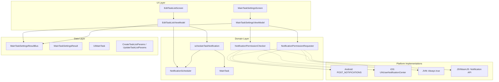
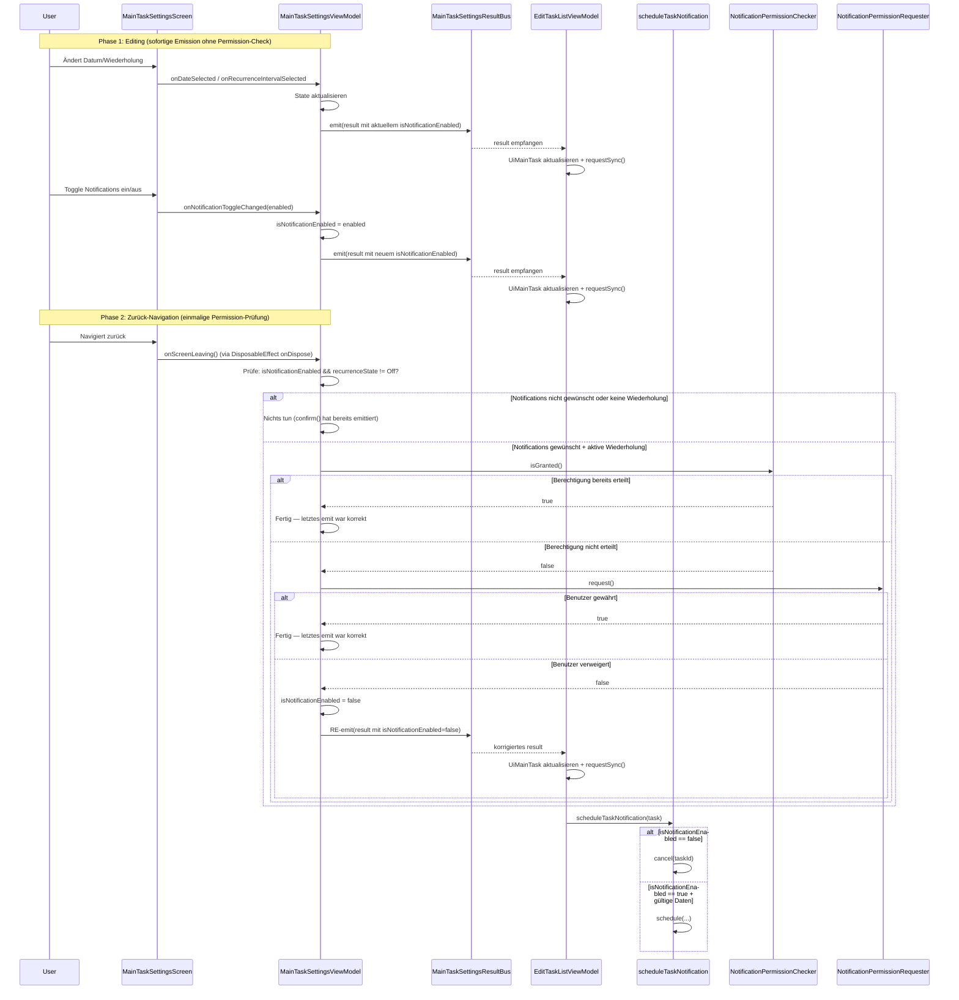

# Design-Dokument: Notification Permission Toggle

## Overview

Dieses Design beschreibt die technische Umsetzung des Features „Notification Permission Toggle" für EchoList. Das Feature erweitert den MainTaskSettingsScreen um einen Toggle zur Steuerung von Notifications pro MainTask.

**Kernprinzip:** Der Toggle steuert ausschließlich die Benutzerabsicht (`isNotificationEnabled`). Die Berechtigungsprüfung findet **einmalig** statt — nur wenn der Benutzer den Screen verlässt (zurück-navigiert) und dabei `isNotificationEnabled = true` bei aktiver Wiederholung vorliegt.

Die Implementierung umfasst:
- Erweiterung des Domain-Modells um das Feld `isNotificationEnabled`
- Zwei neue plattformübergreifende Interfaces für Berechtigungsprüfung und -anfrage
- UI-Erweiterung des MainTaskSettingsScreen mit Material 3 Switch
- Integration mit dem bestehenden Notification-Scheduling über `scheduleTaskNotification`
- Plattformspezifische Implementierungen für Android, iOS, JVM, JS und WasmJS

## Architecture



### Datenfluss

**Wichtig:** Die Berechtigungsprüfung geschieht NICHT bei jeder Änderung im Screen, sondern nur einmalig beim Verlassen des Screens (Zurück-Navigation).



## Components and Interfaces

### 1. Domain Layer — Neue Interfaces

**Datei:** `commonMain/.../domain/NotificationPermissionChecker.kt`

```kotlin
package net.onefivefour.echolist.domain

/**
 * Plattformunabhängige Schnittstelle zur Abfrage des aktuellen
 * Notification-Berechtigungsstatus.
 */
interface NotificationPermissionChecker {
    /**
     * Gibt true zurück, wenn die Notification-Berechtigung auf der
     * aktuellen Plattform erteilt ist.
     */
    suspend fun isGranted(): Boolean
}
```

**Datei:** `commonMain/.../domain/NotificationPermissionRequester.kt`

```kotlin
package net.onefivefour.echolist.domain

/**
 * Plattformunabhängige Schnittstelle zum Anfordern der
 * Notification-Berechtigung beim Benutzer.
 */
interface NotificationPermissionRequester {
    /**
     * Fordert die Notification-Berechtigung an.
     *
     * @return true wenn die Berechtigung gewährt wurde, false bei Verweigerung oder Fehler
     */
    suspend fun request(): Boolean
}
```

**Adressiert:** Requirements 6.1, 6.2

### 2. Domain Layer — MainTask-Erweiterung

**Datei:** `commonMain/.../domain/model/MainTask.kt`

```kotlin
data class MainTask(
    val id: String,
    val description: String,
    val isDone: Boolean,
    val dueDate: String,
    val recurrence: String,
    val isNotificationEnabled: Boolean = true,
    val subTasks: List<SubTask>
)
```

**Adressiert:** Requirements 2.1, 2.2

### 3. Domain Layer — scheduleTaskNotification-Modifikation

**Datei:** `commonMain/.../domain/NotificationScheduling.kt`

Änderung der bestehenden Funktion mit Early-Return-Check:

```kotlin
suspend fun scheduleTaskNotification(
    scheduler: NotificationScheduler,
    task: MainTask,
    taskListName: String
) {
    // Neuer Guard: Notifications pro Task deaktiviert
    if (!task.isNotificationEnabled) {
        scheduler.cancel(task.id)
        return
    }

    // Bisherige Logik bleibt unverändert
    if (task.dueDate.isBlank() || task.recurrence.isBlank()) {
        scheduler.cancel(task.id)
        return
    }

    val dueDate = runCatching { LocalDate.parse(task.dueDate) }.getOrNull()
    if (dueDate == null) {
        scheduler.cancel(task.id)
        return
    }

    val today = Clock.System.todayIn(TimeZone.currentSystemDefault())
    if (dueDate < today) {
        return
    }

    scheduler.schedule(
        taskId = task.id,
        title = "Task due: $taskListName",
        body = task.description.ifEmpty { taskListName }.take(200),
        dueDateIso = task.dueDate
    )
}
```

**Adressiert:** Requirements 5.1, 5.2

### 4. Data Layer — UiMainTask-Erweiterung

**Datei:** `commonMain/.../ui/edittasklist/UiMainTask.kt`

```kotlin
internal class UiMainTask(
    val id: String,
    description: String = "",
    isDone: Boolean = false,
    dueDate: String = "",
    recurrence: String = "",
    isNotificationEnabled: Boolean = true,
    subTasks: List<UiSubTask> = emptyList()
) {
    // ... bestehende Felder ...
    var isNotificationEnabled by mutableStateOf(isNotificationEnabled)

    fun toDomain(): MainTask? {
        // ... bestehende Logik ...
        return MainTask(
            id = id,
            description = trimmedDescription,
            isDone = isDone,
            dueDate = normalizedDueDate,
            recurrence = normalizedRecurrence,
            isNotificationEnabled = isNotificationEnabled,
            subTasks = subTasks.mapNotNull { it.toDomain() }
        )
    }

    companion object {
        fun fromDomain(domain: MainTask): UiMainTask = UiMainTask(
            id = domain.id,
            description = domain.description,
            isDone = domain.isDone,
            dueDate = domain.dueDate,
            recurrence = domain.recurrence.singleLine(),
            isNotificationEnabled = domain.isNotificationEnabled,
            subTasks = domain.subTasks.map { UiSubTask.fromDomain(it) }
        )
    }
}
```

**Adressiert:** Requirements 2.1, 2.3

### 5. Data Layer — MainTaskSettingsResult-Erweiterung

**Datei:** `commonMain/.../ui/maintasksettings/MainTaskSettingsResult.kt`

```kotlin
data class MainTaskSettingsResult(
    val mainTaskId: String,
    val dueDate: String,
    val recurrence: String,
    val isNotificationEnabled: Boolean
)
```

**Adressiert:** Requirements 2.3

### 6. Navigation — Route-Erweiterung

**Datei:** `commonMain/.../ui/navigation/Routes.kt`

```kotlin
@Serializable
data class MainTaskSettingsRoute(
    val mainTaskId: String,
    val currentDueDate: String = "",
    val currentRecurrence: String = "",
    val currentIsNotificationEnabled: Boolean = true
) : NavKey
```

**Adressiert:** Requirements 2.4

### 7. UI Layer — MainTaskSettingsUiState-Erweiterung

**Datei:** `commonMain/.../ui/maintasksettings/MainTaskSettingsUiState.kt`

```kotlin
internal sealed interface MainTaskSettingsUiState {
    data object Loading : MainTaskSettingsUiState
    data class Ready(
        val selectedDueDate: String,
        val recurrenceState: RecurrenceState,
        val initialDateMillis: Long?,
        val isNotificationEnabled: Boolean = true,
        val isNotificationToggleEnabled: Boolean = true,
        val showRecurrenceValidationErrors: Boolean = false,
        val showDueDateRequiredError: Boolean = false
    ) : MainTaskSettingsUiState
}
```

`isNotificationToggleEnabled` wird berechnet als `recurrenceState != RecurrenceState.Off`.

**Adressiert:** Requirements 1.1, 1.4, 7.1

### 8. UI Layer — MainTaskSettingsViewModel-Änderungen (KORRIGIERT)

**Datei:** `commonMain/.../ui/maintasksettings/MainTaskSettingsViewModel.kt`

**Kerndesign-Entscheidung:** `confirm()` enthält KEINE Berechtigungslogik. Es emittiert sofort bei jeder Änderung — genau wie bisher. Die Berechtigungsprüfung findet ausschließlich in `onScreenLeaving()` statt, das beim Verlassen des Screens (Zurück-Navigation) aufgerufen wird.

Neue Konstruktor-Parameter:
```kotlin
internal class MainTaskSettingsViewModel(
    private val mainTaskId: String,
    currentDueDate: String,
    currentRecurrence: String,
    currentIsNotificationEnabled: Boolean,
    private val resultBus: MainTaskSettingsResultBus,
    private val permissionChecker: NotificationPermissionChecker,
    private val permissionRequester: NotificationPermissionRequester
) : ViewModel()
```

Initialer State:
```kotlin
private val _uiState = MutableStateFlow<MainTaskSettingsUiState>(
    MainTaskSettingsUiState.Ready(
        selectedDueDate = currentDueDate,
        recurrenceState = rruleToRecurrenceState(currentRecurrence),
        initialDateMillis = dueDateToUtcMillis(currentDueDate),
        isNotificationEnabled = currentIsNotificationEnabled,
        isNotificationToggleEnabled = rruleToRecurrenceState(currentRecurrence) != RecurrenceState.Off
    )
)
```

Neue/geänderte Methoden:

```kotlin
/**
 * Einfacher State-Update + sofortige Emission. Keine Permission-Logik.
 */
fun onNotificationToggleChanged(enabled: Boolean) {
    updateReady { state ->
        state.copy(isNotificationEnabled = enabled)
    }
    confirm()
}

fun onRecurrenceIntervalSelected(interval: RecurrenceInterval) {
    val newRecurrenceState = when (interval) {
        RecurrenceInterval.Off -> RecurrenceState.Off
        RecurrenceInterval.Daily -> RecurrenceState.Daily()
        RecurrenceInterval.Weekly -> RecurrenceState.Weekly()
        RecurrenceInterval.Monthly -> RecurrenceState.Monthly()
        RecurrenceInterval.Yearly -> RecurrenceState.Yearly
    }

    val isOff = interval == RecurrenceInterval.Off

    updateReady { state ->
        state.copy(
            recurrenceState = newRecurrenceState,
            isNotificationEnabled = if (isOff) false else state.isNotificationEnabled,
            isNotificationToggleEnabled = !isOff,
            showRecurrenceValidationErrors = false
        )
    }
    confirm()
}
```

```kotlin
/**
 * confirm() bleibt synchron und emittiert sofort — OHNE Berechtigungsprüfung.
 * Wird bei JEDER Änderung aufgerufen (Datum, Wiederholung, Toggle).
 */
private fun confirm(): Boolean {
    val currentState = _uiState.value as? MainTaskSettingsUiState.Ready ?: return false

    if (currentState.recurrenceState != RecurrenceState.Off && currentState.selectedDueDate.isBlank()) {
        updateReady { it.copy(showDueDateRequiredError = true) }
        return false
    }

    if (!currentState.recurrenceState.hasValidDetails()) {
        updateReady { it.copy(showRecurrenceValidationErrors = true) }
        return false
    }

    viewModelScope.launch {
        resultBus.emit(
            MainTaskSettingsResult(
                mainTaskId = mainTaskId,
                dueDate = currentState.selectedDueDate,
                recurrence = currentState.recurrenceState.toRrule(),
                isNotificationEnabled = currentState.isNotificationEnabled
            )
        )
    }
    return true
}
```

```kotlin
/**
 * Wird aufgerufen, wenn der Benutzer den Screen verlässt (Zurück-Navigation).
 * Hier findet die EINZIGE Berechtigungsprüfung statt.
 *
 * Ablauf:
 * 1. Wenn isNotificationEnabled == false oder recurrenceState == Off → nichts tun
 * 2. Berechtigung prüfen → wenn erteilt, nichts tun (letztes emit war korrekt)
 * 3. Berechtigung anfordern → wenn gewährt, nichts tun
 * 4. Wenn verweigert oder Fehler → Toggle auf false setzen und korrigiertes Result re-emittieren
 */
fun onScreenLeaving() {
    viewModelScope.launch {
        val state = _uiState.value as? MainTaskSettingsUiState.Ready ?: return@launch

        // Keine Prüfung nötig, wenn Notifications nicht gewünscht oder keine Wiederholung
        if (!state.isNotificationEnabled || state.recurrenceState == RecurrenceState.Off) {
            return@launch
        }

        // Berechtigung bereits erteilt?
        val isGranted = runCatching { permissionChecker.isGranted() }.getOrDefault(false)
        if (isGranted) return@launch

        // Berechtigung anfordern
        val granted = runCatching { permissionRequester.request() }.getOrDefault(false)
        if (granted) return@launch

        // Benutzer hat verweigert — Toggle zurücksetzen und korrektes Ergebnis emittieren
        updateReady { it.copy(isNotificationEnabled = false) }

        resultBus.emit(
            MainTaskSettingsResult(
                mainTaskId = mainTaskId,
                dueDate = state.selectedDueDate,
                recurrence = state.recurrenceState.toRrule(),
                isNotificationEnabled = false
            )
        )
    }
}
```

**Adressiert:** Requirements 1.3, 1.5, 3.1, 3.2, 3.3, 3.4, 4.1, 4.2, 4.3

### 9. UI Layer — MainTaskSettingsScreen-Erweiterung

**Datei:** `commonMain/.../ui/maintasksettings/MainTaskSettingsScreen.kt`

Neuer Callback-Parameter und Notification-Section:

```kotlin
@Composable
internal fun MainTaskSettingsScreen(
    uiState: MainTaskSettingsUiState,
    onDateSelected: (Long) -> Unit,
    onRecurrenceIntervalSelected: (RecurrenceInterval) -> Unit,
    onRecurrenceDetailChanged: (RecurrenceState) -> Unit,
    onNotificationToggleChanged: (Boolean) -> Unit
)
```

Innerhalb von `MainTaskSettingsContent`, nach der Repeat-Section:

```kotlin
SettingsSection(title = "Notifications") {
    Row(
        modifier = Modifier.fillMaxWidth(),
        horizontalArrangement = Arrangement.SpaceBetween,
        verticalAlignment = Alignment.CenterVertically
    ) {
        Text(
            text = "Erinnern",
            style = EchoListTheme.typography.bodyMedium,
            color = EchoListTheme.materialColors.onSurface
        )
        Switch(
            checked = uiState.isNotificationEnabled,
            onCheckedChange = onNotificationToggleChanged,
            enabled = uiState.isNotificationToggleEnabled
        )
    }

    AnimatedVisibility(visible = !uiState.isNotificationToggleEnabled) {
        Text(
            text = "Notifications sind nur bei aktiver Wiederholung verfügbar.",
            style = EchoListTheme.typography.bodySmall,
            color = EchoListTheme.materialColors.onSurfaceVariant,
            modifier = Modifier.padding(top = EchoListTheme.dimensions.s)
        )
    }
}
```

**Adressiert:** Requirements 7.1, 7.2, 7.3, 7.4

### 10. Navigation-Integration — DisposableEffect für onScreenLeaving()

**Datei:** `commonMain/.../App.kt` (im `entry<MainTaskSettingsRoute>` Block)

Die Berechtigungsprüfung wird über einen `DisposableEffect` im Navigation-Entry ausgelöst. Wenn der Screen aus dem Back-Stack entfernt wird, ruft `onDispose` die `onScreenLeaving()`-Methode auf:

```kotlin
entry<MainTaskSettingsRoute> { route ->
    val viewModel = koinViewModel<MainTaskSettingsViewModel>(
        key = "mainTaskSettings-${route.mainTaskId}"
    ) {
        parametersOf(
            route.mainTaskId,
            route.currentDueDate,
            route.currentRecurrence,
            route.currentIsNotificationEnabled
        )
    }

    val uiState by viewModel.uiState.collectAsStateWithLifecycle()

    DisposableEffect(viewModel) {
        onDispose { viewModel.onScreenLeaving() }
    }

    MainTaskSettingsScreen(
        uiState = uiState,
        onDateSelected = viewModel::onDateSelected,
        onRecurrenceIntervalSelected = viewModel::onRecurrenceIntervalSelected,
        onRecurrenceDetailChanged = viewModel::onRecurrenceDetailChanged,
        onNotificationToggleChanged = viewModel::onNotificationToggleChanged
    )
}
```

**Hinweis:** Dieses Pattern wird bereits im Projekt für `EditTaskListViewModel.onScreenLeft()` verwendet. Es ist konsistent mit der bestehenden Architektur.

**Adressiert:** Requirements 3.1, 3.3

### 11. EditTaskListViewModel-Änderungen

**Datei:** `commonMain/.../ui/edittasklist/EditTaskListViewModel.kt`

Im `settingsResultBus.results.collect`-Block:

```kotlin
settingsResultBus.results.collect { result ->
    val task = tasks.firstOrNull { it.id == result.mainTaskId } ?: return@collect
    task.dueDateState.setTextAndPlaceCursorAtEnd(result.dueDate)
    task.recurrenceState.setTextAndPlaceCursorAtEnd(result.recurrence)
    task.isNotificationEnabled = result.isNotificationEnabled  // NEU
    sortTasksByDueDate()
    _uiState.update { it.copy(error = null) }
    requestSync()
}
```

**Adressiert:** Requirements 5.3

### 12. Navigation — EditTaskListScreen → MainTaskSettingsRoute

**Datei:** `commonMain/.../App.kt` (im `EditTaskListScreen`-Bereich)

Die Navigation zum Settings-Screen übergibt nun auch den aktuellen `isNotificationEnabled`-Wert:

```kotlin
onNavigateToSettings = { mainTaskId, currentDueDate, currentRecurrence, currentIsNotificationEnabled ->
    viewModel.onSettingsNavigationStarted()
    backStack.add(
        MainTaskSettingsRoute(
            mainTaskId = mainTaskId,
            currentDueDate = currentDueDate,
            currentRecurrence = currentRecurrence,
            currentIsNotificationEnabled = currentIsNotificationEnabled
        )
    )
}
```

**Adressiert:** Requirements 2.4

### 13. DI-Änderungen

**Datei (pro Plattform):** `{platform}Main/.../di/NotificationModule.{platform}.kt`

Beispiel Android:
```kotlin
val notificationModule = module {
    single<NotificationScheduler> { AndroidNotificationScheduler(context = get()) }
    single<NotificationPermissionChecker> { AndroidNotificationPermissionChecker(context = get()) }
    single<NotificationPermissionRequester> { AndroidNotificationPermissionRequester(context = get()) }
}
```

**Datei:** `commonMain/.../di/AppModules.kt` — ViewModel-Binding erweitern:

```kotlin
viewModel { params ->
    MainTaskSettingsViewModel(
        mainTaskId = params.get(),
        currentDueDate = params.get(),
        currentRecurrence = params.get(),
        currentIsNotificationEnabled = params.get(),
        resultBus = get(),
        permissionChecker = get(),
        permissionRequester = get()
    )
}
```

**Adressiert:** Requirements 6.3

### 14. Plattformspezifische Implementierungen

| Plattform | NotificationPermissionChecker | NotificationPermissionRequester |
|-----------|-------------------------------|----------------------------------|
| **Android** | `ContextCompat.checkSelfPermission(POST_NOTIFICATIONS)` ab API 33; true darunter | `CompletableDeferred`-Pattern mit ActivityResultLauncher für POST_NOTIFICATIONS |
| **iOS** | `UNUserNotificationCenter.current().getNotificationSettings()` → `.authorizationStatus == .authorized` | `UNUserNotificationCenter.requestAuthorization(options: [.alert, .sound])` |
| **JVM** | Gibt immer `true` zurück | Gibt immer `true` zurück |
| **JS** | `Notification.permission == "granted"` | `Notification.requestPermission()` → result == "granted" |
| **WasmJS** | Via `JsFun` interop: `Notification.permission == "granted"` | Via `JsFun` interop: `Notification.requestPermission()` |

**Android-Implementierungsdetail:**

Da `ActivityResultContracts.RequestPermission` eine Activity-Referenz benötigt, wird ein `PermissionResultBridge`-Singleton verwendet:

```kotlin
/**
 * Bridge zwischen ViewModel-Coroutine und Activity-Lifecycle.
 * Die Activity registriert den Launcher und hängt sich an den Bridge.
 * Der Requester suspendiert auf einem CompletableDeferred, das der Launcher completet.
 */
class PermissionResultBridge {
    private var pendingResult: CompletableDeferred<Boolean>? = null

    suspend fun awaitResult(): Boolean {
        val deferred = CompletableDeferred<Boolean>()
        pendingResult = deferred
        return deferred.await()
    }

    fun deliverResult(granted: Boolean) {
        pendingResult?.complete(granted)
        pendingResult = null
    }
}
```

**Adressiert:** Requirements 6.4, 6.5, 6.6, 6.7

## Data Models

### MainTask (Domain)

```kotlin
data class MainTask(
    val id: String,
    val description: String,
    val isDone: Boolean,
    val dueDate: String,
    val recurrence: String,
    val isNotificationEnabled: Boolean = true,
    val subTasks: List<SubTask>
)
```

### MainTaskSettingsResult (Data/UI)

```kotlin
data class MainTaskSettingsResult(
    val mainTaskId: String,
    val dueDate: String,
    val recurrence: String,
    val isNotificationEnabled: Boolean
)
```

### MainTaskSettingsRoute (Navigation)

```kotlin
@Serializable
data class MainTaskSettingsRoute(
    val mainTaskId: String,
    val currentDueDate: String = "",
    val currentRecurrence: String = "",
    val currentIsNotificationEnabled: Boolean = true
) : NavKey
```

### MainTaskSettingsUiState.Ready (UI)

```kotlin
data class Ready(
    val selectedDueDate: String,
    val recurrenceState: RecurrenceState,
    val initialDateMillis: Long?,
    val isNotificationEnabled: Boolean = true,
    val isNotificationToggleEnabled: Boolean = true,
    val showRecurrenceValidationErrors: Boolean = false,
    val showDueDateRequiredError: Boolean = false
) : MainTaskSettingsUiState
```

## Correctness Properties

*A property is a characteristic or behavior that should hold true across all valid executions of a system — essentially, a formal statement about what the system should do. Properties serve as the bridge between human-readable specifications and machine-verifiable correctness guarantees.*

### Property 1: Toggle-Konsistenz

*Für alle* Boolean-Werte `enabled`, wenn `onNotificationToggleChanged(enabled)` aufgerufen wird, MUSS der emittierte `MainTaskSettingsResult.isNotificationEnabled`-Wert dem UI-State `isNotificationEnabled` entsprechen.

**Hinweis:** Dies gilt für die sofortige Emission in `confirm()`. Die Berechtigungsprüfung in `onScreenLeaving()` kann den Wert nachträglich auf `false` korrigieren — das ist ein separater Vorgang.

**Validates: Requirements 1.3, 2.3**

### Property 2: Recurrence.Off erzwingt Deaktivierung

*Für alle* aktiven RecurrenceState-Werte `s` (wobei `s != RecurrenceState.Off`), wenn der RecurrenceState auf `RecurrenceState.Off` wechselt, MUSS `isNotificationEnabled` im resultierenden UI-State `false` sein UND `isNotificationToggleEnabled` MUSS `false` sein.

**Validates: Requirements 1.4, 1.5**

### Property 3: Berechtigungsprüfungs-Guard (in onScreenLeaving)

*Für alle* Kombinationen von `(isNotificationEnabled: Boolean, recurrenceState: RecurrenceState)`, wenn `onScreenLeaving()` aufgerufen wird:
- Wenn `isNotificationEnabled == true` UND `recurrenceState != Off` → `permissionChecker.isGranted()` wird aufgerufen
- Wenn `isNotificationEnabled == false` ODER `recurrenceState == Off` → `permissionChecker.isGranted()` wird NICHT aufgerufen

**Wichtig:** Diese Prüfung findet NICHT in `confirm()` statt, sondern ausschließlich in `onScreenLeaving()`.

**Validates: Requirements 3.1, 3.4**

### Property 4: Berechtigungsverweigerung erzwingt Deaktivierung (in onScreenLeaving)

*Für alle* Zustände, in denen `isNotificationEnabled == true` UND `recurrenceState != Off` UND `permissionChecker.isGranted() == false`: wenn `permissionRequester.request()` den Wert `false` zurückgibt oder eine Exception wirft, MUSS das re-emittierte `MainTaskSettingsResult.isNotificationEnabled` den Wert `false` haben.

**Validates: Requirements 4.2, 4.3**

### Property 5: isNotificationEnabled=false → immer cancel

*Für alle* MainTask-Instanzen mit `isNotificationEnabled == false`, unabhängig von `dueDate` und `recurrence`, MUSS `scheduleTaskNotification` die Methode `scheduler.cancel(task.id)` aufrufen und DARF NICHT `scheduler.schedule(...)` aufrufen.

**Validates: Requirements 5.1**

### Property 6: Route-Parameter Round-Trip

*Für alle* Boolean-Werte `v`, wenn ein `MainTaskSettingsRoute` mit `currentIsNotificationEnabled = v` erstellt und serialisiert/deserialisiert wird, MUSS der resultierende `isNotificationEnabled`-Wert im ViewModel-UiState gleich `v` sein.

**Validates: Requirements 2.4**

## Error Handling

| Fehlerfall | Verhalten | Adressiert |
|---|---|---|
| `NotificationPermissionRequester.request()` wirft Exception | `runCatching` in `onScreenLeaving()` fängt die Exception ab; `isNotificationEnabled` wird auf `false` gesetzt; keine Exception propagiert | Req 4.3 |
| `NotificationPermissionChecker.isGranted()` wirft Exception | Fail-safe in `onScreenLeaving()`: `runCatching` mit Default `false`, löst `request()` aus | Req 3.1 |
| Plattform-spezifischer Fehler beim Berechtigungsdialog (z.B. Activity zerstört) | `CompletableDeferred` wird mit `false` completed via Timeout/Lifecycle-Callback | Req 4.3 |
| `isNotificationEnabled`-Feld fehlt in alten Daten (Migration) | Default `true` stellt Abwärtskompatibilität sicher | Req 2.2 |
| `onScreenLeaving()` wird aufgerufen aber ViewModel-Scope bereits cancelled | `viewModelScope.launch` wird nicht gestartet; letztes emittiertes Result bleibt gültig | — |

## Testing Strategy

### Property-Based Tests (Kotest)

Jede Correctness Property wird als eigenständiger Property-Test mit mindestens 100 Iterationen implementiert.

| Test | Property | Generator | Framework |
|---|---|---|---|
| `NotificationToggleConsistencyTest` | Property 1 | `Arb.boolean()` für Toggle-Werte | Kotest Property |
| `RecurrenceOffDisablesToggleTest` | Property 2 | `Arb.of(RecurrenceState.Daily(), Weekly(), Monthly(), Yearly)` | Kotest Property |
| `PermissionCheckGuardTest` | Property 3 | `Arb.boolean() × Arb.of(RecurrenceState.*)` | Kotest Property |
| `PermissionDeniedDisablesToggleTest` | Property 4 | `Arb.of(RecurrenceState.Daily(), Weekly(), Monthly(), Yearly)` | Kotest Property |
| `NotificationsDisabledAlwaysCancelsTest` | Property 5 | `Arb.mainTask(isNotificationEnabled = false)` mit zufälligem dueDate/recurrence | Kotest Property |
| `RouteParameterRoundTripTest` | Property 6 | `Arb.boolean()` | Kotest Property |

**Konfiguration:**
- Minimum 100 Iterationen pro Test
- Tag-Format: `Feature: notification-permission-toggle, Property {N}: {Titel}`
- Mocks: `NotificationPermissionChecker`, `NotificationPermissionRequester` und `NotificationScheduler` werden gemockt

**Wichtig für Properties 3 und 4:** Diese testen das Verhalten von `onScreenLeaving()`, NICHT von `confirm()`. Die Tests müssen den Screen-Verlassen-Lifecycle simulieren.

### Unit Tests (Beispiel-basiert)

| Test | Szenario | Adressiert |
|---|---|---|
| Default-Wert bei neuem Task | MainTask ohne isNotificationEnabled-Angabe → default true | Req 1.2, 2.2 |
| Toggle ändert State sofort | `onNotificationToggleChanged(false)` → State und emittiertes Result haben `false` | Req 1.3 |
| confirm() emittiert ohne Permission-Check | Jeder `confirm()`-Aufruf emittiert sofort ohne `permissionChecker` Interaktion | Req 3.4 |
| onScreenLeaving() — Berechtigung bereits erteilt | Checker returns true → kein Request, kein Re-Emit | Req 3.2 |
| onScreenLeaving() — Berechtigung gewährt nach Anfrage | Requester returns true → kein Re-Emit (letztes Result bleibt korrekt) | Req 4.1 |
| onScreenLeaving() — Berechtigung verweigert | Requester returns false → Re-Emit mit isNotificationEnabled=false | Req 4.2 |
| onScreenLeaving() — Requester wirft Exception | Exception → Re-Emit mit isNotificationEnabled=false, kein Crash | Req 4.3 |
| onScreenLeaving() — Toggle aus oder Recurrence Off | Kein permissionChecker-Aufruf | Req 3.4 |
| JVM-Implementierung | `isGranted()` und `request()` geben immer true zurück | Req 6.6 |

### Integrationstests

| Test | Szenario | Adressiert |
|---|---|---|
| scheduleTaskNotification mit isNotificationEnabled=false | cancel wird aufgerufen, schedule nicht | Req 5.1 |
| scheduleTaskNotification mit isNotificationEnabled=true | Bisheriges Verhalten unverändert | Req 5.2 |
| Toggle deaktiviert → Sync → Notification abgebrochen | End-to-End-Flow über EditTaskListViewModel | Req 5.3 |
| Koin-Resolution | PermissionChecker und PermissionRequester lösbar | Req 6.3 |

### Test-Organisation

```
commonTest/
└── net/onefivefour/echolist/
    ├── domain/
    │   └── NotificationSchedulingPropertyTest.kt    // Property 5
    └── ui/maintasksettings/
        ├── MainTaskSettingsViewModelPropertyTest.kt  // Properties 1-4
        └── MainTaskSettingsRouteRoundTripTest.kt     // Property 6

jvmTest/
└── net/onefivefour/echolist/
    ├── domain/
    │   └── NotificationSchedulingIntegrationTest.kt
    └── ui/maintasksettings/
        └── MainTaskSettingsViewModelTest.kt          // Unit Tests
```
