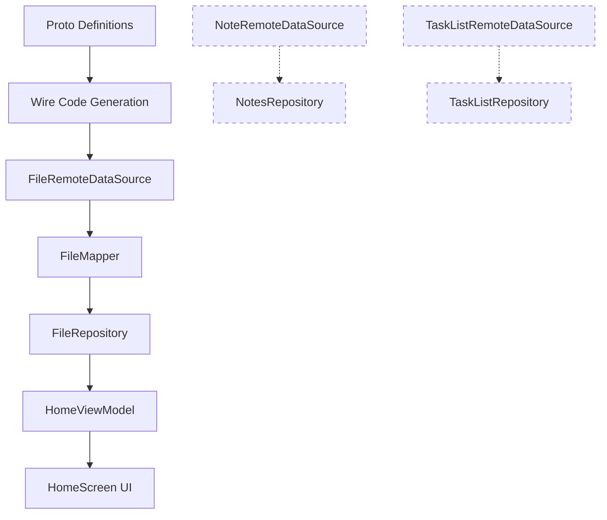

# Design Document: Proto API Update

## Overview

The EchoList backend is introducing breaking changes to its protobuf API. This design covers the client-side adaptation required across the Kotlin Compose Multiplatform codebase. The changes are:

1. **FolderService → FileService**: The proto package renames from `folder.v1` to `file.v1`, the service from `FolderService` to `FileService`, and `GetFolder`/`ListFolders` RPCs are replaced by `ListFiles` returning `repeated string entries`.
2. **NoteService & TaskListService proto updates**: Field and message shape changes to match the new backend contract. Client-side logic (data sources, repositories, mappers) is preserved for future editing use.
3. **HomeViewModel data source switch**: The HomeScreen stops using `NotesRepository.listNotes` for directory listing and instead uses `FileRepository.listFiles`. File entries use `note_` and `tasks_` prefixes to indicate type.
4. **Koin DI rewiring**: All renamed interfaces and implementations are re-bound in the DI modules.

This is a pre-release change — no migration or backwards compatibility is needed.

## Architecture

The existing layered architecture remains unchanged. The change flows top-down through these layers:



Dashed lines indicate preserved-but-unused-for-listing services. The solid path is the new primary data flow for the HomeScreen.

### Key Architectural Decisions

1. **Rename, don't duplicate**: `FolderRemoteDataSource` → `FileRemoteDataSource`, `FolderRepository` → `FileRepository`, etc. The old names are removed since this is pre-release.
2. **String entries as the listing primitive**: `ListFiles` returns `repeated string entries` instead of typed `Folder` messages. The ViewModel is responsible for parsing folder vs. file entries and deriving display names.
3. **Preserve note/task client logic**: `NoteRemoteDataSource`, `NotesRepository`, `TaskListRemoteDataSource`, `TaskListRepository` and their mappers remain in the codebase and Koin graph for future editing screens.
4. **FileUiModel gains a `fileType` field**: To distinguish notes from task lists based on the `note_` / `tasks_` prefix in entry paths.

## Components and Interfaces

### Proto Layer (changed files)

| File | Change |
|------|--------|
| `proto/file.proto` (new, replaces `folder.proto`) | Package `file.v1`, service `FileService` with `CreateFolder`, `ListFiles`, `UpdateFolder`, `DeleteFolder`. `ListFilesResponse` has `repeated string entries`. |
| `proto/notes.proto` | Updated message shapes per Requirement 7. `ListNotesResponse` gains `repeated string entries`. |
| `proto/tasks.proto` | Updated message shapes per Requirement 8. `ListTaskListsResponse` gains `repeated string entries`. |
| `build.gradle.kts` | Wire prune rule changes from `folder.v1.FolderService` to `file.v1.FileService`. |

### Network Layer

| Component | Interface | Change |
|-----------|-----------|--------|
| `FileRemoteDataSource` | `createFolder`, `listFiles`, `updateFolder`, `deleteFolder` | Renamed from `FolderRemoteDataSource`. `getFolder` removed. `listFolders` → `listFiles`. |
| `FileRemoteDataSourceImpl` | — | RPC paths change to `/file.v1.FileService/*`. Uses `file.v1` proto types. |

### Data / Mapper Layer

| Component | Change |
|-----------|--------|
| `FileMapper` (renamed from `FolderMapper`) | `toDomain(ListFoldersResponse)` removed. New `toDomain(ListFilesResponse): List<String>` extracts entries. All other mappings updated to use `file.v1` types. |

### Repository Layer

| Component | Interface | Change |
|-----------|-----------|--------|
| `FileRepository` (renamed from `FolderRepository`) | `createFolder`, `listFiles`, `updateFolder`, `deleteFolder` | `getFolder` removed. `listFolders` → `listFiles` returning `Result<List<String>>`. |
| `FileRepositoryImpl` (renamed from `FolderRepositoryImpl`) | — | Delegates to `FileRemoteDataSource` + `FileMapper`. |

### ViewModel Layer

| Component | Change |
|-----------|--------|
| `HomeViewModel` | Constructor takes `FileRepository` instead of `NotesRepository` + `FolderRepository`. `loadData()` calls `fileRepository.listFiles(path)`. Entry parsing logic extracts folders (trailing `/`) and files (prefix-based type detection). |

### UI Models

| Model | Change |
|-------|--------|
| `FileUiModel` | Adds `fileType: FileType` enum field (`NOTE`, `TASK_LIST`). `preview` and `timestamp` become empty strings (no full Note objects available). |
| `FolderUiModel` | `itemCount` becomes 0 (no sub-item count available from string entries). |

### DI Layer

| Module | Change |
|--------|--------|
| `networkModule` | `FolderRemoteDataSource` binding → `FileRemoteDataSource` / `FileRemoteDataSourceImpl` |
| `dataModule` | `FolderRepository` binding → `FileRepository` / `FileRepositoryImpl` |
| `navigationModule` | `HomeViewModel` constructor: `fileRepository = get()` replaces `notesRepository = get()` + `folderRepository = get()` |


## Data Models

### Proto Messages (file.v1)

```protobuf
// file.proto — package file.v1
service FileService {
  rpc CreateFolder (CreateFolderRequest) returns (CreateFolderResponse);
  rpc ListFiles (ListFilesRequest) returns (ListFilesResponse);
  rpc UpdateFolder (UpdateFolderRequest) returns (UpdateFolderResponse);
  rpc DeleteFolder (DeleteFolderRequest) returns (DeleteFolderResponse);
}

message Folder { string path = 1; string name = 2; }
message CreateFolderRequest { string parent_path = 1; string name = 2; }
message CreateFolderResponse { Folder folder = 1; }
message ListFilesRequest { string parent_path = 1; }
message ListFilesResponse { repeated string entries = 1; }
message UpdateFolderRequest { string folder_path = 1; string new_name = 2; }
message UpdateFolderResponse { Folder folder = 1; }
message DeleteFolderRequest { string folder_path = 1; }
message DeleteFolderResponse {}
```

### Domain Models (Kotlin)

Existing domain models remain unchanged:

```kotlin
data class Folder(val path: String, val name: String)
data class CreateFolderParams(val parentPath: String, val name: String)
data class UpdateFolderParams(val folderPath: String, val newName: String)
data class DeleteFolderParams(val folderPath: String)
```

### UI Models (updated)

```kotlin
enum class FileType { NOTE, TASK_LIST }

data class FileUiModel(
    val id: String,
    val title: String,
    val fileType: FileType,
    val preview: String,
    val timestamp: String
)

// FolderUiModel unchanged structurally, but itemCount will be 0
data class FolderUiModel(
    val id: String,
    val name: String,
    val itemCount: Int
)
```

### Entry Parsing Rules

The `ListFiles` response returns string entries. The ViewModel applies these rules:

| Entry Pattern | Classification | Display Title Derivation |
|---------------|---------------|--------------------------|
| Ends with `/` | Folder | Last path segment before trailing `/` |
| Starts with `note_` (after last `/`) | Note file | Strip `note_` prefix |
| Starts with `tasks_` (after last `/`) | Task list file | Strip `tasks_` prefix |

Example entries and their parsed results:

| Entry | Type | Display Title |
|-------|------|---------------|
| `/work/` | Folder | `work` |
| `/note_meeting-notes` | Note | `meeting-notes` |
| `/tasks_shopping` | Task list | `shopping` |


## Correctness Properties

*A property is a characteristic or behavior that should hold true across all valid executions of a system — essentially, a formal statement about what the system should do. Properties serve as the bridge between human-readable specifications and machine-verifiable correctness guarantees.*

### Property 1: FileMapper domain-to-proto field preservation

*For any* `CreateFolderParams`, `UpdateFolderParams`, or `DeleteFolderParams`, mapping to the corresponding `file.v1` proto request message and reading back the fields should yield the original values.

**Validates: Requirements 1.5, 1.9, 1.11, 3.5, 3.6, 3.7**

### Property 2: FileMapper proto-to-domain field preservation

*For any* `file.v1.Folder`, `CreateFolderResponse`, `ListFilesResponse`, or `UpdateFolderResponse`, mapping to the corresponding domain model should preserve all field values. In particular, `ListFilesResponse` entries should map to an identical `List<String>`.

**Validates: Requirements 1.4, 1.6, 1.8, 1.10, 3.1, 3.2, 3.3, 3.4**

### Property 3: FileRemoteDataSource RPC path correctness

*For any* valid request, each `FileRemoteDataSourceImpl` method (`createFolder`, `listFiles`, `updateFolder`, `deleteFolder`) should invoke `ConnectRpcClient.call` with the path `/file.v1.FileService/{MethodName}`.

**Validates: Requirements 2.3, 2.4, 2.5, 2.6**

### Property 4: FileRepositoryImpl success delegation

*For any* valid input parameters, when the underlying `FileRemoteDataSource` succeeds, `FileRepositoryImpl` should return `Result.success` containing the correctly mapped domain object (or `List<String>` for `listFiles`).

**Validates: Requirements 4.3, 4.4, 4.5, 4.6**

### Property 5: FileRepositoryImpl error propagation

*For any* exception thrown by `FileRemoteDataSource`, `FileRepositoryImpl` should return `Result.failure` wrapping that same exception.

**Validates: Requirements 4.7**

### Property 6: Entry partitioning into folders and files

*For any* list of string entries, partitioning into folder entries (ending with `/`) and file entries (not ending with `/`) should be exhaustive and mutually exclusive — every entry appears in exactly one partition, and the combined count equals the original list size.

**Validates: Requirements 5.4, 5.5**

### Property 7: File entry type classification and title derivation

*For any* file entry path whose filename starts with `note_`, the derived `FileUiModel` should have `fileType = NOTE` and a title equal to the filename with the `note_` prefix removed. *For any* file entry path whose filename starts with `tasks_`, the derived `FileUiModel` should have `fileType = TASK_LIST` and a title equal to the filename with the `tasks_` prefix removed.

**Validates: Requirements 5.6, 5.7, 10.3**

### Property 8: Folder name extraction from path

*For any* folder entry path ending with `/`, the derived `FolderUiModel` name should equal the last path segment before the trailing `/`.

**Validates: Requirements 10.4**

## Error Handling

| Layer | Error Source | Handling Strategy |
|-------|-------------|-------------------|
| `ConnectRpcClientImpl` | HTTP errors, timeouts, deserialization failures | Returns typed `Result.failure` with `NetworkException` subtypes. Retries on transient failures per `NetworkConfig.maxRetries`. |
| `FileRemoteDataSourceImpl` | `ConnectRpcClient` returns `Result.failure` | Calls `.getOrThrow()` — propagates the exception upward. |
| `FileRepositoryImpl` | Any exception from data source or mapper | Wraps in `try/catch`, returns `Result.failure(e)`. |
| `HomeViewModel` | `Result.failure` from repository | `loadData()` handles failure by setting empty folders/files lists in UI state. No crash. |
| Inline folder creation | `Result.failure` from `createFolder` | Sets `InlineCreationState.Error` with the error message. |

No new error types are introduced. The existing `NetworkException` hierarchy (`ClientError`, `ServerError`, `TimeoutError`, `SerializationError`, `NetworkError`) covers all cases.

## Testing Strategy

### Property-Based Tests (Kotest Property)

Each correctness property maps to one or more Kotest property-based tests using `io.kotest.property`. All property tests run a minimum of 100 iterations.

| Test Class | Properties Covered | Description |
|------------|-------------------|-------------|
| `FileMapperPropertyTest` | Property 1, Property 2 | Generates random domain params and proto messages, verifies field preservation in both mapping directions. |
| `FileRemoteDataSourcePropertyTest` | Property 3 | Uses a capturing fake `ConnectRpcClient` to verify RPC paths for all four methods. |
| `FileRepositoryImplPropertyTest` | Property 4, Property 5 | Uses a fake data source; generates random inputs to verify success delegation and error propagation. |
| `EntryParsingPropertyTest` | Property 6, Property 7, Property 8 | Generates random entry lists with mixed folder/file entries, verifies partitioning, type classification, title derivation, and folder name extraction. |

Each test is tagged with a comment: `Feature: proto-api-update, Property {N}: {title}`.

### Unit Tests (Kotest FunSpec)

Unit tests cover specific examples, edge cases, and integration points:

| Test Class | Coverage |
|------------|----------|
| `HomeViewModelTest` | Verifies `loadData()` calls `fileRepository.listFiles`, folder creation triggers reload (Requirements 5.3, 5.8). |
| `KoinModuleTest` | Verifies DI resolution: `FileRemoteDataSource`, `FileRepository`, `HomeViewModel` injection, and preserved `NotesRepository`/`TaskListRepository` bindings (Requirements 6.1–6.6, 9.4). |

### Testing Library

- **Framework**: Kotest (`io.kotest.core.spec.style.FunSpec`)
- **Assertions**: Kotest assertions (`io.kotest.matchers`)
- **Property testing**: Kotest property (`io.kotest.property`) with `Arb` generators and `checkAll`
- **Mocking/Fakes**: Hand-written fakes (consistent with existing test patterns in the codebase)
- **Configuration**: `PropTestConfig(iterations = 100)` for all property tests
