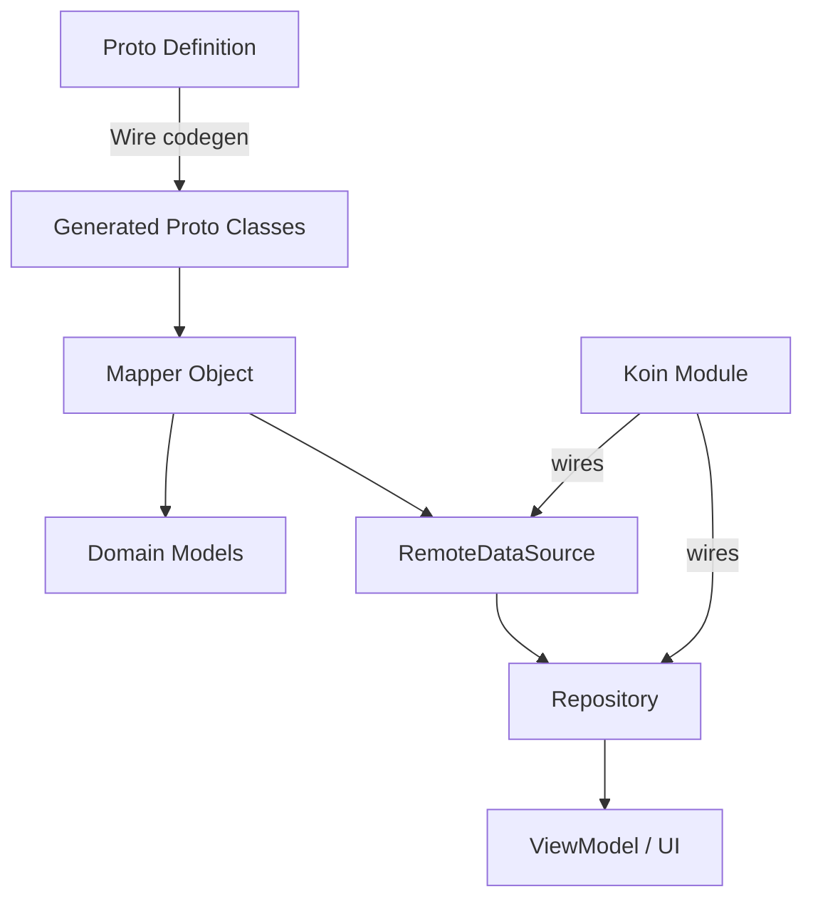

# Design Document: Proto API Update

## Overview

This feature updates the EchoList Kotlin data layer to align with a revised backend proto API. The changes span three services — FolderService, NoteService, and TaskListService — and affect proto definitions, domain models, mappers, remote data sources, repositories, and Koin DI wiring.

Key changes:
- **Domain removal**: The `domain` parameter is removed from all folder operations. All content lives under a single data root.
- **API unification**: RPC names are standardized (e.g. `RenameFolder` → `UpdateFolder`). Responses now return single objects instead of lists where appropriate.
- **Empty delete responses**: All delete RPCs return empty responses instead of updated folder/note lists.
- **TaskListService**: The former TaskService is renamed. New Kotlin client code (models, mapper, data source, repository) is created from scratch.

The project uses Wire for proto code generation, ConnectRPC over HTTP for transport, and follows a layered architecture: proto → mapper → data source → repository → ViewModel.

## Architecture

The existing layered architecture remains unchanged. Each service follows the same pattern:



All three services (Folder, Note, TaskList) follow this identical pattern. The changes are mechanical: update proto files, update or create domain models, update or create mappers, update or create data sources and repositories, and re-wire Koin bindings.

No new architectural patterns are introduced. The TaskListService client is new code but follows the exact same conventions as the existing FolderService and NoteService clients.

## Components and Interfaces

### Proto Files

| File | Service | RPCs |
|------|---------|------|
| `proto/folder.proto` | FolderService | CreateFolder, GetFolder, ListFolders, UpdateFolder, DeleteFolder |
| `proto/notes.proto` | NoteService | CreateNote, ListNotes, GetNote, UpdateNote, DeleteNote |
| `proto/tasks.proto` (new) | TaskListService | CreateTaskList, GetTaskList, ListTaskLists, UpdateTaskList, DeleteTaskList |

### Mappers

| Mapper | Responsibility |
|--------|---------------|
| `FolderMapper` | Converts between folder proto messages and `Folder` domain model. Removes domain field handling. Adds Get/List/Update response mapping. |
| `NoteMapper` | Updates response mapping for `CreateNoteResponse`, `GetNoteResponse`, `UpdateNoteResponse` (now contain nested `note` field). |
| `TaskListMapper` (new) | Converts between task list proto messages and `TaskList`, `MainTask`, `SubTask` domain models. Handles nested MainTask/SubTask conversion in both directions. |

### Remote Data Sources

| Interface | Implementation | Methods |
|-----------|---------------|---------|
| `FolderRemoteDataSource` | `FolderRemoteDataSourceImpl` | createFolder, getFolder, listFolders, updateFolder, deleteFolder |
| `NoteRemoteDataSource` | `NoteRemoteDataSourceImpl` | createNote, listNotes, getNote, updateNote, deleteNote |
| `TaskListRemoteDataSource` (new) | `TaskListRemoteDataSourceImpl` (new) | createTaskList, getTaskList, listTaskLists, updateTaskList, deleteTaskList |

### Repositories

| Interface | Implementation | Key Changes |
|-----------|---------------|-------------|
| `FolderRepository` | `FolderRepositoryImpl` | `createFolder` returns `Result<Folder>` (was `Result<List<Folder>>`). `deleteFolder` returns `Result<Unit>` (was `Result<List<Folder>>`). `renameFolder` replaced by `updateFolder` returning `Result<Folder>`. New `getFolder` and `listFolders` methods. |
| `NotesRepository` | `NotesRepositoryImpl` | `updateNote` uses mapped Note directly from `UpdateNoteResponse` instead of issuing a separate `GetNote` call. |
| `TaskListRepository` (new) | `TaskListRepositoryImpl` (new) | Full CRUD: createTaskList, getTaskList, listTaskLists, updateTaskList, deleteTaskList. |

### Koin Modules

| Module | Changes |
|--------|---------|
| `networkModule` | Add `TaskListRemoteDataSource` → `TaskListRemoteDataSourceImpl` binding. Update `FolderRemoteDataSource` binding. |
| `dataModule` | Add `TaskListRepository` → `TaskListRepositoryImpl` binding. Update `FolderRepository` binding. |

## Data Models

### Folder Domain Models

```kotlin
// Updated — added name field
data class Folder(
    val path: String,
    val name: String
)

// Updated — removed domain field
data class CreateFolderParams(
    val parentPath: String,
    val name: String
)

// Updated — removed domain field
data class DeleteFolderParams(
    val folderPath: String
)

// New — replaces RenameFolderParams
data class UpdateFolderParams(
    val folderPath: String,
    val newName: String
)
```

### Note Domain Models

No changes to existing Note, CreateNoteParams, UpdateNoteParams, or ListNotesResult domain models. The mapper changes are internal — response shapes change but the domain models remain the same.

### TaskList Domain Models (all new)

```kotlin
data class SubTask(
    val description: String,
    val done: Boolean
)

data class MainTask(
    val description: String,
    val done: Boolean,
    val dueDate: String,
    val recurrence: String,
    val subTasks: List<SubTask>
)

data class TaskList(
    val filePath: String,
    val name: String,
    val tasks: List<MainTask>,
    val updatedAt: Long
)

data class TaskListEntry(
    val filePath: String,
    val name: String,
    val updatedAt: Long
)

data class ListTaskListsResult(
    val taskLists: List<TaskListEntry>,
    val entries: List<String>
)

data class CreateTaskListParams(
    val name: String,
    val path: String,
    val tasks: List<MainTask>
)

data class UpdateTaskListParams(
    val filePath: String,
    val tasks: List<MainTask>
)
```

### Proto Message Mapping Summary

| Proto Message | Domain Model | Direction |
|--------------|-------------|-----------|
| `folder.v1.Folder` | `Folder` | proto → domain |
| `CreateFolderRequest` | `CreateFolderParams` | domain → proto |
| `CreateFolderResponse` | `Folder` | proto → domain |
| `GetFolderResponse` | `Folder` | proto → domain |
| `ListFoldersResponse` | `List<Folder>` | proto → domain |
| `UpdateFolderRequest` | `UpdateFolderParams` | domain → proto |
| `UpdateFolderResponse` | `Folder` | proto → domain |
| `DeleteFolderRequest` | `DeleteFolderParams` | domain → proto |
| `DeleteFolderResponse` | (empty) | — |
| `notes.v1.Note` | `Note` | proto → domain |
| `CreateNoteResponse` | `Note` | proto → domain |
| `GetNoteResponse` | `Note` | proto → domain |
| `UpdateNoteResponse` | `Note` | proto → domain |
| `ListNotesResponse` | `ListNotesResult` | proto → domain |
| `DeleteNoteResponse` | (empty) | — |
| `tasks.v1.SubTask` | `SubTask` | both |
| `tasks.v1.MainTask` | `MainTask` | both |
| `CreateTaskListResponse` | `TaskList` | proto → domain |
| `GetTaskListResponse` | `TaskList` | proto → domain |
| `ListTaskListsResponse` | `ListTaskListsResult` | proto → domain |
| `UpdateTaskListResponse` | `TaskList` | proto → domain |
| `DeleteTaskListResponse` | (empty) | — |
| `CreateTaskListRequest` | `CreateTaskListParams` | domain → proto |
| `UpdateTaskListRequest` | `UpdateTaskListParams` | domain → proto |


## Correctness Properties

*A property is a characteristic or behavior that should hold true across all valid executions of a system — essentially, a formal statement about what the system should do. Properties serve as the bridge between human-readable specifications and machine-verifiable correctness guarantees.*

Many of the acceptance criteria in this feature are structural (proto message shapes, data class fields, interface signatures, DI bindings). These are enforced at compile time by Kotlin's type system and Wire codegen — they don't need runtime property tests. The testable properties focus on mapper correctness (field preservation across all inputs) and repository error handling.

### Property 1: Folder mapper domain-to-proto field preservation

*For any* `CreateFolderParams`, `UpdateFolderParams`, or `DeleteFolderParams`, mapping to the corresponding proto request message shall preserve all field values exactly.

**Validates: Requirements 1.4, 1.5, 1.6**

### Property 2: Folder mapper proto-to-domain field preservation

*For any* proto `Folder` message, `CreateFolderResponse`, `GetFolderResponse`, `ListFoldersResponse`, or `UpdateFolderResponse`, mapping to domain shall preserve path and name for every Folder, and list sizes shall be equal.

**Validates: Requirements 3.2, 3.3, 3.4, 3.5, 3.6**

### Property 3: Note mapper response-to-domain field preservation

*For any* `CreateNoteResponse`, `GetNoteResponse`, or `UpdateNoteResponse` containing a nested Note, mapping to a domain `Note` shall preserve file_path, title, content, and updated_at. *For any* `ListNotesResponse`, mapping shall produce a `ListNotesResult` with the same number of notes and entries, all fields preserved.

**Validates: Requirements 6.1, 6.2, 6.3, 6.4**

### Property 4: TaskList mapper proto-to-domain field preservation

*For any* proto `MainTask` (with nested `SubTask` list), mapping to a domain `MainTask` shall preserve description, done, due_date, recurrence, and all nested SubTasks recursively. *For any* `CreateTaskListResponse`, `GetTaskListResponse`, or `UpdateTaskListResponse`, mapping to a domain `TaskList` shall preserve filePath, name, tasks, and updatedAt. *For any* `ListTaskListsResponse`, mapping shall produce a `ListTaskListsResult` with correct taskLists and entries counts and field values.

**Validates: Requirements 10.1, 10.2, 10.3, 10.4, 10.5, 10.6**

### Property 5: TaskList mapper domain-to-proto field preservation

*For any* `CreateTaskListParams` or `UpdateTaskListParams` (with nested `MainTask` and `SubTask` lists), mapping to the corresponding proto request message shall preserve all field values including nested task structures.

**Validates: Requirements 10.7, 10.8**

### Property 6: TaskList mapping round-trip

*For any* valid `TaskList` domain object (with nested `MainTask` and `SubTask` lists), mapping to proto and back to domain shall produce an equivalent object.

**Validates: Requirements 10.9**

### Property 7: TaskListRepository error propagation

*For any* exception thrown by the `TaskListRemoteDataSource`, every `TaskListRepositoryImpl` method shall return `Result.failure` containing that exact exception.

**Validates: Requirements 12.7**

## Error Handling

All repository methods follow the existing `Result<T>` pattern:

- Network calls are wrapped in `try/catch` blocks
- Successful responses are mapped and returned as `Result.success(mappedValue)`
- Exceptions (including `NetworkException`) are returned as `Result.failure(exception)`
- The `TaskListRepositoryImpl` follows the same pattern as `FolderRepositoryImpl` — no offline queue or caching (unlike `NotesRepositoryImpl`)
- `FolderRepositoryImpl.deleteFolder` returns `Result.success(Unit)` on success (empty response)
- `NotesRepositoryImpl.updateNote` no longer issues a separate `getNote` call — the `UpdateNoteResponse` now contains the full Note, so the extra round-trip is eliminated

Mapper functions are pure and do not throw. If a proto field has a default value (empty string, 0, false), the mapper passes it through as-is — no null-safety concerns since Wire proto3 fields are non-nullable in Kotlin.

## Testing Strategy

### Property-Based Testing

- Library: **Kotest** (property module: `io.kotest.property`)
- Each property test uses `checkAll` with Kotest `Arb` generators
- Minimum **100 iterations** per property (configured via `.config(invocations = ...)` or default `checkAll` count)
- Each test is tagged with a comment: **Feature: proto-api-update, Property {number}: {title}**
- Each correctness property maps to a single property-based test

Test files:
- `FolderMapperPropertyTest.kt` — Properties 1, 2 (update existing file)
- `NoteMapperPropertyTest.kt` — Property 3 (update existing file)
- `TaskListMapperPropertyTest.kt` — Properties 4, 5, 6 (new file)
- `TaskListRepositoryImplTest.kt` — Property 7 (new file)

### Unit Testing

Unit tests complement property tests for:
- **Service path verification**: Each `RemoteDataSourceImpl` method calls `ConnectRpcClient` with the correct RPC path string (validates Requirements 4.2–4.6, 7.1, 11.2–11.6)
- **Koin DI resolution**: Each module binding resolves to the correct implementation type (validates Requirements 13.1–13.4)
- **NotesRepositoryImpl update behavior**: `updateNote` uses the mapped Note from `UpdateNoteResponse` directly without calling `getNote` (validates Requirement 6.5)

Test files:
- `FolderRemoteDataSourceImplTest.kt` — service path unit tests (update or new)
- `NoteRemoteDataSourceImplTest.kt` — service path unit tests (new)
- `TaskListRemoteDataSourceImplTest.kt` — service path unit tests (new)
- `NotesRepositoryImplTest.kt` — updateNote behavior test (new or update)
- `KoinModuleTest.kt` — DI resolution tests (new)
