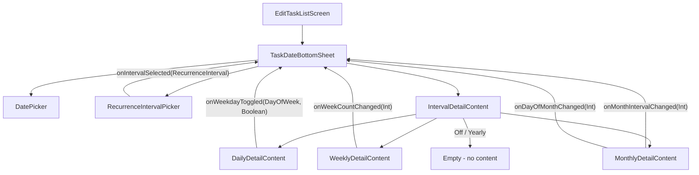

# Design Document: Recurrence Pattern Picker

## Overview

This feature extends the existing `TaskDateBottomSheet` with a recurrence pattern picker, allowing users to configure recurring tasks directly alongside the date picker. The implementation adds a `RecurrenceIntervalPicker` composable (a horizontal row of pill-shaped segments for Off/Daily/Weekly/Monthly/Yearly) and interval-specific detail UIs below it.

All new composables follow the project's stateless pattern: they receive state and emit callbacks. The recurrence state is managed locally within the `TaskDateBottomSheet` scope and exposed to the parent via callbacks, matching the existing `onDueDateSelected` pattern. No backend persistence is involved — this is a UI-only feature.

### Key Design Decisions

1. **RecurrenceInterval as a sealed interface** rather than a plain enum — each variant carries its own `shortLabel` and `fullLabel`, keeping label logic co-located with the interval type and making it easy to add new intervals later.
2. **RecurrenceState as a sealed hierarchy** — each interval variant holds its own configuration data (e.g., `WeeklyState` holds the week count, `DailyState` holds the weekday selections). This avoids a flat data class with nullable fields.
3. **Composable decomposition** — each interval detail UI is a separate stateless composable, keeping the `TaskDateBottomSheet` orchestration clean.
4. **Theme-only styling** — all colors, typography, spacing, and shapes come from `EchoListTheme.*` tokens. No magic `dp` literals.

## Architecture

The feature fits entirely within the existing `ui/edittasklist` package. No new architectural layers are needed.



### Data Flow

1. `TaskDateBottomSheet` holds local `RecurrenceState` (via `remember`/`mutableStateOf`).
2. User taps a pill segment → `RecurrenceIntervalPicker` calls `onIntervalSelected`.
3. `TaskDateBottomSheet` updates `RecurrenceState`, switching the interval and resetting detail config to defaults.
4. The appropriate `IntervalDetailContent` composable renders based on the current `RecurrenceState`.
5. User changes detail config → detail composable emits a callback → `TaskDateBottomSheet` updates state.
6. `TaskDateBottomSheet` exposes the full recurrence selection to its parent via a new `onRecurrenceChanged` callback.

## Components and Interfaces

### RecurrenceInterval (sealed interface)

```kotlin
package net.onefivefour.echolist.ui.edittasklist

sealed interface RecurrenceInterval {
    val shortLabel: String
    val fullLabel: String

    data object Off : RecurrenceInterval {
        override val shortLabel = "Off"
        override val fullLabel = "Off"
    }
    data object Daily : RecurrenceInterval {
        override val shortLabel = "D"
        override val fullLabel = "Daily"
    }
    data object Weekly : RecurrenceInterval {
        override val shortLabel = "W"
        override val fullLabel = "Weekly"
    }
    data object Monthly : RecurrenceInterval {
        override val shortLabel = "M"
        override val fullLabel = "Monthly"
    }
    data object Yearly : RecurrenceInterval {
        override val shortLabel = "Y"
        override val fullLabel = "Yearly"
    }

    companion object {
        val entries: List<RecurrenceInterval> = listOf(Off, Daily, Weekly, Monthly, Yearly)
    }
}
```

### RecurrenceState (sealed interface)

Holds the full recurrence configuration. Each variant corresponds to an interval.

```kotlin
sealed interface RecurrenceState {
    val interval: RecurrenceInterval

    data object Off : RecurrenceState {
        override val interval = RecurrenceInterval.Off
    }
    data class Daily(
        val selectedDays: Set<kotlinx.datetime.DayOfWeek> = emptySet()
    ) : RecurrenceState {
        override val interval = RecurrenceInterval.Daily
    }
    data class Weekly(
        val everyNWeeks: Int = 1
    ) : RecurrenceState {
        override val interval = RecurrenceInterval.Weekly
    }
    data class Monthly(
        val everyNMonths: Int = 1,
        val dayOfMonth: Int = 1
    ) : RecurrenceState {
        override val interval = RecurrenceInterval.Monthly
    }
    data object Yearly : RecurrenceState {
        override val interval = RecurrenceInterval.Yearly
    }
}
```

### RecurrenceIntervalPicker (Composable)

```kotlin
@Composable
internal fun RecurrenceIntervalPicker(
    selectedInterval: RecurrenceInterval,
    onIntervalSelected: (RecurrenceInterval) -> Unit,
    modifier: Modifier = Modifier
)
```

- Renders a horizontal `Row` of five pill-shaped `Surface` segments.
- Each segment shows `shortLabel` when unselected, `fullLabel` when selected.
- Selected segment uses `EchoListTheme.materialColors.primary` background with `onPrimary` text.
- Unselected segments use `EchoListTheme.materialColors.surfaceVariant` background with `onSurfaceVariant` text.
- Uses `EchoListTheme.shapes.small` for pill corner rounding.
- Spacing between pills: `EchoListTheme.dimensions.xs`.
- Padding around the row: `EchoListTheme.dimensions.l` horizontal.

### DailyDetailContent (Composable)

```kotlin
@Composable
internal fun DailyDetailContent(
    selectedDays: Set<DayOfWeek>,
    onDayToggled: (DayOfWeek, Boolean) -> Unit,
    modifier: Modifier = Modifier
)
```

- Renders a horizontal `Row` of seven checkboxes, one per `DayOfWeek` (Monday–Sunday).
- Each checkbox is labeled with the weekday abbreviation (Mon, Tue, Wed, Thu, Fri, Sat, Sun).
- Uses `EchoListTheme.typography.labelSmall` for labels.
- Spacing: `EchoListTheme.dimensions.xs` between items.

### WeeklyDetailContent (Composable)

```kotlin
@Composable
internal fun WeeklyDetailContent(
    everyNWeeks: Int,
    onWeekCountChanged: (Int) -> Unit,
    modifier: Modifier = Modifier
)
```

- Displays "Every [n] week(s)" with an inline numeric text field for `n`.
- Accepts only positive integers (minimum 1).
- Uses `EchoListTheme.typography.bodyMedium` for the label text.
- Text field width constrained to fit ~3 digits.

### MonthlyDetailContent (Composable)

```kotlin
@Composable
internal fun MonthlyDetailContent(
    everyNMonths: Int,
    dayOfMonth: Int,
    onMonthIntervalChanged: (Int) -> Unit,
    onDayOfMonthChanged: (Int) -> Unit,
    modifier: Modifier = Modifier
)
```

- Displays "Every [n] month(s) on the [m]th day" with two inline numeric text fields.
- Month interval: positive integers (minimum 1).
- Day of month: integers 1–31 inclusive.
- Uses `EchoListTheme.typography.bodyMedium` for label text.

### Updated TaskDateBottomSheet Signature

```kotlin
@Composable
internal fun TaskDateBottomSheet(
    sheetState: TaskDateSheetState,
    mainTask: UiMainTask,
    onDismissRequest: () -> Unit,
    onDueDateSelected: (String) -> Unit,
    onRecurrenceChanged: (RecurrenceState) -> Unit
)
```

The bottom sheet internally manages `RecurrenceState` via `remember { mutableStateOf(RecurrenceState.Off) }`. When the state changes, it calls `onRecurrenceChanged` to notify the parent.

## Data Models

### RecurrenceInterval

| Variant  | shortLabel | fullLabel |
|----------|-----------|-----------|
| Off      | "Off"     | "Off"     |
| Daily    | "D"       | "Daily"   |
| Weekly   | "W"       | "Weekly"  |
| Monthly  | "M"       | "Monthly" |
| Yearly   | "Y"       | "Yearly"  |

### RecurrenceState

| Variant  | Fields                                          | Defaults                                    |
|----------|-------------------------------------------------|---------------------------------------------|
| Off      | (none)                                          | —                                           |
| Daily    | `selectedDays: Set<DayOfWeek>`                  | `emptySet()`                                |
| Weekly   | `everyNWeeks: Int`                               | `1`                                         |
| Monthly  | `everyNMonths: Int`, `dayOfMonth: Int`           | `1`, day component of current Base_Date     |
| Yearly   | (none)                                          | —                                           |

### Validation Rules

| Field         | Constraint                  |
|---------------|-----------------------------|
| everyNWeeks   | Positive integer (≥ 1)      |
| everyNMonths  | Positive integer (≥ 1)      |
| dayOfMonth    | Integer in range [1, 31]    |


## Correctness Properties

*A property is a characteristic or behavior that should hold true across all valid executions of a system — essentially, a formal statement about what the system should do. Properties serve as the bridge between human-readable specifications and machine-verifiable correctness guarantees.*

### Property 1: Label mapping correctness

*For any* `RecurrenceInterval` in the entries list, its `shortLabel` and `fullLabel` must match the specification: Off→("Off","Off"), Daily→("D","Daily"), Weekly→("W","Weekly"), Monthly→("M","Monthly"), Yearly→("Y","Yearly").

**Validates: Requirements 2.1, 2.2, 2.3, 2.4, 2.5**

### Property 2: Selected vs unselected label display

*For any* `RecurrenceInterval` chosen as the selected interval, the label function must return `fullLabel` for that interval and `shortLabel` for every other interval in the entries list.

**Validates: Requirements 1.2, 1.3**

### Property 3: Date semantics depend on recurrence state

*For any* `RecurrenceState` and any valid date string, if the state is `Off` then the date represents a due date (recurrence is empty), and if the state is any non-Off variant then the date represents a base date (recurrence is populated).

**Validates: Requirements 3.3, 3.4**

### Property 4: Weekday toggle is a symmetric set operation

*For any* `Set<DayOfWeek>` and any `DayOfWeek`, toggling that day should produce a new set where: if the day was present it is now absent, and if it was absent it is now present. The resulting set size differs from the original by exactly 1.

**Validates: Requirements 5.3**

### Property 5: Weekly format string correctness

*For any* positive integer `n`, the weekly display text must equal `"Every $n week(s)"`.

**Validates: Requirements 6.2**

### Property 6: Monthly format string correctness

*For any* positive integer `n` and any integer `m` in [1, 31], the monthly display text must equal `"Every $n month(s) on the ${m}th day"`.

**Validates: Requirements 7.2**

### Property 7: Positive integer validation

*For any* string input, the positive-integer validator accepts it if and only if the string parses to an integer ≥ 1. This validator is shared by the week interval and month interval inputs.

**Validates: Requirements 6.3, 7.3**

### Property 8: Day-of-month range validation

*For any* integer input, the day-of-month validator accepts it if and only if the value is in the range [1, 31] inclusive.

**Validates: Requirements 7.4**

## Error Handling

### Input Validation

| Input | Invalid Value | Behavior |
|-------|--------------|----------|
| Week interval | Non-positive integer, non-numeric, empty | Reject input; keep previous valid value. Field shows last valid value. |
| Month interval | Non-positive integer, non-numeric, empty | Reject input; keep previous valid value. Field shows last valid value. |
| Day of month | Outside [1, 31], non-numeric, empty | Reject input; keep previous valid value. Field shows last valid value. |

### Edge Cases

- **Switching intervals**: When the user switches from one interval to another, the detail state resets to defaults for the new interval. No stale state carries over.
- **Day 31 on short months**: The UI accepts day 31 as valid input. Handling months with fewer than 31 days is a backend concern (out of scope for this UI-only feature).
- **Empty weekday selection**: The Daily interval allows zero selected weekdays. The UI does not enforce a minimum — that constraint belongs to the backend validation layer.

### State Consistency

- `RecurrenceState` is always in a valid configuration because each sealed variant enforces its own constraints via default values and the validation functions described above.
- The `TaskDateBottomSheet` always holds exactly one `RecurrenceState` — there is no intermediate "unset" state.

## Testing Strategy

### Property-Based Tests (Kotest Property)

Property-based tests use `kotest-property` with `checkAll(PropTestConfig(iterations = 100), ...)`. Each test is tagged with its design property reference.

| Property | Test Description | Generator Strategy |
|----------|-----------------|-------------------|
| 1 | Label mapping correctness | Generate from `RecurrenceInterval.entries` (exhaustive) |
| 2 | Selected vs unselected label display | Generate a random `RecurrenceInterval` as selected; verify labels for all entries |
| 3 | Date semantics depend on recurrence state | Generate random `RecurrenceState` variants and random date strings |
| 4 | Weekday toggle symmetric set operation | Generate random `Set<DayOfWeek>` and a random `DayOfWeek` |
| 5 | Weekly format string | Generate random positive integers (1..1000) |
| 6 | Monthly format string | Generate random positive integers for month (1..1000) and day (1..31) |
| 7 | Positive integer validation | Generate random strings (including numeric, non-numeric, negative, zero, blank) |
| 8 | Day-of-month range validation | Generate random integers (including negatives, zero, 1–31, and >31) |

**Tag format**: `Feature: recurrence-pattern-picker, Property {N}: {title}`

### Unit Tests (Example-Based)

| Requirement | Test Description |
|-------------|-----------------|
| 1.1 | `RecurrenceInterval.entries` has exactly 5 elements in order: Off, Daily, Weekly, Monthly, Yearly |
| 1.4 | `selectedInterval` type system enforces exactly one selection |
| 1.5 | Default `RecurrenceState` is `Off` |
| 4.1 | Off state renders no detail content |
| 5.1 | Daily state renders exactly 7 checkboxes |
| 6.1 | Weekly state renders a numeric input |
| 6.4 | `RecurrenceState.Weekly` defaults `everyNWeeks` to 1 |
| 7.1 | Monthly state renders two numeric inputs |
| 7.5 | `RecurrenceState.Monthly` defaults `everyNMonths` to 1 and `dayOfMonth` to base date day |
| 8.1 | Yearly state renders no detail content |

### Test File Locations

- Property tests: `composeApp/src/commonTest/kotlin/net/onefivefour/echolist/ui/edittasklist/RecurrencePatternPropertyTest.kt`
- Unit tests: `composeApp/src/commonTest/kotlin/net/onefivefour/echolist/ui/edittasklist/RecurrencePatternTest.kt`

### What Is NOT Tested

- UI layout and visual appearance (composable rendering order, spacing, colors) — these are verified by manual inspection and Compose previews.
- Stateless composable pattern adherence — enforced by code review and the composable signatures.
- `EchoListTheme` token usage — enforced by code review and Detekt/ktlint rules.
