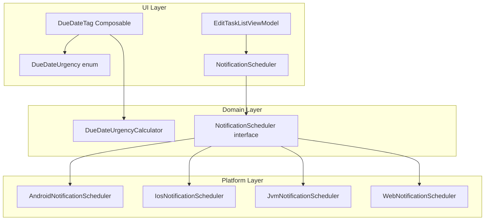
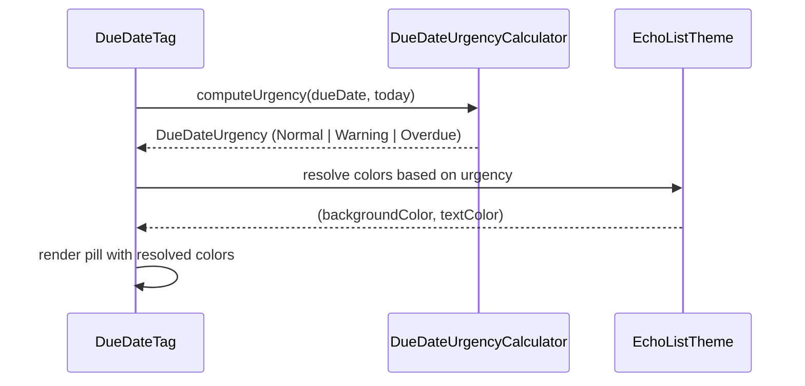
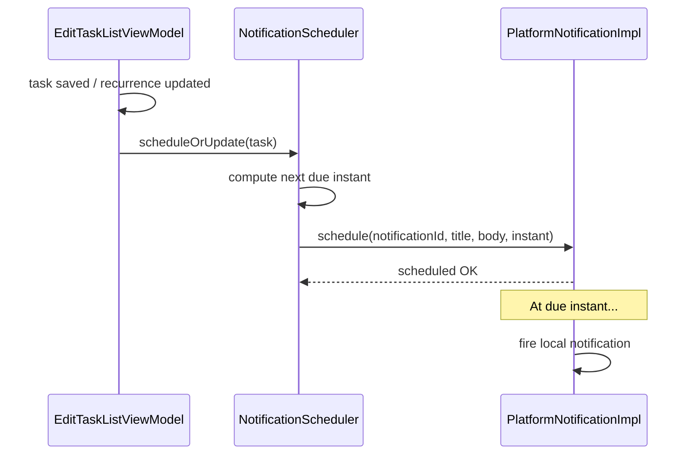

# Design Document: Recurrence Reminders

## Overview

This feature adds two capabilities to the EchoList task list editor:

1. **Visual urgency coloring for the recurrence pill (DueDateTag):** When a recurring task's due date is approaching (< 3 days away) or already due (today or past), the pill background and text colors shift to `warning`/`onWarning` or `error`/`onError` respectively. This gives users an at-a-glance sense of urgency without requiring them to read dates.

2. **Local notifications when a recurring task becomes due:** A cross-platform notification service fires a local notification when a recurring task's due date arrives. This ensures the user is reminded even if the app is not currently open. The notification system uses `expect`/`actual` declarations to delegate to platform-native notification APIs (Android notifications, iOS UNUserNotificationCenter, desktop system tray, and web Notification API).

## Architecture



## Sequence Diagrams

### Urgency Coloring Flow



### Notification Scheduling Flow



## Components and Interfaces

### Component 1: DueDateUrgencyCalculator

**Purpose**: Pure function that determines the urgency level of a task based on its due date relative to today.

```kotlin
package net.onefivefour.echolist.domain

import kotlinx.datetime.LocalDate

enum class DueDateUrgency {
    /** Due date is more than 3 days in the future, or no due date set. */
    Normal,
    /** Due date is within the next 3 days (exclusive of today). */
    Warning,
    /** Due date is today or in the past. */
    Overdue
}

object DueDateUrgencyCalculator {
    fun computeUrgency(dueDate: LocalDate, today: LocalDate): DueDateUrgency
}
```

**Responsibilities**:
- Parse and compare dates to determine urgency tier
- Remain pure — no side effects, no I/O
- Handle edge cases (same day = Overdue, exactly 3 days = Warning)

### Component 2: NotificationScheduler (interface)

**Purpose**: Platform-agnostic contract for scheduling and canceling local notifications tied to recurring tasks.

```kotlin
package net.onefivefour.echolist.domain

interface NotificationScheduler {
    /**
     * Schedule a local notification for the given task.
     * If a notification already exists for this taskId, it is replaced.
     */
    suspend fun schedule(
        taskId: String,
        title: String,
        body: String,
        dueDateIso: String
    )

    /**
     * Cancel any pending notification for the given task.
     */
    suspend fun cancel(taskId: String)
}
```

**Responsibilities**:
- Accept a task ID and due date, convert to platform instant, schedule notification
- Replace existing notifications for the same task (idempotent)
- Cancel notifications when recurrence is removed or task is deleted

### Component 3: Platform Notification Implementations

**Purpose**: `actual` implementations of `NotificationScheduler` per target platform.

```kotlin
// commonMain — expect declaration
package net.onefivefour.echolist.di

import org.koin.core.module.Module

// Already exists; each platform module will add NotificationScheduler binding
expect fun platformModule(): Module
```

**Responsibilities (per platform)**:
- **Android**: Use `AlarmManager` or `WorkManager` to trigger a `BroadcastReceiver` that posts a notification via `NotificationManager`
- **iOS**: Use `UNUserNotificationCenter.addNotificationRequest` with a `UNCalendarNotificationTrigger`
- **JVM Desktop**: Use system tray notifications via `java.awt.SystemTray` or a coroutine-delayed in-process alert
- **JS / WasmJS**: Use the web `Notification` API with `setTimeout` or `ServiceWorker` scheduling

### Component 4: Updated DueDateTag Composable

**Purpose**: Extend the existing `DueDateTag` composable to accept urgency state and render with appropriate colors.

```kotlin
@Composable
private fun DueDateTag(
    dueDate: String,
    isRecurring: Boolean,
    urgency: DueDateUrgency,
    onClick: () -> Unit
)
```

**Responsibilities**:
- Resolve pill background and text color from urgency enum
- Maintain existing layout and behavior
- Remain stateless — urgency is computed externally and passed in

## Data Models

### Model: DueDateUrgency

```kotlin
enum class DueDateUrgency {
    Normal,
    Warning,
    Overdue
}
```

**Validation Rules**:
- Derived purely from date comparison, never stored persistently
- Default is `Normal` when due date is empty or unparseable

### Model: TaskNotificationData

```kotlin
data class TaskNotificationData(
    val taskId: String,
    val taskDescription: String,
    val taskListName: String,
    val dueDateIso: String
)
```

**Validation Rules**:
- `taskId` must be non-blank
- `dueDateIso` must be a valid ISO-8601 date string (yyyy-MM-dd)

## Algorithmic Pseudocode

### Urgency Calculation Algorithm

```kotlin
/**
 * ALGORITHM: computeUrgency
 * INPUT: dueDate: LocalDate, today: LocalDate
 * OUTPUT: DueDateUrgency
 *
 * PRECONDITIONS:
 * - dueDate and today are valid LocalDate instances
 *
 * POSTCONDITIONS:
 * - Returns Overdue if dueDate <= today
 * - Returns Warning if dueDate is within (today, today + 3 days]
 * - Returns Normal if dueDate > today + 3 days
 */
fun computeUrgency(dueDate: LocalDate, today: LocalDate): DueDateUrgency {
    val daysUntilDue = dueDate.toEpochDays() - today.toEpochDays()

    return when {
        daysUntilDue <= 0 -> DueDateUrgency.Overdue
        daysUntilDue in 1..3 -> DueDateUrgency.Warning
        else -> DueDateUrgency.Normal
    }
}
```

**Preconditions:**
- `dueDate` is a valid calendar date
- `today` represents the current calendar date in the user's time zone

**Postconditions:**
- Returns exactly one of the three urgency values
- Result is deterministic for the same inputs
- No side effects

**Loop Invariants:** N/A (no loops)

### Notification Scheduling Algorithm

```kotlin
/**
 * ALGORITHM: scheduleTaskNotification
 * INPUT: task: MainTask (with non-empty dueDate and recurrence)
 * OUTPUT: Unit (side effect: notification scheduled on platform)
 *
 * PRECONDITIONS:
 * - task.dueDate is a valid ISO-8601 date string
 * - task.recurrence is a non-empty RRULE string
 * - NotificationScheduler implementation is available via Koin
 *
 * POSTCONDITIONS:
 * - A local notification is scheduled for the task's due date at start of day (local TZ)
 * - Any previously scheduled notification for the same taskId is replaced
 */
suspend fun scheduleTaskNotification(
    scheduler: NotificationScheduler,
    task: MainTask,
    taskListName: String
) {
    if (task.dueDate.isBlank() || task.recurrence.isBlank()) {
        scheduler.cancel(task.id)
        return
    }

    scheduler.schedule(
        taskId = task.id,
        title = "Task due: $taskListName",
        body = task.description,
        dueDateIso = task.dueDate
    )
}
```

**Preconditions:**
- `task.dueDate` is parseable as `LocalDate`
- `task.recurrence` indicates the task is recurring
- Platform notification permissions have been granted (handled gracefully if not)

**Postconditions:**
- If task has valid dueDate + recurrence: notification is scheduled
- If task has no dueDate or no recurrence: any existing notification is canceled
- Function is idempotent for the same task state

**Loop Invariants:** N/A

## Key Functions with Formal Specifications

### Function 1: DueDateUrgencyCalculator.computeUrgency()

```kotlin
fun computeUrgency(dueDate: LocalDate, today: LocalDate): DueDateUrgency
```

**Preconditions:**
- `dueDate` is a valid `kotlinx.datetime.LocalDate`
- `today` is a valid `kotlinx.datetime.LocalDate` representing current date

**Postconditions:**
- `daysUntilDue <= 0` → returns `Overdue`
- `daysUntilDue in 1..3` → returns `Warning`
- `daysUntilDue > 3` → returns `Normal`
- Pure function: same inputs always produce same output

### Function 2: NotificationScheduler.schedule()

```kotlin
suspend fun schedule(taskId: String, title: String, body: String, dueDateIso: String)
```

**Preconditions:**
- `taskId` is non-blank
- `dueDateIso` is a valid ISO-8601 date string
- Platform notification permissions are requested (graceful no-op if denied)

**Postconditions:**
- A pending notification exists for `taskId` at the start of `dueDateIso` in user's local time zone
- Any previously scheduled notification with the same `taskId` is replaced
- If `dueDateIso` is in the past, the notification fires immediately (or is skipped depending on platform)

### Function 3: resolveUrgencyColors()

```kotlin
@Composable
fun resolveUrgencyColors(urgency: DueDateUrgency): Pair<Color, Color>
```

**Preconditions:**
- Called within a Composable context where `EchoListTheme` is provided

**Postconditions:**
- `Normal` → `(materialColors.surfaceVariant, materialColors.onSurfaceVariant)`
- `Warning` → `(echoListColorScheme.warning, echoListColorScheme.onWarning)`
- `Overdue` → `(materialColors.error, materialColors.onError)`
- No side effects

## Example Usage

### Urgency Coloring in DueDateTag

```kotlin
@Composable
private fun DueDateTag(
    dueDate: String,
    isRecurring: Boolean,
    urgency: DueDateUrgency,
    onClick: () -> Unit
) {
    val (backgroundColor, textColor) = resolveUrgencyColors(urgency)

    Surface(
        shape = RoundedCornerShape(50),
        color = backgroundColor,
        onClick = onClick,
        modifier = Modifier.padding(top = EchoListTheme.dimensions.xs)
    ) {
        Row(
            verticalAlignment = Alignment.CenterVertically,
            modifier = Modifier.padding(
                horizontal = EchoListTheme.dimensions.m,
                vertical = EchoListTheme.dimensions.xs
            )
        ) {
            if (isRecurring) {
                Icon(
                    imageVector = Icons.Default.Refresh,
                    contentDescription = "Recurring",
                    modifier = Modifier
                        .padding(end = EchoListTheme.dimensions.xs)
                        .size(EchoListTheme.dimensions.l),
                    tint = textColor
                )
            }
            Text(
                text = dueDate,
                style = EchoListTheme.typography.labelMedium,
                color = textColor
            )
        }
    }
}

@Composable
private fun resolveUrgencyColors(urgency: DueDateUrgency): Pair<Color, Color> {
    return when (urgency) {
        DueDateUrgency.Normal -> Pair(
            EchoListTheme.materialColors.surfaceVariant,
            EchoListTheme.materialColors.onSurfaceVariant
        )
        DueDateUrgency.Warning -> Pair(
            EchoListTheme.echoListColorScheme.warning,
            EchoListTheme.echoListColorScheme.onWarning
        )
        DueDateUrgency.Overdue -> Pair(
            EchoListTheme.materialColors.error,
            EchoListTheme.materialColors.onError
        )
    }
}
```

### Computing Urgency in MainTaskCard

```kotlin
// Inside MainTaskCard, before rendering DueDateTag:
val today = Clock.System.todayIn(TimeZone.currentSystemDefault())
val urgency = remember(mainTask.dueDateState.text, today) {
    val dateStr = mainTask.dueDateState.text.toString().trim()
    if (dateStr.isBlank() || !mainTask.recurrenceState.text.toString().isNotEmpty()) {
        DueDateUrgency.Normal
    } else {
        runCatching { LocalDate.parse(dateStr) }
            .map { DueDateUrgencyCalculator.computeUrgency(it, today) }
            .getOrDefault(DueDateUrgency.Normal)
    }
}

DueDateTag(
    dueDate = mainTask.dueDateState.text.toString(),
    isRecurring = mainTask.recurrenceState.text.isNotEmpty(),
    urgency = urgency,
    onClick = onNavigateToSettings
)
```

### Notification Scheduling in ViewModel

```kotlin
// In EditTaskListViewModel, after saving or updating recurrence:
private fun scheduleNotifications(taskListName: String) {
    viewModelScope.launch {
        val scheduler: NotificationScheduler = get()
        tasks.forEach { uiTask ->
            val domain = uiTask.toDomain() ?: return@forEach
            scheduleTaskNotification(scheduler, domain, taskListName)
        }
    }
}
```

### Android NotificationScheduler Implementation

```kotlin
// androidMain
class AndroidNotificationScheduler(
    private val context: Context
) : NotificationScheduler {

    override suspend fun schedule(
        taskId: String,
        title: String,
        body: String,
        dueDateIso: String
    ) {
        val dueDate = LocalDate.parse(dueDateIso)
        val instant = dueDate.atStartOfDayIn(TimeZone.currentSystemDefault())
        val triggerAtMillis = instant.toEpochMilliseconds()

        val intent = Intent(context, TaskReminderReceiver::class.java).apply {
            putExtra("task_id", taskId)
            putExtra("title", title)
            putExtra("body", body)
        }

        val pendingIntent = PendingIntent.getBroadcast(
            context,
            taskId.hashCode(),
            intent,
            PendingIntent.FLAG_UPDATE_CURRENT or PendingIntent.FLAG_IMMUTABLE
        )

        val alarmManager = context.getSystemService(Context.ALARM_SERVICE) as AlarmManager
        alarmManager.setExactAndAllowWhileIdle(
            AlarmManager.RTC_WAKEUP,
            triggerAtMillis,
            pendingIntent
        )
    }

    override suspend fun cancel(taskId: String) {
        val intent = Intent(context, TaskReminderReceiver::class.java)
        val pendingIntent = PendingIntent.getBroadcast(
            context,
            taskId.hashCode(),
            intent,
            PendingIntent.FLAG_NO_CREATE or PendingIntent.FLAG_IMMUTABLE
        )
        pendingIntent?.let {
            val alarmManager = context.getSystemService(Context.ALARM_SERVICE) as AlarmManager
            alarmManager.cancel(it)
        }
    }
}
```

## Correctness Properties

*A property is a characteristic or behavior that should hold true across all valid executions of a system — essentially, a formal statement about what the system should do. Properties serve as the bridge between human-readable specifications and machine-verifiable correctness guarantees.*

### Property 1: Urgency partitioning is exhaustive and correct

*For any* valid pair of LocalDate values (dueDate, today), `computeUrgency(dueDate, today)` SHALL return Overdue when the calendar day difference (dueDate - today) is less than or equal to 0, Warning when the difference is 1, 2, or 3, and Normal when the difference is greater than 3 — and exactly one of these three values is returned.

**Validates: Requirements 1.1, 1.2, 1.3, 1.4, 1.5**

### Property 2: Urgency monotonicity

*For any* fixed today and two due dates where dueDate1 < dueDate2, the urgency of dueDate1 SHALL be greater than or equal to the urgency of dueDate2 in severity (Overdue ≥ Warning ≥ Normal).

**Validates: Requirements 1.1, 1.2, 1.3**

### Property 3: Color resolution correctness

*For any* DueDateUrgency value, `resolveUrgencyColors` SHALL return the designated (backgroundColor, textColor) pair: Normal → (materialColors.surfaceVariant, materialColors.onSurfaceVariant), Warning → (echoListColorScheme.warning, echoListColorScheme.onWarning), Overdue → (materialColors.error, materialColors.onError).

**Validates: Requirements 2.1, 2.2, 2.3**

### Property 4: Invalid date defaults to Normal

*For any* string that is either empty (zero-length or whitespace-only) or non-empty but not a valid ISO-8601 date (yyyy-MM-dd), the urgency computation at the call site SHALL produce DueDateUrgency.Normal.

**Validates: Requirements 3.1, 3.2**

### Property 5: Schedule and cancel correctness

*For any* task, if the task has a non-empty due date AND a non-empty recurrence rule, then `scheduleTaskNotification` SHALL invoke `scheduler.schedule()` with the task ID as the unique notification identifier; if the recurrence rule is empty, it SHALL invoke `scheduler.cancel()` with the task's ID. When a task is deleted, cancellation SHALL be invoked for that task's ID.

**Validates: Requirements 4.1, 4.3, 4.4**

### Property 6: Notification idempotency

*For any* task with a given taskId, scheduling a notification twice with the same or different due dates SHALL result in exactly one pending notification for that taskId (the most recent scheduling replaces the previous).

**Validates: Requirements 4.2**

### Property 7: Notification content format

*For any* task with description D (non-empty, at most 200 characters after truncation) in a task list with name N, the notification SHALL have title "Task due: N" and body equal to D. If D is empty, the body SHALL equal N. If D exceeds 200 characters, the body SHALL be truncated to 200 characters.

**Validates: Requirements 5.1, 5.2, 5.3, 5.5**

### Property 8: Start-of-day scheduling

*For any* valid ISO-8601 due date and user time zone, the scheduled notification instant SHALL equal 00:00 (midnight) of that date in the user's local time zone.

**Validates: Requirements 5.4**

### Property 9: Permission denied is a no-op

*For any* schedule() or cancel() invocation when platform notification permission is denied or has never been granted, the NotificationScheduler SHALL complete without throwing exceptions, without scheduling or canceling any notification, and SHALL log a warning indicating the task ID and reason.

**Validates: Requirements 7.1, 7.3**

### Property 10: Past date skips scheduling

*For any* due date that is strictly before today in the user's local time zone, the NotificationScheduler SHALL skip scheduling and complete without creating a notification or throwing an exception. When the due date equals today, scheduling SHALL proceed normally.

**Validates: Requirements 8.1, 8.2**

## Error Handling

### Error Scenario 1: Unparseable Due Date

**Condition**: `dueDate` string is not a valid ISO-8601 date (e.g., empty or malformed).
**Response**: Default to `DueDateUrgency.Normal` — render the pill with standard surfaceVariant styling.
**Recovery**: No error propagated to user; the pill simply shows the raw date text without urgency coloring.

### Error Scenario 2: Notification Permission Denied

**Condition**: Platform denies notification permission (especially relevant on Android 13+ and iOS).
**Response**: `NotificationScheduler.schedule()` becomes a no-op; log a warning.
**Recovery**: Urgency coloring still works independently. Optionally, surface a one-time hint in the UI suggesting the user enable notifications.

### Error Scenario 3: Notification for Past Date

**Condition**: Due date is already in the past when `schedule()` is called.
**Response**: Platform-specific behavior:
- Android: `AlarmManager` fires immediately or skips.
- iOS: `UNNotificationCenter` rejects past triggers.
- Desktop/Web: Skip scheduling.
**Recovery**: Urgency coloring shows `Overdue` regardless; no notification is necessary since user is already viewing the task.

### Error Scenario 4: Task Deleted While Notification Pending

**Condition**: User deletes a task that has a scheduled notification.
**Response**: Call `cancel(taskId)` during task deletion flow.
**Recovery**: The pending alarm/trigger is removed; no orphaned notifications fire.

## Testing Strategy

### Unit Testing Approach

**DueDateUrgencyCalculator tests (commonTest):**
- Test each boundary: today, today-1, today+1, today+3, today+4
- Test with dates far in the future and far in the past
- Test that empty/invalid date strings default to Normal (at the call site)

**Notification scheduling logic tests (commonTest):**
- Verify `schedule` is called when task has dueDate + recurrence
- Verify `cancel` is called when recurrence is removed
- Verify `cancel` is called when task is deleted
- Use a fake `NotificationScheduler` implementation

### Property-Based Testing Approach

**Property Test Library**: Kotest Property (`kotest-property`)

**Properties to test:**
1. For any random `LocalDate` pair (dueDate, today): result is always one of the three enum values
2. For any today: `computeUrgency(today, today)` = Overdue
3. For any today and positive offset > 3: `computeUrgency(today + offset, today)` = Normal
4. Monotonicity: if dueDate1 < dueDate2 and both > today, then urgency(dueDate1) >= urgency(dueDate2) in severity

### Integration Testing Approach

- **Android instrumented tests**: Verify `AlarmManager` is set with correct trigger time after scheduling
- **Composable snapshot tests**: Verify `DueDateTag` renders correct colors for each urgency level
- **ViewModel tests**: Verify that saving a task with recurrence triggers notification scheduling via the injected scheduler

## Performance Considerations

- `computeUrgency` is O(1) and called per visible task card; negligible cost
- `Clock.System.todayIn()` is called once per composition and cached via `remember` keyed on the date text
- Notification scheduling is done on `Dispatchers.Default` (non-blocking), and only fires when a task is saved or recurrence is modified — not on every recomposition
- No new background services or periodic polling required; alarm-based scheduling is the most battery-efficient approach

## Security Considerations

- Notification content includes task description — ensure no sensitive data leaks to lock screen. Use Android's `VISIBILITY_PRIVATE` for sensitive notification content.
- On Android 13+, `POST_NOTIFICATIONS` runtime permission is required — handle gracefully with a permission request flow or fallback.
- iOS requires `UNAuthorizationOptions` request at appropriate timing (not app launch).
- Web Notification API requires user gesture for permission prompt.

## Dependencies

| Dependency | Purpose | Already in project? |
|---|---|---|
| `kotlinx-datetime` | Date arithmetic, `LocalDate`, `Clock.System` | Yes |
| `koin-core` | DI for `NotificationScheduler` binding | Yes |
| `kotest-property` | Property-based tests for urgency calculator | Yes |
| Android `AlarmManager` / `NotificationManager` | Android local notifications | Platform SDK |
| iOS `UserNotifications` framework | iOS local notifications | Platform SDK |
| `java.awt.SystemTray` | Desktop JVM notifications | JDK |
| Web `Notification` API | Browser notifications | Web API |
