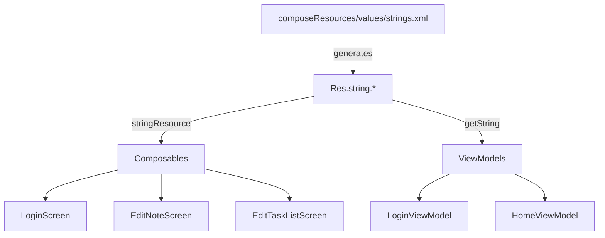

# Design Document: String Resource Extraction

## Overview

This feature extracts all hardcoded user-facing strings from Kotlin source files into Compose Multiplatform string resources (`composeResources/values/strings.xml`). This enables localization (i18n) by allowing translators to add locale-specific `strings.xml` files without modifying Kotlin code.

The project already uses `compose.components.resources` for fonts (`Res.font.*`). This feature extends that usage to string resources via `Res.string.*`, using `stringResource()` in composables and `getString()` in ViewModels.

### Key Design Decisions

1. **Single strings.xml file** — All string keys live in one `composeResources/values/strings.xml` file, matching the standard Compose Multiplatform convention. Locale overrides go in `composeResources/values-<locale>/strings.xml`.
2. **`stringResource()` in Composables, `getString()` in ViewModels** — Composables use `stringResource(Res.string.<key>)` (composable function). ViewModels use `org.jetbrains.compose.resources.getString(Res.string.<key>)` (suspend function) since they are not in a composable context.
3. **Flat key naming convention** — Keys use `<screen>_<purpose>` format (e.g., `login_button`, `edit_note_title_new`). Shared keys omit the screen prefix (e.g., `navigate_back`, `save_button`).
4. **Error strings resolved in ViewModel** — Validation errors in `LoginViewModel` are resolved to localized strings at the point of creation using `getString()`, keeping the `LoginUiState` data class unchanged (still uses `String?` for error fields).

## Architecture

The change is a refactoring — no new modules or architectural layers are introduced.



### Compose Resources Pipeline

The Compose Multiplatform Gradle plugin (`compose.components.resources`) processes `composeResources/values/strings.xml` at build time and generates a type-safe `Res.string` object. This is the same pipeline already generating `Res.font` for the Work Sans font family.

## Components and Interfaces

### Modified Components

| Component | Change | Resource Access |
|---|---|---|
| `LoginScreen` | Replace 5 hardcoded strings with `stringResource()` | `stringResource(Res.string.app_name)`, etc. |
| `LoginViewModel` | Replace 4 error strings with `getString()` | `getString(Res.string.error_backend_url_required)`, etc. |
| `EditNoteScreen` | Replace 5 hardcoded strings with `stringResource()` | `stringResource(Res.string.edit_note_title_new)`, etc. |
| `EditTaskListScreen` | Replace 3 hardcoded strings + reuse 2 shared keys with `stringResource()` | `stringResource(Res.string.edit_tasklist_title_new)`, etc. |
| `HomeViewModel` | Replace 2 "Home" literals with `getString()` | `getString(Res.string.home_title)` |

### New Files

| File | Purpose |
|---|---|
| `composeResources/values/strings.xml` | Default (English) string resource definitions |

### Interface Changes

**`HomeViewModel`**: The `titleFromPath()` and `buildBreadcrumbs()` functions currently return hardcoded `"Home"`. Since `getString()` is a suspend function, these functions need to become suspend or accept the resolved home title as a parameter. The cleanest approach is to pass the resolved string as a parameter:

```kotlin
internal fun titleFromPath(path: String, homeTitle: String): String {
    if (path == "/" || path.isEmpty()) return homeTitle
    return path.trimEnd('/').substringAfterLast('/')
}

internal fun buildBreadcrumbs(path: String, homeTitle: String): List<BreadcrumbItem> {
    val breadcrumbs = mutableListOf(BreadcrumbItem(label = homeTitle, path = "/"))
    // ...
}
```

The ViewModel resolves the string once in `init`/`loadData` and passes it through.

**`LoginViewModel`**: The `onLoginClick()` method needs to become aware of string resources. Since `getString()` is a suspend function and `onLoginClick()` already launches a coroutine for the login call, the validation can be moved into that coroutine scope, or the strings can be resolved eagerly in `init`. The simplest approach: resolve error strings inside the existing `viewModelScope.launch` block, making `onLoginClick()` launch a coroutine for the full flow (validation + login).

## Data Models

### String Resource Keys

```xml
<!-- Login Screen -->
<string name="app_name">EchoList</string>
<string name="login_backend_url_label">Backend URL</string>
<string name="login_username_label">Username</string>
<string name="login_password_label">Password</string>
<string name="login_button">Log in</string>

<!-- Login Validation Errors -->
<string name="error_backend_url_required">Backend URL is required</string>
<string name="error_username_required">Username is required</string>
<string name="error_password_required">Password is required</string>
<string name="error_login_failed">Login failed</string>

<!-- Edit Note Screen -->
<string name="edit_note_title_new">New Note</string>
<string name="edit_note_title_edit">Edit Note</string>
<string name="edit_note_placeholder">Enter note content</string>

<!-- Edit Tasklist Screen -->
<string name="edit_tasklist_title_new">New Tasklist</string>
<string name="edit_tasklist_title_edit">Edit Tasklist</string>
<string name="edit_tasklist_placeholder">Enter tasklist content</string>

<!-- Shared -->
<string name="navigate_back">Navigate back</string>
<string name="save_button">Save</string>

<!-- Home Screen -->
<string name="home_title">Home</string>
```

Total: 17 string resource entries.

### Existing Data Models — No Changes

`LoginUiState`, `HomeScreenUiState`, and `BreadcrumbItem` remain unchanged. Error strings in `LoginUiState` stay as `String?` — they are resolved to localized values before being set.


## Correctness Properties

*A property is a characteristic or behavior that should hold true across all valid executions of a system — essentially, a formal statement about what the system should do. Properties serve as the bridge between human-readable specifications and machine-verifiable correctness guarantees.*

### Property 1: Home title parameterization

*For any* path string and any non-empty home title string, `titleFromPath(path, homeTitle)` should return `homeTitle` when the path is `"/"` or empty, and `buildBreadcrumbs(path, homeTitle)` should always have `homeTitle` as the label of the first breadcrumb item.

**Validates: Requirements 6.2**

### Property 2: Validation errors use resource strings for all input combinations

*For any* combination of backend URL, username, and password strings (where each may be blank or non-blank), when `LoginViewModel.onLoginClick()` is called, every non-null error field in the resulting `LoginUiState` should exactly match the corresponding localized resource string (`error_backend_url_required`, `error_username_required`, `error_password_required`), and no error field should contain a hardcoded English literal that differs from the resource value.

**Validates: Requirements 3.2**

## Error Handling

### Build-Time Errors

- **Missing string key**: If a `Res.string.<key>` reference is used in Kotlin but the key is not defined in `strings.xml`, the build will fail at compile time with an unresolved reference error. This is enforced by the Compose Resources code generation.
- **Malformed XML**: If `strings.xml` has invalid XML syntax, the Gradle resource processing task will fail with a parse error.

### Runtime Errors

- **Missing locale file**: If a locale-specific `strings.xml` is missing, the Compose Resources framework falls back to the default `composeResources/values/strings.xml`. No application-level error handling is needed.
- **`getString()` in ViewModels**: This is a suspend function. If called from a cancelled coroutine scope, it throws `CancellationException` — standard coroutine behavior, no special handling required.

### No New Error Paths

This refactoring does not introduce new error conditions. The existing error handling in `LoginViewModel` (validation errors, login failure) remains unchanged — only the source of the error message strings changes from hardcoded literals to resource lookups.

## Testing Strategy

### Dual Testing Approach

Both unit tests and property-based tests are used, complementing each other:

- **Unit tests**: Verify specific examples — that the `strings.xml` file contains all 17 required keys, that specific screens render without hardcoded strings.
- **Property tests**: Verify universal properties — that `titleFromPath`/`buildBreadcrumbs` correctly use the home title parameter for all paths, and that `LoginViewModel` validation produces resource-backed error strings for all input combinations.

### Unit Tests

1. **String resource file completeness**: Parse `strings.xml` and assert all 17 keys are present with non-empty values.
2. **`titleFromPath` specific examples**: Verify `titleFromPath("/", "Home")` returns `"Home"`, `titleFromPath("/docs/notes", "Home")` returns `"notes"`.
3. **`buildBreadcrumbs` specific examples**: Verify root path produces single breadcrumb, nested path produces correct chain.

### Property-Based Tests

**Library**: Kotest Property (`io.kotest.property`) — already in `commonTest` dependencies.

**Configuration**: Minimum 100 iterations per property test.

**Tag format**: Each test is annotated with a comment: `Feature: string-resource-extraction, Property {number}: {property_text}`

Each correctness property above maps to exactly one property-based test:

1. **Property 1 test** — Generate random path strings and random home title strings. Assert `titleFromPath` returns the home title for root/empty paths and a path segment otherwise. Assert `buildBreadcrumbs` always has the home title as the first breadcrumb label.
   - Tag: `Feature: string-resource-extraction, Property 1: Home title parameterization`

2. **Property 2 test** — Generate random combinations of blank/non-blank strings for backend URL, username, and password. Call `onLoginClick()` and assert that each non-null error in the UI state matches the expected resource string value.
   - Tag: `Feature: string-resource-extraction, Property 2: Validation errors use resource strings`
