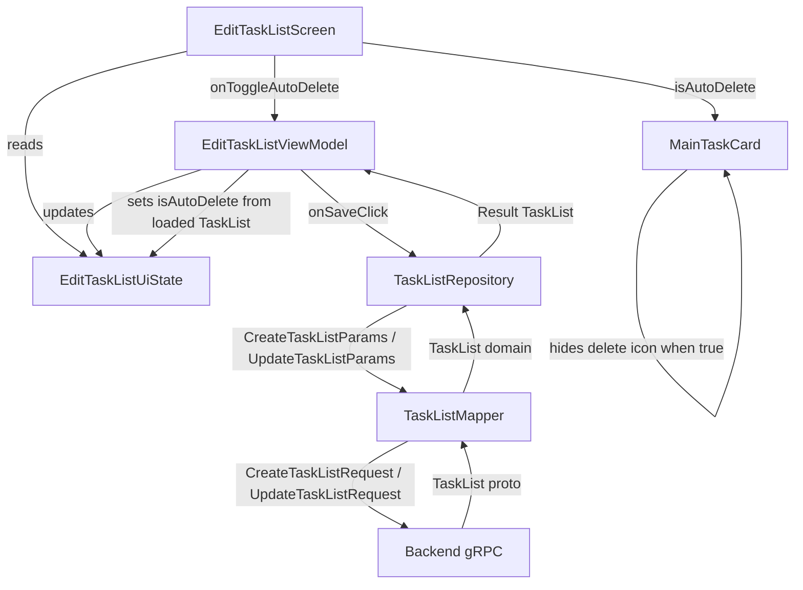

# Design Document: TaskList AutoDelete

## Overview

This feature exposes the `isAutoDelete` flag in the TaskList editor UI so users can opt in to automatic deletion of completed tasks by the backend. The network layer (proto schema, DTOs, mapper, repository) already carries `isAutoDelete` end-to-end. The remaining work is confined to the UI/ViewModel layer:

1. Render an "Auto Delete" toggle at the top of the task-list content area in `EditTaskListScreen`.
2. Manage the toggle state in `EditTaskListViewModel` and `EditTaskListUiState`.
3. Pass the flag through `CreateTaskListParams` / `UpdateTaskListParams` on save.
4. Restore the flag when loading an existing TaskList for editing.
5. Conditionally hide the manual-delete icon on `MainTaskCard` when AutoDelete is enabled.
6. Ensure checking/unchecking tasks works identically regardless of the AutoDelete setting.

Because the backend owns all deletion logic, the frontend never removes tasks itself — it only flips the boolean and sends it along.

## Architecture

The feature touches three layers, all within the existing `composeApp` module:



No new classes or modules are introduced. Every change is an addition to an existing file:

| File | Change |
|---|---|
| `EditTaskListUiState` | Already has `isAutoDelete: Boolean = false` ✅ |
| `EditTaskListViewModel` | Already has `onToggleAutoDelete`, passes flag on create/update, restores on load ✅ |
| `EditTaskListScreen` | Already renders `Switch` + label, wires `onToggleAutoDelete`, disables during loading/saving ✅ |
| `MainTaskEditorCard` | Already accepts `isAutoDelete` param and conditionally hides delete icon ✅ |
| `TaskList` (composable) | Already passes `isAutoDelete` to `MainTaskCard` ✅ |
| `CreateTaskListParams` | Already has `isAutoDelete: Boolean = false` ✅ |
| `UpdateTaskListParams` | Already has `isAutoDelete: Boolean` ✅ |
| `TaskListMapper` | Already maps `isAutoDelete` ↔ `is_auto_delete` in both directions ✅ |
| `TaskList` (domain) | Already has `isAutoDelete: Boolean` ✅ |

**Key finding:** After code review, the feature is fully implemented across all layers. The design document captures the existing architecture and validates correctness through properties and tests.

## Components and Interfaces

### EditTaskListUiState

```kotlin
internal data class EditTaskListUiState(
    val titleState: TextFieldState,
    val mainTasks: SnapshotStateList<UiMainTask>,
    val mode: EditTaskListMode,
    val isAutoDelete: Boolean = false,   // ← AutoDelete flag
    val isLoading: Boolean = false,
    val isSaving: Boolean = false,
    val error: String? = null
)
```

- `isAutoDelete` defaults to `false` for new TaskLists (Requirement 2).
- The `Switch` is disabled when `isLoading || isSaving` (Requirement 1.3).

### EditTaskListViewModel

Relevant methods:

| Method | Behavior |
|---|---|
| `onToggleAutoDelete(Boolean)` | Updates `_uiState` with the new value |
| `onSaveClick()` | Reads `_uiState.value.isAutoDelete` and passes it into `CreateTaskListParams` or `UpdateTaskListParams` |
| `loadTaskList(id)` | Sets `isAutoDelete` from the loaded `TaskList.isAutoDelete` |
| `onMainTaskCheckedChange(index, isChecked)` | Toggles `isDone` — unaffected by `isAutoDelete` |
| `onSubTaskCheckedChange(mainIdx, subIdx, isChecked)` | Toggles `isDone` — unaffected by `isAutoDelete` |

### EditTaskListScreen

The toggle is rendered inside the main `Surface`, above the task list:

```kotlin
Row(modifier = Modifier.fillMaxWidth()) {
    Text(
        text = "Auto Delete",
        style = EchoListTheme.typography.titleSmall,
        color = EchoListTheme.materialColors.onSurface,
        modifier = Modifier.weight(1f)
    )
    Switch(
        checked = uiState.isAutoDelete,
        onCheckedChange = onToggleAutoDelete,
        enabled = !uiState.isLoading && !uiState.isSaving
    )
}
```

### MainTaskCard

The delete icon is conditionally rendered:

```kotlin
if (!isAutoDelete) {
    Icon(
        painter = painterResource(Res.drawable.ic_delete),
        contentDescription = "Delete main task",
        modifier = Modifier.clip(RoundedCornerShape(50))
            .clickable { onRemoveMainTask() }
            .padding(horizontal = EchoListTheme.dimensions.m, vertical = EchoListTheme.dimensions.m)
    )
}
```

### TaskListMapper

Bidirectional mapping (already implemented):

- `CreateTaskListParams.isAutoDelete` → `CreateTaskListRequest.is_auto_delete`
- `UpdateTaskListParams.isAutoDelete` → `UpdateTaskListRequest.is_auto_delete`
- `tasks.v1.TaskList.is_auto_delete` → `TaskList.isAutoDelete`

## Data Models

### Domain Layer

```kotlin
data class TaskList(
    val id: String,
    val filePath: String,
    val name: String,
    val tasks: List<MainTask>,
    val updatedAt: Long,
    val isAutoDelete: Boolean       // ← the flag
)
```

### DTO Layer

```kotlin
data class CreateTaskListParams(
    val name: String,
    val path: String,
    val tasks: List<MainTask>,
    val isAutoDelete: Boolean = false   // defaults to false
)

data class UpdateTaskListParams(
    val id: String,
    val title: String,
    val tasks: List<MainTask>,
    val isAutoDelete: Boolean
)
```

### Proto Layer

```protobuf
message TaskList {
    ...
    bool is_auto_delete = 6;
}

message CreateTaskListRequest {
    ...
    bool is_auto_delete = 4;
}

message UpdateTaskListRequest {
    ...
    bool is_auto_delete = 4;
}
```


## Correctness Properties

*A property is a characteristic or behavior that should hold true across all valid executions of a system — essentially, a formal statement about what the system should do. Properties serve as the bridge between human-readable specifications and machine-verifiable correctness guarantees.*

### Property 1: Create-mode isAutoDelete propagation

*For any* boolean value of `isAutoDelete`, when the user toggles AutoDelete to that value and saves a new TaskList, the `CreateTaskListParams` passed to the repository SHALL carry the same `isAutoDelete` value.

**Validates: Requirements 3.1, 3.2**

### Property 2: Update-mode isAutoDelete propagation

*For any* boolean value of `isAutoDelete` and any existing TaskList, when the user sets AutoDelete to that value and saves, the `UpdateTaskListParams` passed to the repository SHALL carry the same `isAutoDelete` value.

**Validates: Requirements 4.1**

### Property 3: Mapper create round-trip preserves isAutoDelete

*For any* valid `CreateTaskListParams`, mapping to a `CreateTaskListRequest` via `TaskListMapper.toProto` and then mapping the response `TaskList` proto back to the domain via `TaskListMapper.toDomain` SHALL produce a `TaskList` whose `isAutoDelete` equals the original `CreateTaskListParams.isAutoDelete`.

**Validates: Requirements 6.1, 3.3**

### Property 4: Mapper update round-trip preserves isAutoDelete

*For any* valid `UpdateTaskListParams`, mapping to an `UpdateTaskListRequest` via `TaskListMapper.toProto` and then mapping the response `TaskList` proto back to the domain via `TaskListMapper.toDomain` SHALL produce a `TaskList` whose `isAutoDelete` equals the original `UpdateTaskListParams.isAutoDelete`.

**Validates: Requirements 6.2, 4.2**

### Property 5: Load restores isAutoDelete from backend

*For any* `TaskList` domain object with any `isAutoDelete` value stored in the repository, when the `EditTaskListViewModel` loads that TaskList in edit mode, the resulting `EditTaskListUiState.isAutoDelete` SHALL equal the loaded `TaskList.isAutoDelete`.

**Validates: Requirements 5.1, 5.2**

### Property 6: Delete icon visibility is inverse of isAutoDelete

*For any* `MainTaskCard` rendered with a given `isAutoDelete` boolean, the manual delete icon SHALL be visible if and only if `isAutoDelete` is `false`.

**Validates: Requirements 7.1, 7.2**

### Property 7: Task check/uncheck is independent of isAutoDelete

*For any* MainTask or SubTask in the task list, and *for any* boolean value of `isAutoDelete`, toggling the `isDone` state SHALL update the task's `isDone` to the new value, the task SHALL remain in the list, and the list size SHALL be unchanged.

**Validates: Requirements 8.1, 8.2, 8.3, 8.4**

## Error Handling

| Scenario | Handling |
|---|---|
| Network failure on save (create or update) | `TaskListRepositoryImpl` returns `Result.failure(e)`. The ViewModel sets `isSaving = false` and populates `uiState.error` with the exception message. The toggle remains enabled so the user can retry. |
| Network failure on load | `TaskListRepositoryImpl` returns `Result.failure(e)`. The ViewModel sets `isLoading = false` and populates `uiState.error`. `isAutoDelete` stays at its default (`false`). |
| Toggle tapped while loading/saving | The `Switch` is disabled (`enabled = !uiState.isLoading && !uiState.isSaving`), so the tap is ignored by the Compose framework. |
| Invalid task data on save | Validation in `validateDrafts()` runs before the network call. If validation fails, the error is shown and `isAutoDelete` is unaffected. |

No new error paths are introduced by this feature. The `isAutoDelete` flag is a simple boolean with no validation constraints beyond its type.

## Testing Strategy

### Property-Based Testing

- Library: **Kotest Property** (`io.kotest.property`)
- Framework: **Kotest** with `FunSpec` style
- Runner: JUnit 5 on JVM (`jvmTest`), multiplatform expect/actual on `commonTest`
- Minimum iterations: **100** per property test (via `PropTestConfig(iterations = 100)`)
- Each test is tagged with a comment: `Feature: tasklist-auto-delete, Property {N}: {title}`

Properties 1, 2, 5, and 7 require a `FakeTaskListRepository` and `EditTaskListViewModel` instantiation with `StandardTestDispatcher` + `runTest`, following the existing pattern in `EditTaskListViewModelPropertyTest.kt`.

Properties 3 and 4 are pure mapper tests using Kotest `Arb` generators for `CreateTaskListParams` and `UpdateTaskListParams`, following the existing pattern in `TaskListMapperPropertyTest.kt`.

Property 6 is a Compose UI property. Since the codebase does not currently use a Compose test harness, this property is validated by code inspection of the `if (!isAutoDelete)` guard in `MainTaskCard`. If a Compose testing dependency is added in the future, this property can be automated.

### Unit Tests

Unit tests complement property tests for specific examples and edge cases:

- **Default value**: Verify `EditTaskListUiState` defaults `isAutoDelete` to `false` in create mode.
- **Default DTO value**: Verify `CreateTaskListParams()` defaults `isAutoDelete` to `false`.
- **Toggle round-trip in ViewModel**: Toggle on, toggle off, verify state returns to `false`.
- **Load with `isAutoDelete = true`**: Load a TaskList with `isAutoDelete = true`, verify UI state matches.
- **Load with `isAutoDelete = false`**: Load a TaskList with `isAutoDelete = false`, verify UI state matches.

### Test File Locations

| Test | Location |
|---|---|
| ViewModel property tests (Properties 1, 2, 5, 7) | `composeApp/src/jvmTest/.../ui/edittasklist/EditTaskListViewModelPropertyTest.kt` |
| Mapper property tests (Properties 3, 4) | `composeApp/src/commonTest/.../data/mapper/TaskListMapperPropertyTest.kt` |
| Unit tests | `composeApp/src/commonTest/.../ui/edittasklist/` or `jvmTest` equivalent |

### Existing Test Coverage

The existing `EditTaskListViewModelPropertyTest.kt` and `TaskListMapperPropertyTest.kt` already cover several of these properties:

- Mapper round-trip for `isAutoDelete` is covered by the existing Property 18 and Property 20 tests in `TaskListMapperPropertyTest.kt`.
- ViewModel create/update with `isAutoDelete` is partially covered by Properties 1 and 2 in `EditTaskListViewModelPropertyTest.kt`.
- Task checking independence from `isAutoDelete` is covered by the four dedicated tests in `EditTaskListViewModelPropertyTest.kt`.

New tests should fill any gaps, particularly around the property-based generation of random `isAutoDelete` values during ViewModel create/update flows.
