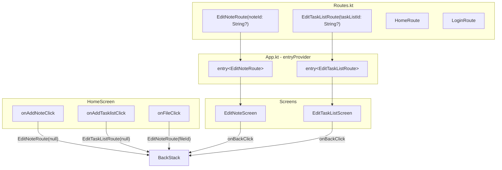

# Design Document: Unified Edit Screens

## Overview

This feature consolidates the separate create and detail screens for notes and tasklists into unified edit screens with a single route each. The current codebase has four separate components for what is essentially two workflows:

- `NoteDetailRoute` + `NoteDetailScreen` (view/edit existing note) and `NoteCreateRoute` + `NoteCreateScreen` (create new note) → merged into `EditNoteRoute` + `EditNoteScreen`
- `TasklistDetailRoute` + `TasklistDetailScreen` (create new tasklist, no edit mode yet) → replaced by `EditTaskListRoute` + `EditTaskListScreen`

Each new route uses an optional ID parameter (`noteId: String?` / `taskListId: String?`). When `null`, the screen operates in create mode. When non-null, it operates in edit mode. This is a pure refactoring — no new user-facing functionality is added. Actual data loading for edit mode is out of scope.

After the refactor, the old files (`NoteDetailScreen.kt`, `NoteDetailUiState.kt`, `NoteDetailViewModel.kt`, `NoteCreateScreen.kt`, `TasklistDetailScreen.kt`) and their packages are deleted. All navigation wiring in `App.kt` and all property tests are updated to reference the new routes.

## Architecture



### Navigation Flow

The app uses `androidx.navigation3` with `rememberNavBackStack`. The refactor changes which route classes are pushed but not the navigation mechanics:

- `onAddNoteClick` pushes `EditNoteRoute(noteId = null)` (was `NoteCreateRoute`)
- `onAddTasklistClick` pushes `EditTaskListRoute(taskListId = null)` (was `TasklistDetailRoute`)
- `onFileClick` pushes `EditNoteRoute(noteId = fileId)` (was `NoteDetailRoute(noteId = fileId)`)
- Back navigation still calls `backStack.removeLastOrNull()`

### Package Structure (after refactor)

```
ui/
├── editnote/
│   └── EditNoteScreen.kt          ← NEW (replaces notecreate/ + notedetail/)
├── edittasklist/
│   └── EditTaskListScreen.kt      ← NEW (replaces tasklistdetail/)
├── home/                           ← MODIFIED (callback wiring)
├── navigation/
│   └── Routes.kt                  ← MODIFIED (new route definitions)
└── ...
```

Deleted packages: `ui/notecreate/`, `ui/notedetail/`, `ui/tasklistdetail/`

## Components and Interfaces

### EditNoteRoute

**File:** `Routes.kt`

```kotlin
@Serializable
data class EditNoteRoute(val noteId: String? = null) : NavKey
```

Replaces both `NoteDetailRoute(noteId: String)` and `NoteCreateRoute`. Registered in `navKeySerializersModule`.

### EditTaskListRoute

**File:** `Routes.kt`

```kotlin
@Serializable
data class EditTaskListRoute(val taskListId: String? = null) : NavKey
```

Replaces `TasklistDetailRoute`. Registered in `navKeySerializersModule`.

### EditNoteScreen

**File:** `composeApp/src/commonMain/kotlin/net/onefivefour/echolist/ui/editnote/EditNoteScreen.kt`

```kotlin
@Composable
fun EditNoteScreen(
    noteId: String?,
    text: String,
    onTextChanged: (String) -> Unit,
    onSaveClick: () -> Unit,
    onBackClick: () -> Unit,
    modifier: Modifier = Modifier
)
```

- Stateless composable following project patterns
- Title: `"New Note"` when `noteId == null`, `"Edit Note"` when non-null
- TopAppBar with back button (ArrowBack icon), editable `OutlinedTextField`, save button
- Uses `EchoListTheme.materialColors`, `EchoListTheme.typography`, `EchoListTheme.dimensions`
- Structurally identical to the current `NoteCreateScreen` but with dynamic title based on `noteId`

### EditTaskListScreen

**File:** `composeApp/src/commonMain/kotlin/net/onefivefour/echolist/ui/edittasklist/EditTaskListScreen.kt`

```kotlin
@Composable
fun EditTaskListScreen(
    taskListId: String?,
    text: String,
    onTextChanged: (String) -> Unit,
    onSaveClick: () -> Unit,
    onBackClick: () -> Unit,
    modifier: Modifier = Modifier
)
```

- Stateless composable following project patterns
- Title: `"New Tasklist"` when `taskListId == null`, `"Edit Tasklist"` when non-null
- Same layout as `EditNoteScreen` but with tasklist-specific placeholder text
- Uses `EchoListTheme.materialColors`, `EchoListTheme.typography`, `EchoListTheme.dimensions`

### App.kt Entry Provider Changes

Old entries removed: `entry<NoteDetailRoute>`, `entry<NoteCreateRoute>`, `entry<TasklistDetailRoute>`

New entries:

```kotlin
entry<EditNoteRoute> { route ->
    var text by remember { mutableStateOf("") }
    EditNoteScreen(
        noteId = route.noteId,
        text = text,
        onTextChanged = { text = it },
        onSaveClick = { /* no-op */ },
        onBackClick = { backStack.removeLastOrNull() }
    )
}

entry<EditTaskListRoute> { route ->
    var text by remember { mutableStateOf("") }
    EditTaskListScreen(
        taskListId = route.taskListId,
        text = text,
        onTextChanged = { text = it },
        onSaveClick = { /* no-op */ },
        onBackClick = { backStack.removeLastOrNull() }
    )
}
```

### HomeScreen Callback Changes

The existing callbacks change their route targets:

| Callback | Before | After |
|----------|--------|-------|
| `onFileClick` | `backStack.add(NoteDetailRoute(fileId))` | `backStack.add(EditNoteRoute(noteId = fileId))` |
| `onAddNoteClick` | `backStack.add(NoteCreateRoute)` | `backStack.add(EditNoteRoute())` |
| `onAddTasklistClick` | `backStack.add(TasklistDetailRoute)` | `backStack.add(EditTaskListRoute())` |

No changes to `HomeScreen.kt` itself — only the lambdas passed in `App.kt`.

## Data Models

### Route Definitions (after refactor)

| Route | Parameters | Purpose |
|-------|-----------|---------|
| `LoginRoute` | None | Login screen (unchanged) |
| `HomeRoute` | `path: String = "/"` | Home/folder browser (unchanged) |
| `EditNoteRoute` | `noteId: String? = null` | Create or edit a note |
| `EditTaskListRoute` | `taskListId: String? = null` | Create or edit a tasklist |

### Removed Routes

| Route | Replacement |
|-------|------------|
| `NoteDetailRoute(noteId: String)` | `EditNoteRoute(noteId = noteId)` |
| `NoteCreateRoute` | `EditNoteRoute()` (noteId defaults to null) |
| `TasklistDetailRoute` | `EditTaskListRoute()` (taskListId defaults to null) |

### Serialization Module (after refactor)

```kotlin
val navKeySerializersModule = SerializersModule {
    polymorphic(NavKey::class) {
        subclass(LoginRoute::class, LoginRoute.serializer())
        subclass(HomeRoute::class, HomeRoute.serializer())
        subclass(EditNoteRoute::class, EditNoteRoute.serializer())
        subclass(EditTaskListRoute::class, EditTaskListRoute.serializer())
    }
}
```

### Removed Data Models

- `NoteDetailUiState` sealed interface (Loading/Success/Error) — no longer needed since edit mode data loading is out of scope
- `NoteDetailViewModel` — removed along with its Koin registration


## Correctness Properties

*A property is a characteristic or behavior that should hold true across all valid executions of a system — essentially, a formal statement about what the system should do. Properties serve as the bridge between human-readable specifications and machine-verifiable correctness guarantees.*

### Property 1: Route serialization round-trip

*For any* `EditNoteRoute` with an arbitrary `noteId` (including `null`) and *for any* `EditTaskListRoute` with an arbitrary `taskListId` (including `null`), serializing to JSON using the polymorphic `navKeySerializersModule` and deserializing back should produce an object equal to the original.

**Validates: Requirements 1.4, 2.4**

### Property 2: Edit screen title reflects mode

*For any* non-null string `noteId`, `EditNoteScreen` should display the title `"Edit Note"`. *For any* non-null string `taskListId`, `EditTaskListScreen` should display the title `"Edit Tasklist"`. The title must be determined solely by the nullability of the ID parameter, not its value.

**Validates: Requirements 3.3, 4.3**

### Property 3: Create actions push null-ID routes

*For any* back stack state, invoking the add-note action should append `EditNoteRoute(noteId = null)` to the top of the stack, and invoking the add-tasklist action should append `EditTaskListRoute(taskListId = null)` to the top of the stack. In both cases, the stack size should increase by exactly one and all previous entries should remain unchanged.

**Validates: Requirements 5.4, 5.5**

### Property 4: File click pushes EditNoteRoute with file ID

*For any* back stack state and *for any* non-empty file ID string, clicking a file item should append `EditNoteRoute(noteId = fileId)` to the top of the stack. The stack size should increase by exactly one and all previous entries should remain unchanged.

**Validates: Requirements 5.6**

### Property 5: Back navigation pops top entry

*For any* back stack that has an `EditNoteRoute` or `EditTaskListRoute` on top, invoking the back action should remove the top entry. The stack size should decrease by exactly one and the remaining entries should equal the original stack minus the last element.

**Validates: Requirements 5.7**

## Error Handling

| Scenario | Handling |
|----------|----------|
| Save button tapped | No-op by design. The callback is provided but wired to do nothing. No error state needed. |
| Back navigation from single-entry stack | `removeLastOrNull()` safely returns `null`. The `NavigationBackHandler` disables back when `backStack.size <= 1`. |
| Null noteId / taskListId | Expected create-mode behavior. The screen displays "New Note" / "New Tasklist" title. No error. |
| Route not found | Navigation3's `entryProvider` will not match unknown routes. Both new routes are registered in the serializers module and entry provider. |
| Old route references | Compilation will fail if any code still references `NoteDetailRoute`, `NoteCreateRoute`, or `TasklistDetailRoute`, catching stale references at build time. |

Since this is a refactoring with no new persistence or network calls, error handling is minimal. The save button remains non-functional (no-op), and edit-mode data loading is out of scope.

## Testing Strategy

### Property-Based Testing

- **Library:** Kotest property-based testing (`io.kotest.property`)
- **Configuration:** Minimum 100 iterations per property test
- **Tag format:** `Feature: unified-edit-screens, Property {number}: {property_text}`
- Each correctness property is implemented by a single property-based test

| Property | Test File | Approach |
|----------|-----------|----------|
| Property 1 | `RouteSerializationPropertyTest.kt` | Generate arbitrary `String?` values for `noteId`/`taskListId`, construct routes, serialize via `Json` with `navKeySerializersModule`, deserialize, assert equality. Test both concrete type and polymorphic `NavKey` serialization. |
| Property 2 | `EditScreenTitlePropertyTest.kt` | Generate arbitrary non-null strings, pass as `noteId`/`taskListId` to a title-resolution function, assert result is `"Edit Note"` / `"Edit Tasklist"`. |
| Property 3 | `NavigationPropertyTest.kt` | Generate random back stacks of `NavKey`, invoke add-note/add-tasklist actions, assert correct route on top with null ID, stack size +1, previous entries unchanged. |
| Property 4 | `NavigationPropertyTest.kt` | Generate random back stacks and random non-empty file ID strings, invoke file-click action, assert `EditNoteRoute(noteId = fileId)` on top. |
| Property 5 | `NavigationPropertyTest.kt` | Generate random back stacks with an edit route on top, invoke back, assert top removed and size -1. |

### Unit Testing

Unit tests complement property tests for specific examples and edge cases:

- `EditNoteScreen` displays "New Note" title when `noteId` is `null` (example, validates 3.2)
- `EditTaskListScreen` displays "New Tasklist" title when `taskListId` is `null` (example, validates 4.2)
- `EditNoteScreen` back button invokes `onBackClick` callback (example, validates 3.5)
- `EditTaskListScreen` back button invokes `onBackClick` callback (example, validates 4.5)

### Test Migration

Existing tests that reference old routes must be updated:

| Test File | Changes |
|-----------|---------|
| `RouteSerializationPropertyTest.kt` | Remove `NoteDetailRoute`, `NoteCreateRoute`, `TasklistDetailRoute` tests. Add `EditNoteRoute` and `EditTaskListRoute` round-trip tests with `Arb.string().orNull()`. |
| `NavigationPropertyTest.kt` | Replace `NoteCreateRoute` with `EditNoteRoute(noteId = null)`, `TasklistDetailRoute` with `EditTaskListRoute(taskListId = null)`. Update `Arb.navKey()` and `Arb.detailRoute()` generators. Add file-click navigation test. |
| `SaveButtonNoOpPropertyTest.kt` | Update screen name references in comments/descriptions from `NoteCreateScreen`/`TasklistDetailScreen` to `EditNoteScreen`/`EditTaskListScreen`. Logic unchanged. |
